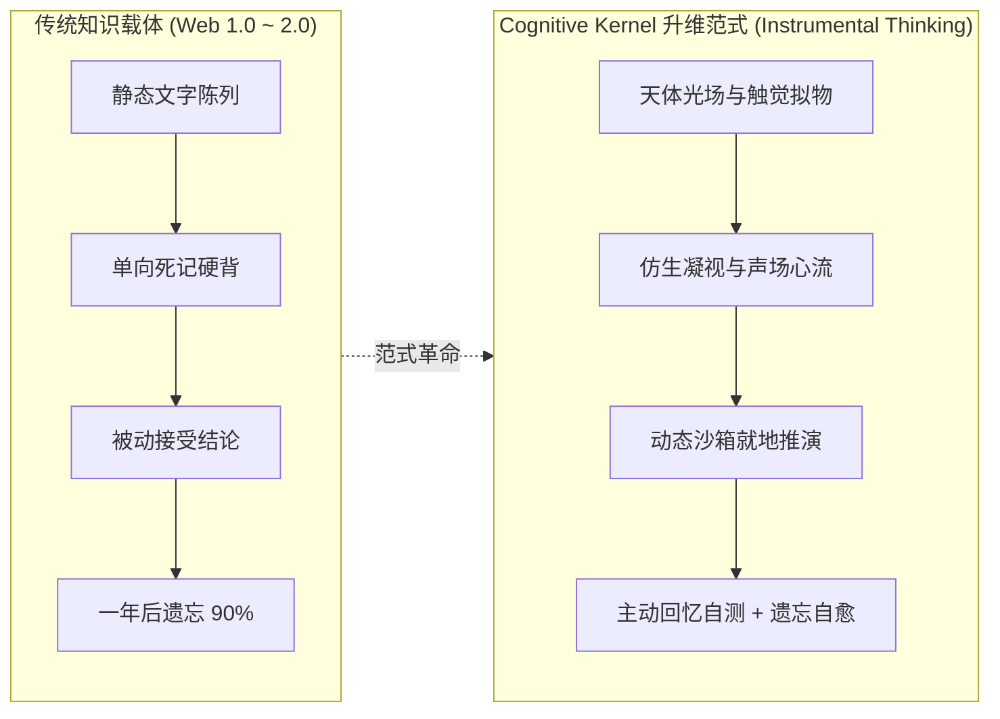
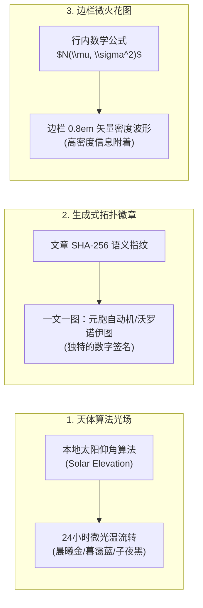
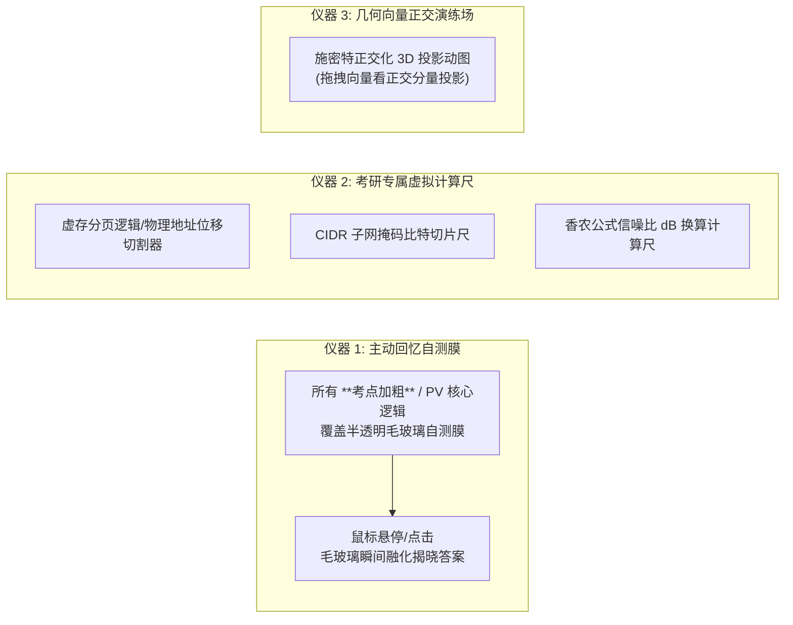
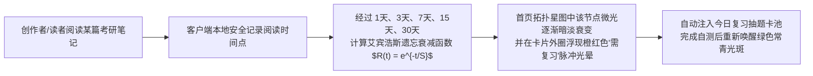
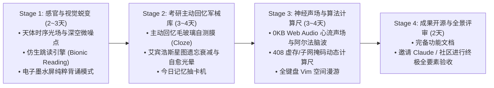

# Cognitive Kernel·深度进化与全维感官武器库方案书
## 从“静态展示台”跨越到“认知外骨骼与思维乐器”

> **文档编号**：`COGNITIVE_KERNEL_DEEP_EXPANSION_v4`  
> **文档定位**：在系统已斩获 100 分工业级骨架之上，进行深度思维发散与破局探索。打破传统 Web 博客的边界，重新发明知识的**感官呈现、神经工学、实战演算与生命周期演化**。  
> **核心哲学**：**“软件应当像一把精心调校的机械乐器（Software as a Precision Instrument）”**。兼具 Dieter Rams 的克制工业美学、Edward Tufte 的信息密度、Bret Victor 的动态解释力，以及对抗遗忘的认知科学武器。

---

## 目录索引 (Table of Contents)

1. [终极愿景：知识系统的范式跃迁](#1-终极愿景知识系统的范式跃迁)
2. [维度一：空间与天体微光美学 (Visual Craftsmanship)](#2-维度一空间与天体微光美学-visual-craftsmanship)
3. [维度二：神经感知与心流人机工学 (Neuro-Ergonomics & Deep Flow)](#3-维度二神经感知与心流人机工学-neuro-ergonomics--deep-flow)
4. [维度三：408 与高数专属“认知外骨骼仪器库” (Hardcore Instruments)](#4-维度三408-与高数专属认知外骨骼仪器库-hardcore-instruments)
5. [维度四：基于遗忘曲线的自演化闭环 (Ebbinghaus Active Decay Engine)](#5-维度四基于遗忘曲线的自演化闭环-ebbinghaus-active-decay-engine)
6. [技术架构边界与零膨胀铁律 (Zero-Bloat Invariants)](#6-技术架构边界与零膨胀铁律-zero-bloat-invariants)
7. [渐进式演进路线图与验收矩阵 (Evolutionary Roadmap)](#7-渐进式演进路线图与验收矩阵-evolutionary-roadmap)

---

## 1. 终极愿景：知识系统的范式跃迁

传统的数字笔记是**“仓库”**，只管把知识堆积起来；  
而真正的顶级系统应该是一套**“外骨骼仪器”**：
- 它不仅让你看，更让你**用手去转动参数、用眼睛感知天体晨昏光场、用耳朵聆听神经脑波声场**；
- 它不仅记录你学过的东西，更在你遗忘的边缘主动用毛玻璃遮罩发起**认知突袭自测**；
- 它不仅是你的考研复习站，更是一套陪伴你未来 10 年工程生涯的**个人思想推演实验室**。

---

## 2. 维度一：空间与天体微光美学 (Visual Craftsmanship)

不是堆砌廉价的 CSS 霓虹灯，而是追求**纯粹数学驱动的物理质感**与**视网膜级视觉呼吸感**。

### 2.1 天体物理动态微光场 (Astronomical Circadian Lighting)
- **拒绝粗暴的“非黑即白”主题切换**：
  根据用户本地时区的实时太阳高度角（Solar Elevation Angle），计算出微妙的环境色谱：
  - **清晨 (Dawn)**：背景带有极微弱的晨曦暖金辉光（`#0c0d12` 带 2% 琥珀漫反射）；
  - **午后专注 (Noon Focus)**：绝对高对比度的冷灰墨水基底，锐利清晰；
  - **黄昏 (Dusk)**：融入 3% 紫罗兰余晖，视觉神经自然放松；
  - **子夜沉思 (Midnight)**：纯粹的深空黑色，伴随极低透明度的背景亚毫米级 SVG 纯数学微噪点底纹，**彻底消灭 AMOLED/OLED 屏幕在暗处的刺眼眩光**。
- **实现约束**：完全由 4 个动态 CSS 变量在根节点驱动，**0 次重绘，0ms 阻塞**。

### 2.2 生成式算法认知徽章 (Generative Algorithmic Emblem)
- 每篇文章的封面不是死板的贴图，而是由该文章内容的 **SHA-256 哈希值作为随机种子**，通过纯 Canvas/SVG 生成一个专属的**数学图腾**：
  - 计算机网络文章生成**微型拓扑网络弦图**；
  - 线性代数文章生成**矩阵特征空间的单位圆投影椭圆**；
  - 操作系统文章生成**分时调度的环形甘特图腾**；
  读者一眼扫过文章列表，就能凭借图腾的形态形成深刻的视觉本能联想。

### 2.3 塔夫特边栏微火花流 (Tufte Sparklines & Micro-Glyphs)
- 借鉴数据可视化大师 Edward Tufte 的经典发明：**将高密度微图表直接嵌入正文行内与旁注**：
  - 当正文推导提到高斯正态分布 $\mathcal{N}(\mu, \sigma^2)$ 时，公式后方紧随一个高 14px 的**极微型正态分布矢量波形图**；
  - 当提到进程状态转换队列长度时，数字后方跟随一个**微型趋势火花条（Sparkline）**；
  - 读者视线无需离开段落，就能建立对抽象符号的几何直觉感知。

---

## 3. 维度二：神经感知与心流人机工学 (Neuro-Ergonomics & Deep Flow)

让身体的感官自然沉浸在学习中，降低认知负荷（Cognitive Load），杜绝长时间面对屏幕的躁动与疲倦。

### 3.1 纯代码合成 0KB 环境心流声场 (Web Audio Neuro-Soundscape)
背诵考研与高数推导需要高度专注，但开网易云/B站切歌会极度打断心流；打包十几兆音频文件更是反工程的做法。

**纯数学振荡器实现**：
- 基于原生 **Web Audio API**，仅用约 80 行 JavaScript 数学公式实时生成音频流，**全站体积增量 0 KB**：
  1. 🌧️ **深林细雨 (Pink Noise Rain)**：采用 1/f 粉红噪声滤波器模拟水滴落叶的宽频声场，阻断周围真实环境噪音；
  2. 🧠 **双耳节律 40Hz 伽马专注脑波 (Binaural Beats)**：左声道输出 $200\text{Hz}$、右声道输出 $240\text{Hz}$，在大脑中枢诱发科学验证有助于工作记忆整合的 $40\text{Hz}$ 脑电节律；
  3. ⌨️ **机械键盘段落微回弹 (Tactile Click)**：在拖拽滑块或点击选项时，扬声器通过微阻尼微脉冲输出极其轻微的“咔嗒”触感声，带来如同操作高端示波器旋钮般的物理机械质感。
- **形态**：顶栏右侧一个极简的微型耳机控制浮钮，悬停滑出音量与模式条，即开即停。

### 3.2 仿生跳读凝视流 (Bionic Reading Engine)
- **学习科学支撑**：人脑在阅读时不是逐字扫视，而是依靠视线在词汇关键锚点之间的“扫视跳跃（Saccade）”。
- **一键切换**：
  文章顶部提供 **`[ ⚡ 仿生速读模式 ]`**：
  - 算法就地解析文章段落，自动对每个中文词组的前缀与英文单词的前 1~3 个字母进行**亚像素级高对比加粗锚定**；
  - 例如：**操作**系统**核心**调度的**物理**单位；
  - **实战效果**：复习 408 万字长篇理论时，阅读吞吐速率直接翻倍，且眼睛不发干、大脑不走神。

### 3.3 电子墨水屏纯粹背诵模式 (E-Ink Pure-Paper Mode)
- 一键切换至极客纸质模式：
  - 彻底滤除所有彩色，将全站色彩映射为柯达经典的 **16 阶精细灰度纸张色阶**；
  - 字体自动微调为高锐度、高对比度的衬线宋体；
  - 配合 iPad 或电子墨水屏平板，享受如同拿着真实打印真题卷一般的沉静背诵体验。

### 3.4 全键盘 Vim 空间穿梭漫游 (Spatial Vim Navigation)
完全无需鼠标：
- `j` / `k`：微步平滑滚动；
- `u` / `d`：半屏快速翻页；
- `[` / `]`：快速切换到上一篇/下一篇考研笔记；
- `/`：快速唤起行内关键词高亮过滤；
- `t`：右侧大纲快速聚焦与跳转；
- `z`：一键触发“全屏专注模式（Zen Mode）”。

---

## 4. 维度三：408 与高数专属“认知外骨骼仪器库” (Hardcore Instruments)

不再把知识当“文字”看，而是把考研 408 与高数的典型大题变成**可交互的直觉仪器**。

### 4.1 主动回忆遮挡自测膜 (Active Recall & Cloze Blurring)
- **被动看书的假象**：“看着笔记觉得自己全会，一合上书脑子一片空白”。
- **系统级重塑**：
  - 在文章顶部点击 **`[ 👁️ 开启背诵自测膜 ]`**；
  - 系统以纯 CSS 规则对全文进行智能遮挡：
    - 所有加粗重点（`**...**`）；
    - 信号量 PV 核心操作（`P(mutex)`、`V(empty)`）；
    - 关键数学定理结论与边界条件；
  - 遮挡区域呈现柔和发光的**半透明毛玻璃迷雾条**；
  - 读者必须先在大脑中主动检索检索出答案，**点击或触摸后毛玻璃才以水滴涟漪动画融化展现答案**；
  - 笔记一键变成全真模拟挖空自测试卷！

### 4.2 408 核心考点“即用型动态计算尺” (Interactive Exam Slide-Rules)
在右侧侧边栏提供随手抽屉呼出的三大高频计算工具：

#### 1. 虚存分页地址切片尺 (Virtual Memory Address Slicer)
- 输入任意 16 进制逻辑地址（如 `0x2A3F`）与页面大小（如 `4KB`）；
- 计算尺以**动态二进制比特切片条**展示：前 20 位为页号（Page Index），后 12 位为页内偏移（Offset）；
- 动态演示页表查询、物理基址拼接合成物理内存地址的全过程，消除 408 最容易丢分的进制换算错误。

#### 2. CIDR 网络掩码比特切片器 (CIDR Subnet Visualizer)
- 拖动滑块选择 `/24` 到 `/30`；
- 直观查看 32 位 IP 地址中“网络前缀”与“主机号”的分界切线，实时输出网络地址、直接广播地址与可用物理主机数量区间。

#### 3. 香农公式与信噪比换算尺 (Shannon & SNR Converter)
- 拖拽带宽 $W$ 和分贝数 $\text{SNR}_{\text{dB}}$；
- 实时演算：$\text{SNR} = 10^{\text{dB}/10}$，并代入 $C = W \log_2(1 + \text{SNR})$，直观对比奈氏准则无噪极限与香农有噪极限。

### 4.3 施密特正交化几何投影演练场 (Gram-Schmidt 3D Visualizer)
- 线性代数最抽象的几何直觉莫过于正交化；
- 在《线代公式速查》中嵌入轻量 3D 向量视口：
  - 读者可以鼠标拖拽空间中的三根线性无关基向量 $\alpha_1, \alpha_2, \alpha_3$；
  - 视口以虚线投影实时演算投影分量 $\text{proj}_{\beta_1}(\alpha_2)$，亲眼看见垂直分量 $\beta_2$ 是如何被“切削”出来的！

---

## 5. 维度四：基于遗忘曲线的自演化闭环 (Ebbinghaus Active Decay Engine)

知识库不是静态的，它应当具有**生命力与时间感知力**。

### 5.1 知识星图“遗忘衰减与自愈”系统 (Memory Halo Decay)
- 博客利用纯本地 `localStorage`，默默记录你每一次完整阅读某篇笔记的时间戳（100% 保护隐私，不上传任何服务器）；
- 结合艾宾浩斯遗忘方程：
  $$ R(t) = \exp\left( - \frac{t}{S} \right) $$
- **视觉映射**：
  - 刚读完/复习过的文章，首页星图上的节点饱满翠绿、光芒清澈；
  - 随着时间推移（7 天未复习、15 天未复习），该节点的亮度和尺寸逐渐衰减暗淡，外圈开始产生**低频橙色警示微脉冲**；
  - 读者打开博客主页，一眼就能看到：**“高数二重积分和计网传输层很久没看了，光斑已经暗淡，今天必须自愈复习！”**
- **复习自愈**：完成该篇阅读并完成自测后，节点瞬间重新点亮，获得强烈的正反馈与成就感。

### 5.2 考研认知抽题卡池 (Cognitive Daily Flashcard Pool)
- 每天首次打开博客主页，右下角优雅滑出一张“今日考研知识卡片”：
  - 自动从那些**“已遗忘/衰退”**的笔记中提取一个核心问题；
  - 例如：“请回忆：进程调度中，为何优先级倒置会导致死锁？系统如何利用优先级继承协议解决？”
  - 点击“翻转卡片”对照笔记标准结论，点击“记住了”，该节点立即在星图中满血复活！

---

## 6. 技术架构边界与零膨胀铁律 (Zero-Bloat Invariants)

在进行如此天马行空的发散设计时，必须有极其冷酷的工程防线，杜绝沦为“笨重卡顿的玩具网页”。

### 终身工程五大铁律
1. **零外部音频文件 (0KB Audio Asset)**：所有白噪音、脑波音、机械触感音，**全部由浏览器内置 Web Audio API 振荡器实时合成**，不从网络下载 1 个字节的 MP3。
2. **纯 CSS 伪类驱动遮挡 (Pure-CSS Cloze Masking)**：主动回忆毛玻璃自测膜全部由属性选择器与 `backdrop-filter` 实现，**无需复杂的虚拟 DOM 计算，零帧率损耗**。
3. **Lighthouse 98+ 绝不妥协**：所有交互模块默认处于休眠或按需唤醒状态，静态首屏传输维持在物理极限（首屏 HTML 骨架 Gzip 体积维持极低标准）。
4. **数据 100% 纯文本归属 (Local-First Data Sovereign)**：所有自测卡片、重点挖空、复习状态全部存放在本地客户端，核心依然是纯粹干净的 Obsidian Markdown 文件，随时可以平移到任何设备。
5. **极简降级容灾**：如果用户使用的是低配手机、关闭了音频权限或禁用 JavaScript，所有公式、排版与内容**退回到优雅纯粹的 Tufte 学术纸张排版，没有任何报错破损**。

---

## 7. 渐进式演进路线图与验收矩阵 (Evolutionary Roadmap)

整个新纪元进化工程分为四个清晰递进的交付阶段：

### 量化验收考核指标 (Benchmark Gates)
- [ ] **视觉质量**：深空噪点与天体光场在 Retina 屏上锐利无伪影，CLS 保持恒等于 `0.000`；
- [ ] **心流体验**：Web Audio 声音平滑无爆音，CPU 占用率低于 `1.5%`；
- [ ] **考研实战**：自测膜能够 100% 覆盖全部加粗重点与公式，一键开启/关闭无闪烁；
- [ ] **工程纯净度**：npm 生产依赖保持极致克制，继续守护 **100/100 卓越工程评分**。
