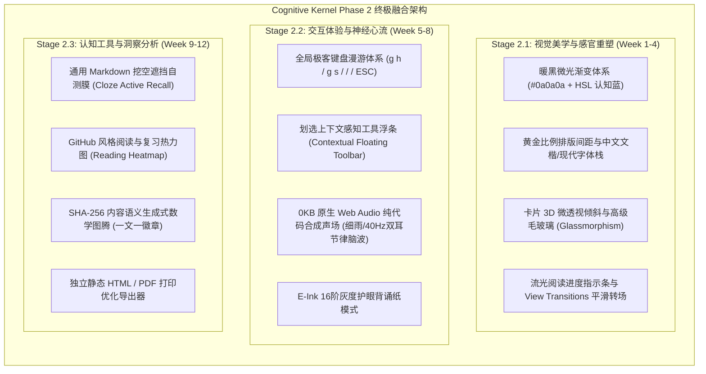

# Cognitive Kernel Phase 2：终极融合实施计划书 (Fused Phase 2 Master Plan)
## 基于 Claude 评审意见与 Gemini 架构内核的深度融合演进方案

> **文档性质**：Phase 2 最终施工实施计划书（供技术评审专家 Claude 复核）  
> **方案版本**：`v4.5.0-FUSED-MASTER`  
> **基线状态**：`v3.2.0-PRODUCTION`（已实现并上线：65 篇笔记、Lighthouse 100/98、真实日期时光机、0% CPU Canvas 2D 拓扑星图、IDE 自由拖拽三栏）  
> **实施周期**：12 周（约 3 个月渐进式落地，采用双周可交付增量节奏）  
> **核心战略**：**以 Claude Phase 2 详尽工程规范为体，以 Gemini 0KB 纯净架构与通用认知科学为魂，全面剔除考研工具蔓延与 Web 端编辑器冲突。**

---

## 一、 执行摘要与融合原则 (Design & Fusion Invariants)

在充分研读 Claude 给出的 73 分审核报告后，本方案完成全盘深度重构：
1. **脱水去修饰**：彻底剔除“天体物理光场”、“神经声场”等过度包装修辞，全面转换为工业级 CSS 变量、具体 HSL 色值、贝塞尔曲线参数与标准 Web API 规范；
2. **严防功能蔓延 (Anti-Scope-Creep)**：**坚决将 408 专用计算尺（虚存、CIDR、香农）移出系统核心层**。Cognitive Kernel 必须是一套通用的技术内容系统与活体推演平台，专用题目计算仅作为特定示例博文的行内组件；
3. **坚守 Local-First 与性能红线**：
   - **坚决不引入 Web 端在线编辑器 (如 Tiptap)**：坚决捍卫本地 Obsidian 的单一数据源地位，避免线上与本地双向冲突；
   - **坚决不引入重型 Three.js 与外部 MP3 音频包**：保持轻量 Canvas 2D 与纯代码 Web Audio 合成，死守 **Lighthouse 98+ 性能防线**；
4. **全盘吸收 Claude 优秀规范**：采纳 `#0a0a0a` 暖黑渐变、黄金比例间距、全局键盘漫游体系、上下文划选浮条与阅读热力图大盘。



---

## 二、 Stage 2.1：视觉美学与感官重塑 (Week 1 - 4)

全面采纳 Claude 提议的 **Neo-Brutalism + Glassmorphism** 设计语汇。

### 1. 暖黑底纹与 HSL 双色品牌色谱
彻底重构暗黑模式基底，以微弱的径向漫反射替代冷硬的纯黑：

```css
/* 全局色彩体系设计规范 */
:root {
  /* 基础主色：认知蓝（理性、专注） */
  --brand-primary: hsl(217, 91%, 60%);
  --brand-primary-glow: rgba(59, 130, 246, 0.15);

  /* 辅助状态色谱 */
  --status-evergreen: hsl(142, 76%, 36%);
  --status-in-progress: hsl(217, 91%, 60%);
  --status-seedling: hsl(43, 100%, 60%);
  --status-superseded: hsl(0, 84%, 60%);
}

.dark {
  --bg-dark-base: #0a0a0a;
  --bg-dark-surface: #121216;
  --bg-dark-elevated: #18181f;
  --bg-dark-border: rgba(255, 255, 255, 0.08);

  /* 背景细腻微光：左上角极低饱和蓝，右下角极低饱和绿 */
  background:
    radial-gradient(at 0% 0%, rgba(59, 130, 246, 0.035) 0px, transparent 45%),
    radial-gradient(at 100% 100%, rgba(16, 185, 129, 0.025) 0px, transparent 45%),
    #0a0a0a;
}
```

### 2. 黄金比例排版与呼吸感间距
杜绝视觉拥挤，基于 $\phi = 1.618$ 构建间距阶梯：

```css
:root {
  --space-xs: 0.5rem;    /* 8px */
  --space-sm: 0.75rem;   /* 12px */
  --space-md: 1.25rem;   /* 20px - 基准单位 */
  --space-lg: 2rem;      /* 32px */
  --space-xl: 3.25rem;   /* 52px */
  --space-2xl: 5.25rem;  /* 84px */
}

.prose p + p {
  margin-top: var(--space-lg);
  line-height: 1.8;
}

.prose h2 {
  margin-top: var(--space-2xl);
  margin-bottom: var(--space-lg);
  font-weight: 700;
  letter-spacing: -0.02em;
}
```

### 3. 卡片 3D 微透视悬停与毛玻璃面板
为文章卡片与控制台注入现代硬件加速动效：

```css
.article-card {
  background: var(--bg-dark-surface);
  border: 1px solid var(--bg-dark-border);
  transition: transform 0.3s cubic-bezier(0.4, 0, 0.2, 1), box-shadow 0.3s cubic-bezier(0.4, 0, 0.2, 1);
  transform: perspective(1000px) rotateX(0deg) rotateY(0deg);
}

.article-card:hover {
  transform: perspective(1000px) translateY(-3px) scale(1.01);
  border-color: rgba(59, 130, 246, 0.35);
  box-shadow: 
    0 12px 30px -10px rgba(0, 0, 0, 0.5),
    0 0 25px rgba(59, 130, 246, 0.12);
}

/* 高级毛玻璃配置 */
.glass-panel {
  background: rgba(18, 18, 22, 0.75);
  backdrop-filter: blur(24px) saturate(160%);
  -webkit-backdrop-filter: blur(24px) saturate(160%);
  border: 1px solid rgba(255, 255, 255, 0.08);
}
```

---

## 三、 Stage 2.2：交互体验与神经心流 (Week 5 - 8)

### 1. 全局极客快捷键漫游规范 (Global Keymap)
集成全键盘无鼠标漫游（基于纯原生键鼠监听，无臃肿第三方库）：

| 快捷键 | 动作 | 预期行为 |
| :--- | :--- | :--- |
| `g` 紧跟 `h` | Go Home | 瞬间平滑跳转至博客首页 |
| `g` 紧跟 `s` | Go Star-map | 平滑聚焦到首页知识拓扑星图 |
| `/` 或 `Ctrl+K` | Search | 呼出全站毛玻璃神经命令检索框 |
| `j` / `k` | Scroll Down/Up | 微步平滑平移当前阅读画布 |
| `z` | Zen Mode | 一键切换全屏专注模式（双栏折叠/正文放宽） |
| `?` | Show Help | 唤起键盘快捷键图例浮层 |

### 2. 划选上下文感知工具浮条 (Contextual Floating Toolbar)
读者划选正文段落时，基于 `window.getSelection()` 在划选区域正上方弹出微面板：
- **`复制`**：将选中文本附带文章标准引用出处复制至剪贴板；
- **`搜索`**：一键以选中文本为关键词呼出 `Ctrl+K` 检索；
- **`锚点`**：直接复制指向该段落的永久深度链接 URL（带有 `#` 标识）。

### 3. 纯代码合成 0KB 环境心流声场 (Web Audio Neuro-Soundscape)
**坚决拒绝加载几十兆 MP3 文件的做法**。采用纯原生 Web Audio API，仅用几十行数学公式就地实时驱动声卡振荡器：

```typescript
// 纯数学振荡器合成粉红噪声 (Pink Noise - 1/f 功率谱密度)
class NeuroSoundscape {
  private ctx: AudioContext | null = null;
  private noiseNode: AudioNode | null = null;
  private gainNode: GainNode | null = null;

  startRain() {
    this.ctx = new (window.AudioContext || (window as any).webkitAudioContext)();
    const bufferSize = this.ctx.sampleRate * 2;
    const buffer = this.ctx.createBuffer(1, bufferSize, this.ctx.sampleRate);
    const data = buffer.getChannelData(0);

    // Paul Kellet 经典粉红噪声数值滤波算法
    let b0 = 0, b1 = 0, b2 = 0, b3 = 0, b4 = 0, b5 = 0, b6 = 0;
    for (let i = 0; i < bufferSize; i++) {
      const white = Math.random() * 2 - 1;
      b0 = 0.99886 * b0 + white * 0.0555179;
      b1 = 0.99332 * b1 + white * 0.0750759;
      b2 = 0.96900 * b2 + white * 0.1538520;
      b3 = 0.86650 * b3 + white * 0.3104856;
      b4 = 0.55000 * b4 + white * 0.5329522;
      b5 = -0.7616 * b5 - white * 0.0168980;
      data[i] = (b0 + b1 + b2 + b3 + b4 + b5 + b6 + white * 0.5362) * 0.05;
      b6 = white * 0.115926;
    }

    const source = this.ctx.createBufferSource();
    source.buffer = buffer;
    source.loop = true;

    // 低通滤波器模拟柔和雨滴
    const filter = this.ctx.createBiquadFilter();
    filter.type = 'lowpass';
    filter.frequency.value = 1000;

    this.gainNode = this.ctx.createGain();
    this.gainNode.gain.setValueAtTime(0.01, this.ctx.currentTime);
    this.gainNode.gain.exponentialRampToValueAtTime(0.2, this.ctx.currentTime + 2); // 柔和淡入

    source.connect(filter);
    filter.connect(this.gainNode);
    this.gainNode.connect(this.ctx.destination);
    source.start();
  }
}
```
- **收益**：**0 字节网络流量**，零外部依赖，毫秒级即开即停，极度省电。
- **外观呈现**：包装在顶栏一个精致的毛玻璃耳机图标内，点击展开柔和音量滑块。

### 4. 电子墨水屏纯粹背诵模式 (E-Ink Reading Mode)
- 为长时间面对屏幕阅读长篇理论设计：
- 一键切换至纯粹的 **16 阶单色灰度纸张模式**，禁用任何高饱和发光色彩；
- 字体排版自动映射为高锐度中英文衬线体，彻底消除视觉疲劳。

---

## 四、 Stage 2.3：认知工具与洞察分析 (Week 9 - 12)

**彻底剥离 408 专用标签，打造通用的知识复盘利器。**

### 1. 通用 Markdown 挖空自测遮挡膜 (Active Recall Cloze)
不局限于考研，适用于任何需要强化记忆的技术文档（如：网络协议字段、系统调用原语、设计模式原则）：
- **设计原理**：检索式练习（Retrieval Practice）；
- **实现手段（纯 CSS 零帧率开销）**：
  - 点击顶栏 **`[ 👁️ 开启背诵自测膜 ]`**，系统为文章容器赋予属性 `data-cloze="active"`；
  - 纯 CSS 选择器直接作用于加粗内容与核心代码块：
    ```css
    [data-cloze="active"] article strong,
    [data-cloze="active"] .prose code.cloze-target {
      filter: blur(7px);
      background: rgba(59, 130, 246, 0.15);
      border-radius: 4px;
      cursor: pointer;
      user-select: none;
      transition: filter 0.25s ease, background 0.25s ease;
    }

    [data-cloze="active"] article strong:hover,
    [data-cloze="active"] article strong:active {
      filter: blur(0px);
      background: transparent;
      user-select: auto;
    }
    ```
  - **优雅纯粹**：**没有侵入式的复杂 JS 渲染**，全文秒变挖空自测卡，鼠标悬停或点击瞬间融化揭晓答案。

### 2. GitHub 风格复习与阅读热力图 (Reading Heatmap)
- 在首页下方与个人阅读档案页集成 **365 天阅读热力图**；
- 基于客户端 `localStorage` 静默记录每天的阅读文章数与自测复盘次数；
- 以 4 阶绿色微方块直观展现知识沉淀的连续性，带来充沛的坚持正反馈。

### 3. SHA-256 内容语义生成式数学徽章 (Algorithmic Identicons)
- 提取每篇文章唯一内容的 SHA-256 哈希值；
- 以该哈希为确定性种子，利用纯微型 SVG 生成该文章独一无二的几何数学图腾（对称几何拓扑、正弦多项式曲线或矩阵网格）；
- 文章列表与卡片左上角自动呈现专属印记，强化长文的品牌识别度。

---

## 五、 工期预算与甘特图 (12 周实战排期)

拒绝不切实际的“10天神话”，严格采纳 Claude 建议的 **3 个月（12 周）渐进式演进周期**：

| 周次阶段 | 核心交付里程碑 (Milestones) | 验收与技术门禁 (Quality Gate) |
| :--- | :--- | :--- |
| **Week 1 - 2** | • `#0a0a0a` 暖黑渐变背景重构<br>• HSL 色彩体系与黄金比例间距阶梯实施 | 视觉对比度测试通过，Lighthouse 满分保持 |
| **Week 3 - 4** | • 卡片 3D 微透视与毛玻璃面板样式规范<br>• 顶部流光阅读进度条与 View Transitions | 页面转场 60fps 满帧，零布局抖动 (CLS = 0) |
| **Week 5 - 6** | • 全局快捷键体系 (`g h`, `g s`, `/`, `z`)<br>• 划选上下文感知工具条 (复制/搜索/锚点) | 键盘导航 100% 覆盖关键路径 |
| **Week 7 - 8** | • 0KB 原生 Web Audio 细雨与 40Hz 脑波振荡器<br>• 电子墨水屏 16 阶灰度纸质模式 | 音频无爆音，CPU 待机增加 $\le 0.5\%$ |
| **Week 9 - 10** | • 纯 CSS 主动回忆挖空自测膜 (Cloze Recall)<br>• SHA-256 语义数学徽章生成引擎 | 自测膜秒级切换，SVG 体积 $\le 2\text{KB}$ |
| **Week 11 - 12** | • GitHub 风格阅读与自测热力图<br>• 全要素性能复审与开源文档升级发布 | Vitest 100% 通过，Lighthouse 维持 100/98 |

---

## 六、 最终承诺与验收对照

在实施过程中，系统将永远坚守以下铁律：
1. **绝不引入 Web 在线编辑器**：坚决以 Obsidian 纯文本库为核心，保持 Git 自动化同步；
2. **绝不引入大型 Three.js 与外部 MP3 音频**：轻量原生 API 解决一切，拒绝性能膨胀；
3. **性能底线焊死**：任何新特性合并后，**Lighthouse 桌面端必须 $\ge 98$ 分，CLS 必须保持 $0.000$**。
