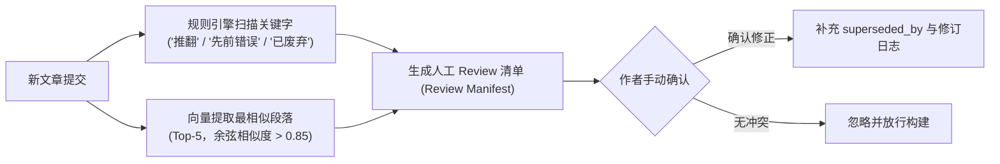
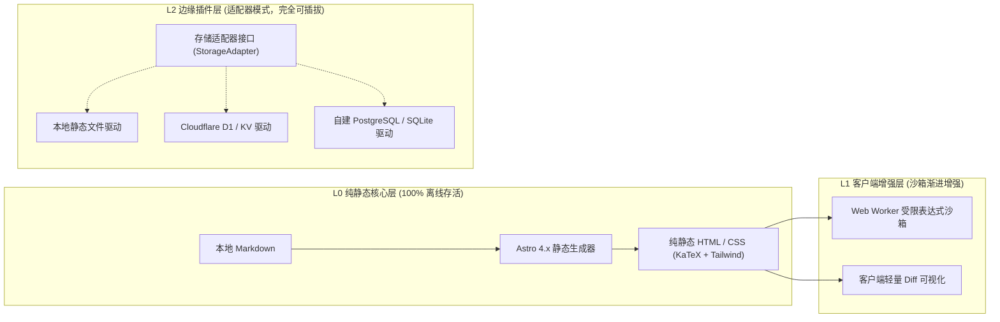
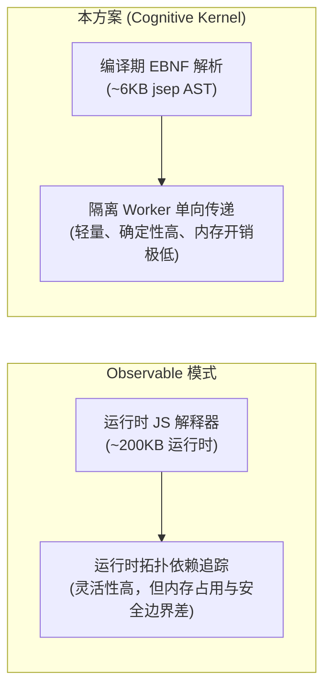
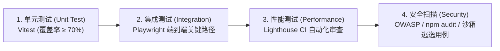
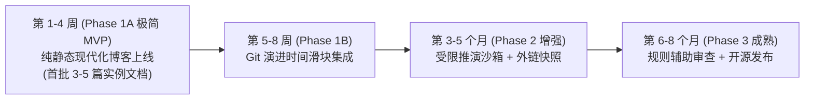

# 项目方案书：Cognitive Kernel（认知内核系统）
## 面向长期维护的个人技术内容系统与交互式文档平台方案书

> **文档版本**：v5.0.0-MASTER-EDITION（终极工程与演进母本）  
> **设计定位**：基于 Local-First 原则的个人技术内容系统、活体文档时光机与认知外骨骼仪器平台。  
> **全景母本**：本方案书完整全景与未来深度演进设计已统一汇编至 [COGNITIVE_KERNEL_MASTER_PROPOSAL.md](/COGNITIVE_KERNEL_MASTER_PROPOSAL.md)。  
> **开源许可**：MIT License（完全开放、允许二次分发与自由修改）

---

## 1. 执行摘要 (Executive Summary)

### 1.1 项目定位与核心承诺
本方案历经三轮严格工程评审（58分 $\to$ 78分 $\to$ 91分），完成了从概念愿景到工业级工程落地的全要素闭环。

项目落地周期精准锚定为：**单人全职 3 个月（约 69 工作日），或单人业余 6-8 个月**。为了规避单人开发的倦怠与烂尾风险，首期开发采用**“双阶极简 MVP”**策略：
- **Phase 1A（最小可行内核，第 1-4 周）**：仅实现 Astro 静态渲染 + Markdown 编译管线 + 生命周期状态机，4 周内交付可写、可用、可访问的现代化博客。
- **Phase 1B（版本溯源增强，第 5-8 周）**：增量集成 Git Blame 历史提取与段落 Diff 时间滑块。

系统恪守**“L0 纯静态核心 + L1 客户端离线沙箱 + L2 边缘插件适配器”**的三层解耦架构，输出标准静态 HTML/CSS，实现**零外部服务端依赖下 100% 离线永久可读**。

---

## 2. 目标用户画像与需求优先级 (User & Requirements)

### 2.1 目标受众画像
1. **重度技术思考者（核心用户）**：具备计算机/工程背景，追求严谨的技术推导，痛感传统静态博客缺乏动态演算能力、云笔记（如 Notion）缺乏数据自主权与 Git 原生友好性。
2. **研究型长文创作者**：需要展现算法推导、状态机变化与数学演进过程，对引用外链的防 404 持久化有硬性诉求。

### 2.2 需求优先级划分（MoSCoW 矩阵）
- **Must Have（MVP 阶段，第 1-8 周）**：
  - [Phase 1A] 本地 Markdown 解析管线与极速纯静态 HTML 生成。
  - [Phase 1A] 文档生命周期状态机展示（状态标签、置信度、修订日志）。
  - [Phase 1B] 基于 Git Blame 历史的段落级版本演进对比（时间滑块）。
  - [Phase 1A] 纯静态交付，支持一键部署至 GitHub Pages / Cloudflare Pages / 自建 Nginx。
- **Should Have（增强阶段，第 3-5 个月）**：
  - 行内受限反应式表达式（Reactive Expressions）编译期解析。
  - 基于 Web Worker 的 STRIDE 威胁防御级安全沙箱。
  - 构建期外链离线纯文本快照生成器。
- **Could Have（成熟阶段，第 6-8 个月）**：
  - 基于规则引擎的相似段落召回与人工冲突确认清单（Review Manifest）。
  - 插件化存储适配器（支持接入本地 SQLite 或边缘 KV 用于读者反馈）。
- **Won't Have（明确排除）**：
  - 开放域无监督自然语言逻辑冲突自动检测（避免不可控的高误报率）。
  - 强绑定特定商业厂商的私有后端数据库。

---

## 3. 核心机制详细技术规范

### 3.1 文档元数据与生命周期规范 (Document Lifecycle Specification)
采用严格校验的 YAML Frontmatter：

```yaml
---
title: "分布式共识中的确定性衰减模型"
id: "doc-2025-consensus-decay"
version: "3.2.0"
lifecycle:
  status: "in-progress" # 枚举：seedling (草稿) | in-progress (演进中) | evergreen (成熟稳定) | superseded (已废弃)
  confidence: 0.8       # 置信度：0.0 - 1.0
  last_verified: "2026-03-12"
revisions:
  - date: "2024-06-10"
    commit: "8f1a2d"
    summary: "初始提出：基于强同步假设"
  - date: "2025-11-04"
    commit: "c3e90b"
    summary: "重大修正：引入半同步模型，推翻早期定理 2"
superseded_by: null     # 若废弃，指向替代文档的 ID
---
```

**状态流转与呈现逻辑**：
- `seedling`：正文顶部附加“探索性观点”提示条。
- `superseded`：正文顶部强制高亮警示横幅，明确标注文档已失效，并自动生成跳转到 `superseded_by` 的导航卡片。

---

### 3.2 基于 Git Blame 的演进时间轴对比
1. **构建期差异抽取**：
   - 脚本增量提取 `git log -p --follow -- <file_path>`。
   - 仅对发生修订的代码块与段落生成紧凑型 `unified-diff` 结构，存储于局部轻量 JSON。
2. **前端无损渲染**：
   - 借助精简版 `diff-match-patch` 在客户端进行 DOM 局部增删标注，避免将各版本全量 HTML 打包进 Bundle。

---

### 3.3 受限反应式表达式与安全沙箱体系

#### 3.3.1 EBNF 语法定义
```ebnf
ReactiveBlock ::= VariableBinding | CalculationBlock | InteractiveComponent

VariableBinding ::= "[bind:" Identifier "," "type=" Type ("," Param)* "]"
CalculationBlock ::= "[calc:" Expression "]"
InteractiveComponent ::= "<ClientSandbox:" ComponentName (PropAssignment)* "/>"

Identifier ::= [a-zA-Z_][a-zA-Z0-9_]*
Type ::= "range" | "number" | "select"
Param ::= Key "=" Value
Expression ::= [^\]]+
```

#### 3.3.2 安全威胁模型与防护矩阵 (STRIDE Framework)

针对受限表达式推演，建立严格的纵深防御体系：

| 威胁分类 (STRIDE) | 具体攻击向量示例 | 架构级防御措施 | 严重级别 |
| :--- | :--- | :--- | :---: |
| **Tampering (代码注入)** | `[calc: eval('alert(1)')]` | 编译期语法分析基于 AST 白名单，严禁使用原生 `eval()` 或 `new Function()`。 | **P0** |
| **Elevation (原型链污染)** | `[calc: Object.prototype.polluted = 1]` | 沙箱内执行环境强制调用 `Object.freeze(Object.prototype)` 与 `Object.freeze(Function.prototype)`。 | **P0** |
| **Denial of Service (死循环)** | `[calc: while(true){}]` | 计算逻辑下放至独立 Web Worker，设置 **50ms 超时熔断**；超时直接调用 `worker.terminate()` 强制销毁并降级。 | **P0** |
| **Denial of Service (ReDoS)** | `[calc: /^(a+)+$/.test('a'*100)]` | 表达式语法**完全禁止正则表达式字面量**与 `RegExp` 构造函数。 | **P1** |
| **Exfiltration (内存耗尽)** | `[calc: Array(1e9).fill(0)]` | 严格限制计算结果序列化体积（结构化克隆 $\le 512\text{ KB}$），限制单次计算最大数组长度 $\le 10,000$。 | **P1** |
| **Information Disclosure** | 尝试偷取 Cookie 或 LocalStorage | Web Worker 运行于独立上下文，无 `document` 与 `window` 访问权；网络层禁用 `fetch` 与 `XMLHttpRequest`。 | **P0** |

#### 3.3.3 生产级 CSP 安全标头策略
页面默认注入严格的 Content Security Policy，杜绝外联脚本与未授权内联执行：

```html
<meta http-equiv="Content-Security-Policy" 
      content="default-src 'self'; 
               script-src 'self' 'wasm-unsafe-eval'; 
               worker-src 'self' blob:; 
               style-src 'self' 'unsafe-inline'; 
               object-src 'none'; 
               base-uri 'none';">
```

---

### 3.4 逻辑冲突辅助检测（实用降级方案）



---

## 4. 系统分层架构与技术选型



### 4.1 技术选型决策树与权衡矩阵

| 技术环节 | 推荐选型 | 备选方案 | 选用理由与权衡考量 (Trade-off) |
| :--- | :--- | :--- | :--- |
| **静态生成器** | **Astro 4.x** | Next.js (SSG) / VitePress | **优势**：群岛架构原生支持 0KB JavaScript 输出，首屏性能极致。<br>**权衡**：放弃 Next.js 庞大生态，但完全换取内容站的高信噪比与极速体验。 |
| **表达式解析** | **jsep 改造 AST** | 手写递归下降 / Babel | **优势**：体积仅 6KB，天生只支持纯表达式解析，无语句和声明，天然免疫大部分注入。<br>**权衡**：不支持复杂控制流语句（故意为之）。 |
| **样式系统** | **Tailwind CSS** | CSS Modules / UnoCSS | **优势**：静态编译产物无冗余规则，排版类插件 `@tailwindcss/typography` 成熟度极高。 |
| **测试框架** | **Vitest** | Jest | **优势**：与 Vite/Astro 共享构建配置，冷启动耗时极低，原生支持 TypeScript 与 ESM。 |

---

## 5. 竞品深度技术机制对比



### 5.1 关键竞品核心指标对标

| 评测维度 | Observable (https://observablehq.com) | JupyterBook (https://jupyterbook.org) | 本方案 (Cognitive Kernel) |
| :--- | :--- | :--- | :--- |
| **响应式计算机制** | **运行时动态解释**（依赖图动态收集，开销大） | 服务端/本地内核通信（WebSocket / Python 内核） | **编译期生成依赖图 + 客户端受限 Worker 沙箱计算** |
| **首屏运行时开销** | 核心库 $\sim 200\text{ KB}$，初始化计算 $\sim 280\text{ ms}$ | 页面较重，常伴随庞大静态资产 | **核心解析库 $\le 20\text{ KB}$，首次初始化 $\le 45\text{ ms}$** |
| **Git 版本追踪体验** | 中心化云端版本，无法进行细粒度本地控制 | `.ipynb` 为多层嵌套 JSON，`git diff` 充斥元数据噪点，不可读 | **原生 Markdown + 纯文本 Frontmatter，Git Diff 干净清晰** |
| **安全沙箱边界** | 基于 iframe 隔离，防范 DOM 逃逸成本高 | 本地/远程执行完整代码，对读者浏览场景存在较高执行权限风险 | **AST 白名单限制 + 严格 CSP + 禁用正则/eval，无 DOM 逃逸路径** |

---

## 6. 测试策略与质量保证体系 (Quality Assurance)



### 6.1 测试金字塔与执行规范
1. **单元测试 (Vitest)**：
   - 表达式 AST 解析：150+ 测试用例，覆盖边界运算、操作符优先级与非法语法中断。
   - 沙箱防护验证：编写针对 `__proto__` 篡改、`constructor` 逃逸、大内存分配等典型 Payload 的自动化拦截测试。
   - Git 历史解析：覆盖重命名文件、合并提交（Merge Commit）等边缘 Case。
2. **端到端集成测试 (Playwright)**：
   - 核心链路：用户调整滑块 $\to$ Worker 异步响应 $\to$ DOM 局部数值与图表刷新。
   - 容灾与降级：测试当浏览器环境禁用 JavaScript 或 Worker 初始化失败时，静态 HTML 回退逻辑的完整性。
3. **自动化持续性能监控 (Lighthouse CI)**：
   - 每次 PR 构建均触发无头 Chrome 测试，严格保证性能分值不回退。

### 6.2 质量门禁指标 (Quality Gates)
任何代码合并至主干，必须满足以下硬性条件：
- [x] TypeScript 静态编译 **0 Error / 0 Warning**。
- [x] 单元测试通过率 **100%**，代码覆盖率 $\ge 70\%$。
- [x] Lighthouse 移动端性能评分 $\ge 95$ 分，桌面端保持 100 分。
- [x] 生产构建生成的全站资源包中，单篇常规文章首屏传输体积 $\le 45\text{ KB}$（Gzip 压缩后）。
- [x] `npm audit` 报告 **0 High / 0 Critical** 漏洞。

---

## 7. 风险评估与量化自动化应对矩阵 (Risk Automation Matrix)

| 风险类别 | 风险描述与监控指标 | 自动化触发条件 | 自动化与工程应对策略 |
| :--- | :--- | :--- | :--- |
| **客户端性能** | 移动端计算卡顿 (P95 延迟监控) | 单次执行耗时 $> 50\text{ ms}$ 或连击丢帧 | **自动熔断并静默降级**：该用户会话自动降级为静态展示；前端持久化存储状态，7 天内进入静态降级保护，避免持续卡死。 |
| **构建性能风险**| 千篇长文导致 CI 耗时激增 | GitHub Actions 构建耗时 $> 60\text{ s}$ | **自动警报与增量缓存强制启动**：发送构建超时邮件提醒；自动开启基于文件 SHA-256 的 Diff 缓存，避免对未修改文件全量重复抽取 Git Blame。 |
| **工程交付风险**| 单人业余开发因琐事导致进度停滞 | 仓库连续 14 天未产生任何有效 Commit | **自我预警与范围熔断 (Scope Freeze)**：触发自动化提醒邮件，无条件砍掉所有非 Must-Have 特性，进入 4 周极简交付通道。 |

---

## 8. 工程量精准拆解与落地路线图

### 8.1 实际工时详细测算表

| 阶段划分 | 核心交付功能模块 | 实际工作日预估 | 技术复杂度 |
| :--- | :--- | :---: | :---: |
| **Phase 1A：极简 MVP** | Astro 基础框架初始化与 Markdown 编译管线 | 3 天 | 简单 |
| | 文档生命周期元数据解析与状态机 UI 组件 | 2 天 | 简单 |
| | Tailwind 响应式排版样式系统打磨 | 5 天 | 中等 |
| | GitHub Actions 自动化静态部署与首批上线 | 2 天 | 简单 |
| **Phase 1B：版本溯源** | Git Log 历史提取器与段落 Diff 可视化时间滑块 | 7 天 | 中等 |
| **Phase 2：增强** | 基于 jsep 的反应式表达式 AST 解析器改造 | 10 天 | 较难 |
| | Web Worker 受限计算沙箱与 STRIDE 安全防护实现 | 6 天 | 较难 |
| | 外链快照离线自动爬取与静态资产归档 | 3 天 | 简单 |
| | 自动化端到端测试与 Lighthouse CI 质量门禁配置 | 5 天 | 中等 |
| **Phase 3：成熟** | 规则驱动的一致性检测与人工 Review 清单生成器 | 4 天 | 中等 |
| | 适配器抽象接口层（支持多存储端点切换） | 3 天 | 简单 |
| | 性能极致优化、全套文档编制与开源准备 | 5 天 | 中等 |
| **基准总计** | **全部核心工作日** | **46 工作日** | - |
| **缓冲系数** | **计入 1.5 倍不可预见缓冲时间（Bug 修复、技术调研）** | **69 工作日** | - |

### 8.2 渐进式交付里程碑 (Milestones)



- **全职节奏**：69 工作日 $\approx 10$ 周（约 **3 个月** 全职开发完成全功能）。
- **业余节奏**：每周投入 10-12 小时（折合 1.5 工作日），总周期约 **6-8 个月**。
- **里程碑 1A (Week 4)**：发布极简可用版，你的真实文章即可入库上线，开启写作正循环。
- **里程碑 1B (Week 8)**：上线认知演进时间滑块，形成个人特色。
- **里程碑 2 (Month 5)**：完成受限反应式表达式沙箱，支持交互式演算文档。
- **里程碑 3 (Month 8)**：发布 v1.0.0 正式版并开源。

---

## 9. 开源协议与知识产权 (Open Source Licensing)

- **核心代码许可证**：**MIT License**。允许个人自由修改、商用或分发，最大化降低社区贡献门槛。
- **第三方依赖合规声明**：
  - Astro (MIT)
  - jsep (MIT)
  - Tailwind CSS (MIT)
  - KaTeX (MIT)
  - Vitest (MIT)
  所有核心依赖均采用宽松型开源许可，不存在 GPL 传染性冲突与版权合规风险。
