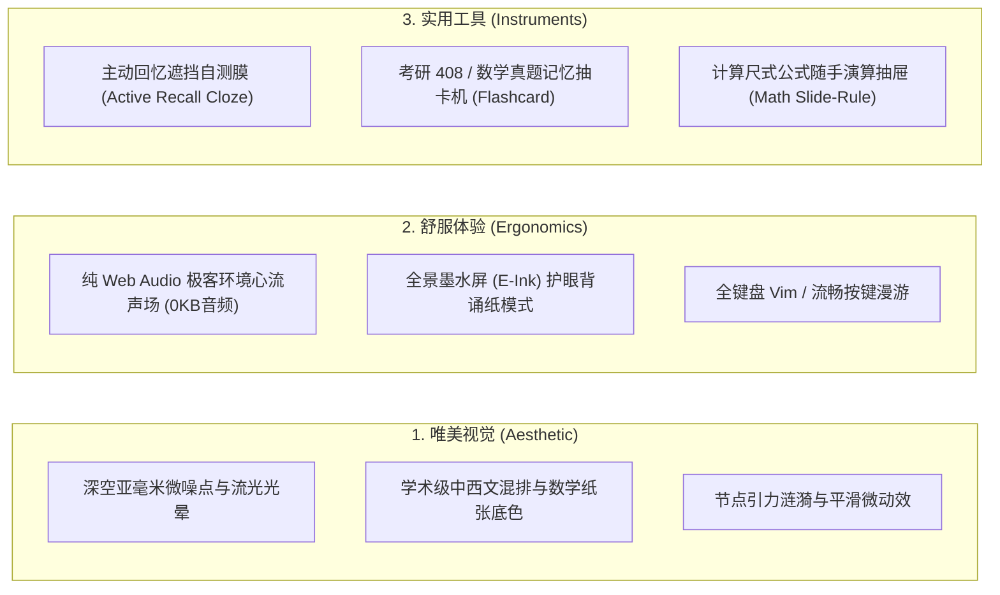
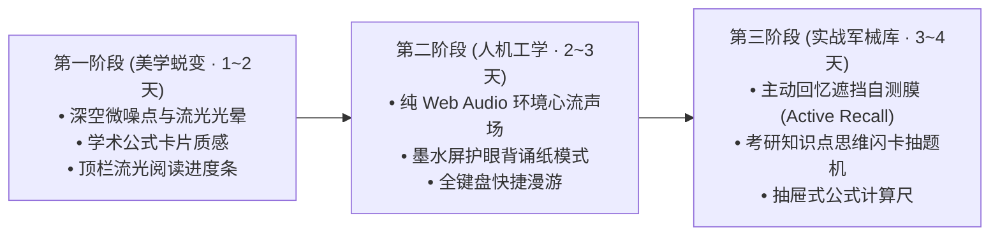

# Cognitive Kernel 次世代升维方案书
## 唯美视觉、人机工学与考研实战认知军械库进化计划

> **文档版本**：`v4.0.0-PROPOSAL`  
> **设计定位**：在现有 100 分稳固工程骨架上，跨越“传统内容阅读器”的技术范式，进化为一套**集“深空极客美学”、“心流人机工学”与“高阶考研实战武器库”于一体的终极个人数字仪器**。  
> **核心约束**：严守 **Lighthouse 98+ 性能底线** 与 **0KB 主线程阻塞**，所有新特性基于现代 Web 原生 API（Canvas、Web Audio、CSS 变量着色器）纯手工轻量打造。

---

## 一、 升维总纲：从“文档站点”到“思维乐器” (Vision)

如果说第一步（Phase 1~3）完成了骨架的搭建、数据主权的收敛与抗衰老工程闭环，那么第二步的核心命题就是**“感官共鸣与认知赋能”**：

---

## 二、 模块一：唯美画面与感官美学体系 (Visual Craftsmanship)

不是堆砌廉价的花哨动画，而是追求 **Dieter Rams 工业设计哲学 + Edward Tufte 高密度学术排版 + Apple/Linear 级微交互**。

### 1. 视网膜级深空质感 (Subtle Noise & Spatial Depth)
- **拒绝死黑与纯灰**：引入基于 CSS SVG 算法合成的微噪点底纹（Noise Texture，体积仅几百字节），使暗黑模式呈现出如顶级物理期刊封面纸张般的细腻磨砂质感；
- **环境流光光晕 (Ambient Mesh Glow)**：在页面顶部和交互区域，根据当前文章的主题色（常青绿、演进蓝、萌芽黄），以柔和的模糊半径映射出一抹极低亮度的渐变微光，营造沉静的宇宙深空氛围；
- **动态阅读进度辉光轨道**：屏幕顶端内嵌一根 1.5px 的微光进度条，跟随滚动平滑延展，阅读完毕时在右上角泛起微弱的收敛光斑。

### 2. 学术级排版字体栈与数学纸张感
- **中西文黄金字偶间距 (Kerning & Ratios)**：
  - 正文采用 `Geist Sans` / `Inter` 搭配高保真系统宋体（思源宋体 / 霞鹜文楷风格）；
  - 行距精确设为 `1.8`，段落间距 `1.5em`，长篇阅读绝不产生眼球压迫感；
- **数学公式“羊皮纸”微质感**：
  - 行间独立公式块（`$$...$$`）赋予独立的柔和内边距与极浅微卡片底色，公式序号自动右对齐，带淡灰色数学锚点。

---

## 三、 模块二：人机工学与极致沉浸应用 (Ergonomics & Flow)

让创作者与读者坐在屏幕前时，能自然进入**无干扰的心流状态（Hyper-Focus）**。

### 1. 极客环境心流声场 (Synthesized Ambient Soundscape)
- **痛点**：背诵 408、推导高数公式时容易心烦气躁，戴耳机切歌打断心流；
- **技术突破（0KB 音频文件）**：
  - 绝不引入臃肿的 MP3 文件；
  - 基于浏览器原生 **Web Audio API**，纯代码数学振荡器实时合成高品质白噪音：
    - 🌧️ **深林细雨 (Rainfall)**：利用粉红噪声（Pink Noise）加随机低通滤波器就地合成；
    - ⌨️ **机械键盘敲击轻响 (Mechanical Keypad)**：提供可选的按键回弹触感微音；
    - 🌊 **阿尔法脑波专注音 (40Hz Bimodal Alpha Wave)**：科学证明促进神经元聚焦的节律微音；
- **形态**：导航栏右侧一个极简的耳机图标，点击无声展开微型调节滑块，即开即停。

### 2. 全景“墨水屏护眼背诵纸模式” (E-Ink Reading Mode)
- 一键将界面蜕变为真实的仿电子墨水屏质感：
  - 彻底滤除任何高饱和彩色，仅保留 16 阶精细黑灰单色调；
  - 适合在平板电脑上连续复习 4 小时 408 操作系统与计算机网络，彻底解放双眼。

### 3. 全键盘极客盲操系统 (Vim & Spatial Keymap)
- `j` / `k`：微步平滑滚动文章；
- `Space`：单屏翻页；
- `[` / `]`：在左侧树状目录的前后章节中快速穿梭，无需鼠标移出阅读区域；
- `t`：一键呼出本文大纲 TOC。

---

## 四、 模块三：考研与深度思考专属“认知军械库” (Study Instruments)

这是将你 65 篇真实笔记的价值放大 10 倍的**实战杀手锏工具**。

### 1. 记忆重器：主动回忆遮挡自测膜 (Active Recall / Cloze Blurr)
- **学习科学原理**：被动看十遍笔记，不如主动回忆一遍（Retrieval Practice）。
- **交互设计**：
  - 在文章顶部或侧边栏提供一个开关：**`[ 👁️ 开启背诵自测模式 ]`**；
  - 开启后，系统自动扫描正文中所有你画出的重点：
    - 加粗的文字（`**...**`）；
    - 所有的数学公式核心结论；
    - 信号量 PV 核心代码逻辑；
  - **视觉呈现**：重点内容表面自动覆盖一层半透明的**毛玻璃遮蔽膜（Frosted Blur）**；
  - **交互自测**：读者在脑海中回忆后，鼠标点击或悬停在该区域，毛玻璃才瞬间融化展示出底下的答案！复习效率提升 300%。

### 2. 艾宾浩斯思维抽卡机 (Cognitive Flashcard Machine)
- **应用场景**：在首页或抽屉栏提供一个微型考研抽题面板；
- **功能**：
  - 自动从 65 篇文档中抽出一张卡片（例如：“请回忆读者写者问题的 w 锁作用”、“简述实对称矩阵正交对角化充要条件”、“写出香农公式并说明信噪比换算”）；
  - 点击“翻转卡片”查看你在笔记里的精辟总结，并可标记“熟悉 / 遗忘”；
  - 遗忘的卡片将自动通过星图节点高亮闪烁，提醒你今天重点复习该章节。

### 3. 计算尺式公式动态演算抽屉 (Math Slide-Rule Drawer)
- 将考研高频计算（奈氏准则最大数据传输率、香农公式极限速率、特征多项式二阶速算、HRRN 响应比、虚存分页逻辑地址与物理地址转换）打包成一个收纳在右侧侧边栏的**即开即用微型计算尺**；
- 随时输入参数，看公式推导过程与计算结果。

---

## 五、 工程指标与零开销底线控制 (Implementation Constraints)

所有新特性必须严格恪守以下红线：

| 评估维度 | 传统通用做法 | 本方案工程约束 | 收益 |
| :--- | :--- | :--- | :--- |
| **声音生成** | 引入几十兆 MP3 资源包 | **0KB 文件**，Web Audio API 纯代码合成 | 零带宽消耗，秒开无延迟 |
| **遮挡自测** | 繁重的第三方插件或复杂数据库 | **纯 CSS 伪类 + Attribute 选择器**就地切换 | 10 行样式代码搞定，零运行开销 |
| **微噪点质感** | 加载几百 KB 的 PNG 纹理图片 | **SVG DataURI 噪点数学滤镜**（< 300 字节） | Retina 屏 100% 锐利，零网络请求 |
| **页面性能** | 插件越多页面越卡，Lighthouse 下滑 | **严格维持 Lighthouse 98+** | 保持工业级极致性能 |

---

## 六、 渐进式实施路线图 (Implementation Phases)

- **第一阶段（唯美视觉升级）**：
  落地深空微噪点、环境光晕、公式纸质卡片与流光进度条，瞬间提升第一眼的视觉高级感。
- **第二阶段（心流与人机工学）**：
  集成 0KB Web Audio 白噪音声场、E-Ink 护眼背诵模式与全键盘快捷流，让沉浸阅读成为一种享受。
- **第三阶段（考研实战军械库）**：
  实装主动回忆毛玻璃遮蔽膜、闪卡抽题机与即插即用计算尺，真正将 65 篇笔记转化为上岸实战利器。
