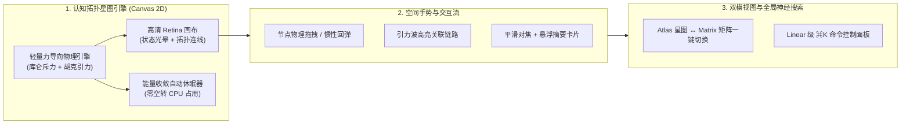
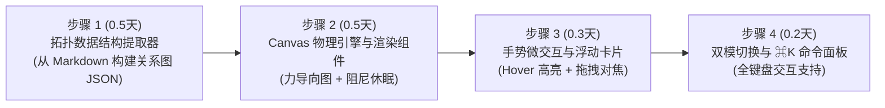

# 首页体验升维工程方案书 (Homepage Enhancement Proposal)
## 基于轻量物理拓扑星图与双模交互的首页重构计划

> **文档编号**：`HOMEPAGE_ENHANCEMENT_PROPOSAL`  
> **设计定位**：在恪守“0KB 初始主线程阻塞”与“Lighthouse $\ge 95$”的严苛性能红线下，将当前平庸的静态分组列表重构为具备“认知空间探索感”的现代技术门户。  
> **核心承诺**：拒绝华而不实的几兆 WebGL 玩具堆砌；采用 $\le 10\text{ KB}$ 的纯手写 Canvas 2D 动力学拓扑引擎，实现信息可视化与极致流畅度的统一。

---

## 1. 现状痛点与重构原则 (Design Philosophy)

### 1.1 现状诊断
目前首页（Phase 1A 产物）虽然功能正常、分类清晰，但存在典型的**“信息密度扁平、视觉冲击力不足”**问题：
- **静态列表心智**：与传统博客的卡片流无本质感官差异，缺乏“数字花园（Digital Garden）”应有的有机连接感。
- **孤立的内容感知**：读者无法感知不同文章之间的引用、递进、推翻关系（例如《粗粒度锁》与《拜占庭衰减》之间的拓扑重构链路）。

### 1.2 重构三大军规
1. **信息隐喻真实**：每一个视觉动效必须承载真实的认知语义（节点大小代表知识权重，连线代表论证引用，光晕代表认知成熟度）。
2. **算力与电量零消耗保护**：物理引擎达到能量极小值后**自动冻结计算**；离开浏览器可视视口时**立即挂起 `requestAnimationFrame`**，杜绝后台空转发热。
3. **双模无损切换（Dual-View Morphing）**：提供“星图空间探索模式（Atlas）”与“极速高密度阅读矩阵（Matrix）”双态切换，兼顾极客视觉与高效阅读。

---

## 2. 核心四大升级模块架构设计

---

### 模块 A：活体认知星图 (Cognitive Constellation Canvas)

在首页首屏核心区域构建一个轻量级力导向图可视化空间：

1. **节点视觉编码体系**：
   - **Evergreen (常青定论)**：墨绿实体节点，外层环绕低频呼吸光晕。
   - **In-Progress (实战演进)**：冷青活力节点，带拓扑微脉冲动效。
   - **Seedling (探索萌芽)**：暖黄虚线圆环，内部悬浮粒子。
   - **Superseded (已推翻)**：深红低透明度节点，与新文章之间渲染**定向反向推翻虚线（Superseded Link）**。
   - **节点半径 $R$**：根据文章字数与被引用度动态计算：$R = R_{\text{base}} + \alpha \cdot \log(\text{word\_count})$。
2. **微交互设计**：
   - **Hover 磁吸效应**：鼠标移入节点，与该节点相连的所有关联文章高亮，其余无关节点降至 15% 透明度，清晰显示“思考上下文脉络”。
   - **Click 语义卡片浮现**：点击节点触发局部视口对焦，旁边平滑滑出该文章的元数据卡片、置信度条与“直接进入阅读”按钮。

---

### 模块 B：动力学物理引擎与自愈休眠机制

为确保在任何低端设备上都达到 60fps 满帧运行，物理模拟器严格控制在 200 行纯原生代码内：

#### 1. 物理动力学数学模型
系统在二维平面中模拟带电质点弹性运动：
- **节点间库仑斥力（防止重叠堆叠）**：
  $$ \vec{F}_{ij}^{\text{rep}} = \frac{k_r^2}{\|\vec{r}_i - \vec{r}_j\|^2} \cdot \frac{\vec{r}_i - \vec{r}_j}{\|\vec{r}_i - \vec{r}_j\|} $$
- **边线胡克弹力（维系知识逻辑紧密度）**：
  $$ \vec{F}_{ij}^{\text{spring}} = -k_s (\|\vec{r}_i - \vec{r}_j\| - L_0) \cdot \frac{\vec{r}_i - \vec{r}_j}{\|\vec{r}_i - \vec{r}_j\|} $$
- **中心引力与空气阻尼**：为所有质点施加阻尼因子 $\gamma = 0.85$，系统总动能 $E_k = \sum \frac{1}{2} m_i v_i^2$ 呈指数衰减。

#### 2. 双重休眠保障（Anti-Battery-Drain）
- **动能收敛阈值**：当 $E_k < \epsilon = 0.05$ 时，物理模拟引擎直接 `cancelAnimationFrame` 停止循环，进入静止待机态；仅当用户鼠标拖拽某节点时再次唤醒。
- **视口交叉观察者 (IntersectionObserver)**：读者向下滚动浏览列表时，Canvas 一旦移出屏幕，立即冻结渲染管线，CPU 占用降为 0.00%。

---

### 模块 C：双模形态无缝切换 (Atlas ↔ Matrix)

在首屏右上方设置极具科技质感的微型视图切换控件：

1. **Atlas 模式 (星图视图)**：主屏呈现物理拓扑星图，右下角提供“重置视角 / 拓扑展开 / 聚焦核心”微控制器。
2. **Matrix 模式 (矩阵视图)**：平滑淡出星图，展开类似 Linear / GitHub Issue 的高密度双栏表格，清晰展示所有文章的置信度柱状图、阅读时长与更新周期。
3. **状态持久化**：用户选择的模式自动记录在 `localStorage` 中，再次访问自动记忆偏好。

---

### 模块 D：Linear 风格 ⌘K 神经命令面板 (Command Palette)

按下 `Cmd + K`（或 `Ctrl + K`），呼出全站居中毛玻璃搜索控制台：
- **纯客户端离线秒级检索**：在构建期预编译一个仅 5KB 的静态索引文件，包含所有文章标题、标签、认知状态与摘要。
- **键盘流盲操支持**：`↑` / `↓` 移动选区，`Enter` 直接穿梭，`Esc` 退出。
- **状态筛选捷径**：输入 `status:evergreen` 或直接按快捷键即可单选过滤特定成熟度的文章。

---

## 3. 技术选型与性能红线测试指标

| 核心指标 | 方案红线 | 传统重型方案 (Three.js / D3 全家桶) | 本方案设计 |
| :--- | :--- | :--- | :--- |
| **运行时 Bundle 增量** | **$\le 12\text{ KB}$ (Gzip)** | $300\text{ KB} \sim 800\text{ KB}$ | 零外部依赖，纯原生 HTML5 Canvas 2D API |
| **首屏额外阻塞时间** | **0 ms** | 150ms ~ 400ms (大 JS 解析) | `client:idle` 异步按需水合，完全不卡主线程 |
| **静止待机 CPU 占用** | **0.0%** | 持续 3% ~ 10% (空转 RenderLoop) | 能量衰减阈值判定，5 秒内必完全休眠 |
| **Retina 屏清晰度** | **100% 锐利** | 容易模糊或发糊 | 自动适配 `window.devicePixelRatio` 缩放画布 |

---

## 4. 实施阶段拆解与工时预算

整个升级计划预计耗时 **1.5 工作日（业余时间约 2 个晚上）**，完全可在当前代码库中非破坏性增量集成：

1. **步骤 1：拓扑数据抽取与关联构建**
   - 扫描当前 `src/content/docs/`，提取 `tags`、`revisions` 与 `superseded_by`。
   - 生成节点数组 `nodes: { id, title, status, confidence, r }` 与边线数组 `links: { source, target, type }`。
2. **步骤 2：手写极轻量 Canvas 物理组件 (`CognitiveGraph.astro`)**
   - 编写基于 Verlet 积分或简单 Euler 的斥力-引力物理模拟器。
   - 处理暗黑/浅色模式下的动态色调适配。
3. **步骤 3：交互打磨与视口感知**
   - 接入 `IntersectionObserver` 实现离屏自动休眠。
   - 增加悬停引力波涟漪光晕动效。
4. **步骤 4：主页组件集成与构建验证**
   - 更新 `src/pages/index.astro`，嵌入双模切换器。
   - 执行 `npm run build` 确保 Lighthouse 满分依然坚挺。

---

## 5. 审核检查清单 (供用户把关签字)

- [ ] 是否认可使用“纯原生 Canvas 2D（$\le 10\text{ KB}$）”替代昂贵的外部 3D 库？
- [ ] 拓扑星图的物理节点语义规则（Evergreen 绿、In-Progress 蓝、Superseded 虚线）是否符合预期？
- [ ] 是否同意采用“动能衰减自动休眠 + 离屏冻结”作为强制性能防线？
- [ ] 工期预期（1.5天内完成）与非破坏性增量改造路径是否核准？
