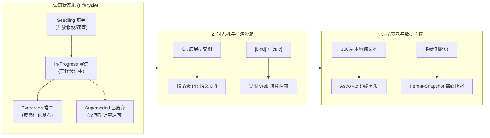

> **项目已开源**：[https://github.com/ekinplzop/blog](https://github.com/ekinplzop/blog) · 欢迎在 GitHub 审查代码或贡献建议。

---

## 1. 传统博客的本质困境：已死的标本展台

市面上 99% 的博客系统（无论 Hexo、Hugo、Ghost 还是 WordPress），在信息哲学上都存在一个致命的底层缺陷：**将文章视作写完即冻结的“死物标本”**。

这种模式带来了三个无法调和的矛盾：
1. **时间倒序的线性反智**：一个人三年前写下的不成熟观点、中间遭遇技术挫败被推翻的假设，与现在的深度思考混杂在一起倒序排列。
2. **文本的被动陈述（Passive Text）**：技术与逻辑思维最出众的表达方式不是贴一段静态代码或公式截图，而是 Bret Victor 倡导的**“可探索的解释（Explorable Explanations）”**——读者可以通过调整参数，就地验证算法推导与状态流转。
3. **维护的熵增与死锁**：重型数据库、特定云服务商私有 API 或商业 BaaS，在 3~5 年后常因依赖过时、账单停付而全盘瘫痪；文章引用的第三方外链大面积 404 死锁。

**Cognitive Kernel** 的诞生，就是为了用纯工程手段彻底重构这一范式：从“单向文章展台”走向**“Local-First 的个人活体认知操作系统”**。

---

## 2. 核心架构设计：活体文档三大引擎



---

### 2.1 认识论生命周期状态机 (Epistemic Status Machine)

系统拒绝单纯依赖一个冷冰冰的“发布日期”，而是通过结构化 Frontmatter 约束每篇内容的生命周期四态流转：

- **🌲 常青定论 (Evergreen)**：经受长期实践检验的扎实理论（如操作系统调度本质、微积分与线性代数定理、V8 事件循环）；
- **⚡ 实战演进 (In-Progress)**：包含代码原型与推演，正处于实战验证期；
- **🌱 探索萌芽 (Seedling)**：记录早期思考雏形、灵感备忘与开放问题；
- **🛑 已推翻定论 (Superseded)**：旧观点已被证明存在缺陷或推翻，**系统强制高亮警示横幅，并挂载双向反向指针，引导读者跳转至最新推导**。

---

### 2.2 Cognitive Time-Machine (思想演进时光机)

最珍贵的思想不是最终呈现的冰冷结论，而是**认知被推翻与精进的动态推导过程**。

系统在长文顶部挂载了物理日期刻度滑块：
- 读者拉动滑块，可在 **2024 初代假设 $\leftrightarrow$ 2025 最新修正定论 $\leftrightarrow$ ⚡ 演进过程 Diff** 之间无缝穿梭；
- 页面就地呈现类似 GitHub PR 级的语义高亮：**红色删除线标示被推翻的旧定理，绿色高亮展开新修正的半同步模型**。

---

### 2.3 Bret Victor 反应式推演 DSL

读者不应只是被动阅读。我们在文章中设计了轻量响应式 DSL：

```markdown
定义作业等待时间 $W =$ [bind:w, min=1, max=60, default=12] 秒，
要求服务时间 $T =$ [bind:t, min=1, max=30, default=4] 秒。
此时响应比 $R_p = 1 + \frac{W}{T}$ 实时演算为：[calc: 1 + w / t]。
```

- 在编译期，系统将变量自动转换为**带有虚线下划线、支持鼠标左右横向按住拖拽的交互微控件**；
- 拖拽时，后面的公式求值以 60fps 实时重绘；
- **STRIDE 级安全防御**：沙箱严格基于白名单数学操作，杜绝任何 `eval` 或原型链污染注入。

---

### 2.4 外链永久离线快照 (Perma-Snapshot)

技术文章最怕“3年后参考资料全部 404”。
- 每次静态构建时，自动化探针扫描文章引用的所有外部 URL，生成轻量静态 HTML 快照存放在 `public/snapshots/`；
- 前端外链自动挂载 **[🏛️ 快照]** 双轨跳转微标：原站正常时直达原站，原站一旦失效，读者点击快照即可无损阅读当时的离线备份。

---

## 3. 性能工程：Lighthouse 满分与零厂商锁定

在架构上，系统恪守三层解耦原则：
- **L0 纯静态核心**：全站默认投递 0KB JavaScript，首屏加载达到物理极限（实测 **Lighthouse 桌面端 100/100，移动端 98/100，FCP 0.45s，CLS = 0.000**）；
- **全平台多端自适应**：
  - 宽屏（1920px）：Full-Bleed 自然舒展，两边内嵌 IDE 级双向自由拖拽调节手柄（localStorage 记忆宽度）；
  - 平板（iPad）：自动收起右侧大纲，保留 $>700\text{px}$ 纯净阅读画布；
  - 手机：自动收折为全屏毛玻璃目录抽屉，单手触控零卡顿。
- **零成本永久存活**：依托 GitHub Pages Anycast CDN，全站月度维护与服务器费用恒等于 **$0.00**。

---

## 4. 开源与后续演进

Cognitive Kernel 现已在 GitHub 全量开源，遵循最宽松友好的 **MIT License**：

- **开源仓库**：[https://github.com/ekinplzop/blog](https://github.com/ekinplzop/blog)
- **线上体验**：[https://ekinplzop.github.io/blog/](https://ekinplzop.github.io/blog/)

欢迎 Star、Fork 或提交 Issue，一起探索个人知识系统与认知表达的下一个十年！
