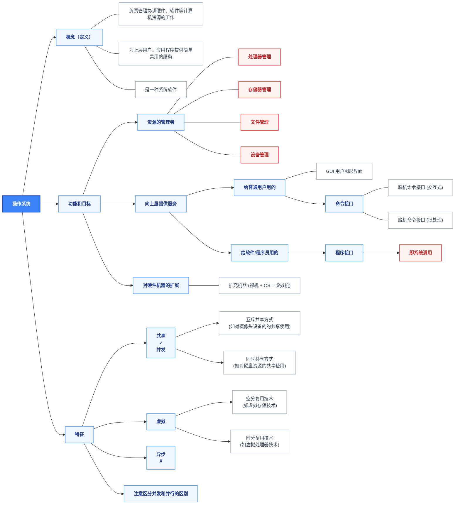
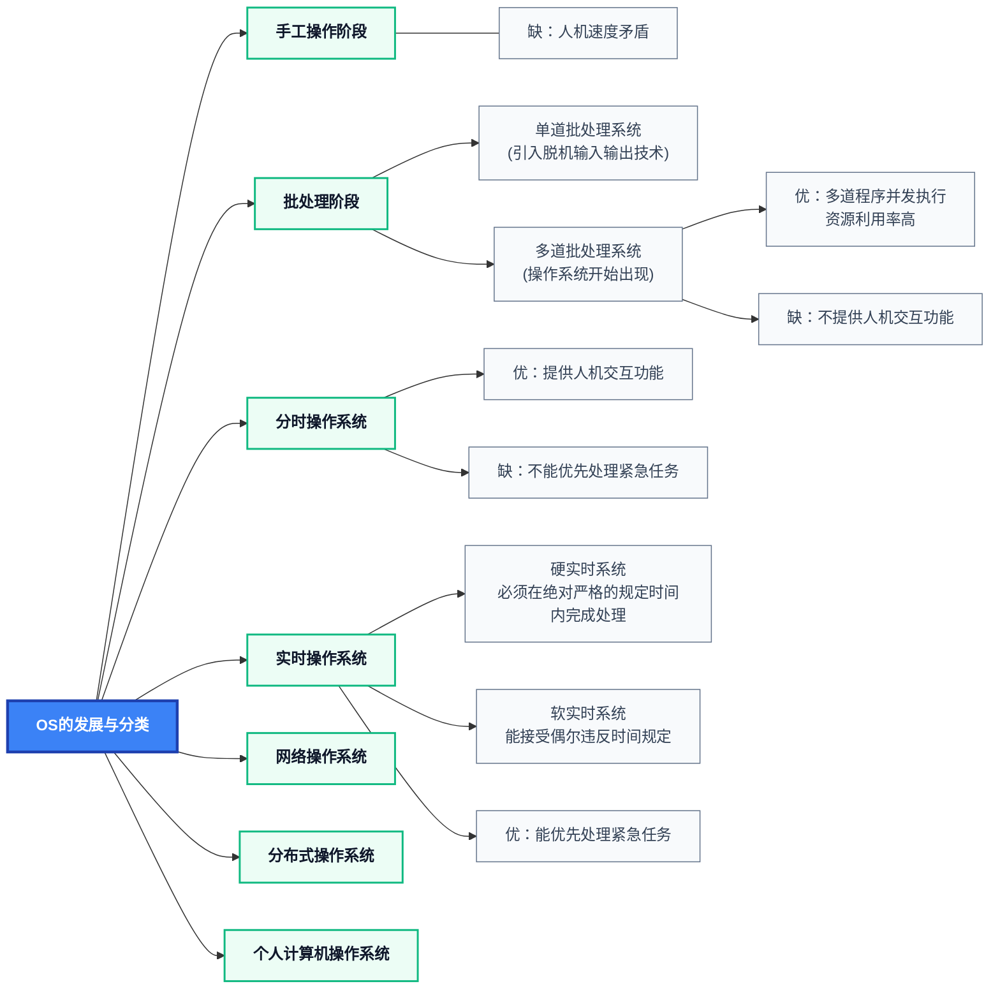
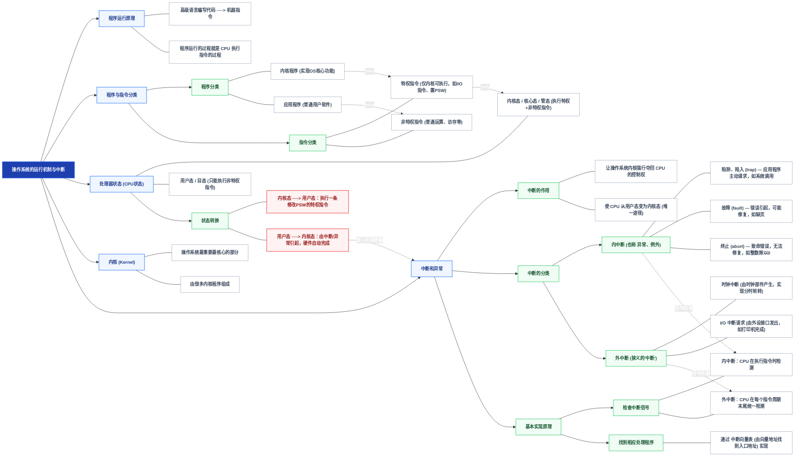

## 1.1 操作系统的基本概念

操作系统：控制和管理计算机系统内硬件和软件资源、合理组织调度计算机工作和资源分配、方便用户使用的程序集合
地位：硬件之上、应用软件之下的系统软件；是“裸机上的第一层扩充”。

并发和共享互为存在条件。

## 1.2 OS历程

## 1.3 OS运行机制

- 陷入指令是在用户态执行的，执行陷入指令后立即引发一个内中断，使CPU进入内核态。
- 发出系统调用请求是在用户态，而对系统调用的相应处理在核心态下进行。
- 内中断： 是正在执行的指令直接引起， 触发来源 ：CPU 内部产生，来自指令执行过程。
- 系统调用： 操作系统对应用程序和程序员提供的接口， 区别于库函数（库函数既存在对系统调用进一步的封装的类别，也存在不使用系统调用的类别）

## 1.4 OS体系结构

  
  <!-- 左侧大括号：操作系统 -->
  

    

      操作系统
      }
    

  

  <!-- 中间核心色块堆叠体系 -->
  

    
    <!-- 1. 用户层 + 应用程序内嵌 -->
    

      
用户

      

        应用程序（软件）
      

    

    <!-- 2. 非内核功能 -->
    

      非内核功能（如GUI）
    

    <!-- 3. 内核上层功能 -->
    

      进程管理、存储器管理、设备管理等功能
    

    <!-- 4. 内核底层核心（三块并列） -->
    

      
时钟管理

      
中断处理

      
原语（设备驱动、CPU切换等）

    

    <!-- 5. 裸机（纯硬件） -->
    

      裸机（纯硬件）
    

  

  <!-- 右侧大括号：内核 -->
  

    

      {
      内核
    

  

> 其中： 只把最基本功能(时钟管理，中断处理，原语, 进程管理,通信,基本调度）保留在内核 称为微内核。 典型： Mach,  QNX 
> 优点: 内核功能少， 结构清晰， 方便维护
> 缺点：需要频繁切换用户态和内核态，开销大

>大内核（宏内核）：将进程管理、内存管理、文件系统、设备驱动、网络协议栈等全部放在内核态运行，作为一个整体的大程序。典型：Linux、UNIX
> 折中方案——混合内核：结构上采用微内核思想做模块化，但把关键服务放回内核态以减少消息传递开销，如 Windows NT、macOS (XNU)（Mach + BSD）。

 操作系统的分层结构： 将操作系统划分为若干层次，每层完成一组相对独立的功能。
 - 只能上层调用下层，下层为上层提供服务
 - 禁止下层调用上层，也禁止跨层调用（严格分层时）
 - 优点：分层隔离,便于调试

操作系统的模块化结构： 将操作系统按功能划分为若干个独立模块， 每个模块实现一项系统功能（进程管理、内存管理、文件系统、I/O 管理等）
- 主从式（主控 + 从模块）：设一个主控模块（内核核心），由它调用、协调其他模块。
- 模块之间通过预先定义好的接口相互通信， 各模块可独立设计、编码、编译、测试，最后链接成完整的 OS
- 与分层结构的关键区别：模块间调用关系是双向、任意的，不要求单向依赖

操作系统的外核结构： 内核负责进程调度、进程通信等功能，外核负责为用户进程分配未经抽象的硬件资源，且由外核负责保证资源使用安全

## 1.5 操作系统的引导

计算机开机时内存是空的（RAM 是易失性的），操作系统不在内存里，而 CPU 只能执行内存中的指令——这就产生了问题。

加电后 CPU 从ROM中读取（BIOS/UEFI）取指执行，先进行硬件自检（POST）；随后 依据CMOS确定优先级， BIOS 读取启动磁盘的主引导记录（MBR）并执行其引导代码；引导代码扫描分区表定位活动分区，并将首扇区（PBR）加载到内存中；启动管理器将 OS 内核映像装入内存并跳转执行；内核完成硬件初始化，建立数据结构、启动 init 进程，最终呈现登录界面，引导结束。

- 引导分为多个阶段：  因为最初可执行的固件代码和它加载能力都极小（BIOS 只能读 512 字节），无法直接装入庞大的 OS；只能采用“逐级加载”策略——小程序加载大程序，每一级能力更强，最终加载完整内核。

## 1.6 虚拟机

虚拟机：使用虚拟化技术，将一台物理机器虚拟化为多台虚拟机（Virtual Machine, VM），每个虚拟机都可以独立运行一个操作系统
虚拟机管理程序： VMM
第一类VMM： 直接运行到硬件上， 第二类VMM： 运行在宿主操作系统上