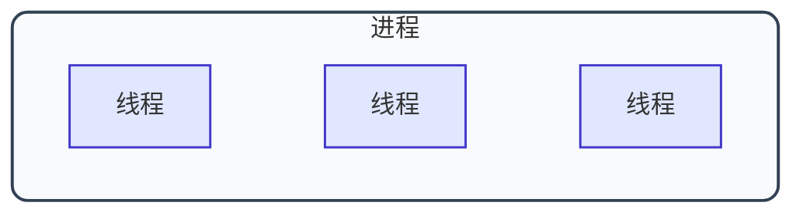

## 2.1 进程


- 进程是系统进行资源分配和调度的一个独立单位(动态性) 
- 传统''程序''仅是一组静态的指令集合

PCB : 数据结构--描述和管理一个进程的信息
进程实体(进程映像): PCB  程序段(程序指令)  数据段(数据) 
- 进程映像就是静态的一个快照
>PCB是进程存在的唯一标志
>操作系统才是PCB的管理者


- 进程特征：
    - 动态性 
    - 并发性（多个同时存在）
    一个进程的失败不会直接影响其他进程
    进程以各自独立的、不可预知的速度向前推进,执行顺序和时间不确定,同样的输入可能产生不同的执行序列,相同程序多次运行可能产生不同结果
    互斥：某些资源同一时刻只能被一个进程使用
    同步：进程间需要协调执行顺序和时序关系.
    - 独立性（独立资源、调度）
    - 异步性（顺序不定）
    - 结构性（1＋1＋1，即 PCB＋程序段＋数据段）


众所周知,进程具有动态性: 那么按照状态来划分:
- 创建态（创建 PCB、准备资源）
- 就绪态  
- 运行态（CPU 正在执行）
- 阻塞态（等待某条件/资源，就绪之前无法进行）
- 终止态（回收资源、PCB 等）
>运行态是能直接转换为就绪态的,  比如分配的时间片用完/ CPU被高优先级进程抢占了, 那就只能进入就绪态再等分配CPU了.

<svg viewBox="0 0 880 260" width="100%" height="260" xmlns="http://www.w3.org/2000/svg" style="background:#ffffff; font-family:-apple-system, BlinkMacSystemFont, 'Segoe UI', 'PingFang SC', 'Microsoft YaHei', sans-serif; display:block; margin:20px auto; max-width:100%;">
  <defs>
    <!-- 标准实心三角形箭头定义 -->
    <marker id="arr-gray" viewBox="0 0 10 10" refX="8" refY="5" markerWidth="6" markerHeight="6" orient="auto">
      <path d="M 0 1.5 L 8 5 L 0 8.5 z" fill="#475569"/>
    </marker>
    <marker id="arr-green" viewBox="0 0 10 10" refX="8" refY="5" markerWidth="6" markerHeight="6" orient="auto">
      <path d="M 0 1.5 L 8 5 L 0 8.5 z" fill="#16a34a"/>
    </marker>
    <marker id="arr-orange" viewBox="0 0 10 10" refX="8" refY="5" markerWidth="6" markerHeight="6" orient="auto">
      <path d="M 0 1.5 L 8 5 L 0 8.5 z" fill="#ea580c"/>
    </marker>
    <marker id="arr-amber" viewBox="0 0 10 10" refX="8" refY="5" markerWidth="6" markerHeight="6" orient="auto">
      <path d="M 0 1.5 L 8 5 L 0 8.5 z" fill="#d97706"/>
    </marker>
  </defs>

  <!-- ================= 1. 矩形状态框（完全水平与垂直对齐） ================= -->
  <!-- 创建态 -->
  <rect x="20" y="30" width="95" height="48" rx="8" fill="#e0f2fe" stroke="#0284c7" stroke-width="2"/>
  <text x="67.5" y="60" text-anchor="middle" font-size="16" font-weight="bold" fill="#0369a1">创建态</text>

  <!-- 就绪态 -->
  <rect x="230" y="30" width="95" height="48" rx="8" fill="#dcfce7" stroke="#16a34a" stroke-width="2"/>
  <text x="277.5" y="60" text-anchor="middle" font-size="16" font-weight="bold" fill="#14532d">就绪态</text>

  <!-- 运行态 -->
  <rect x="520" y="30" width="95" height="48" rx="8" fill="#ffedd5" stroke="#ea580c" stroke-width="2"/>
  <text x="567.5" y="60" text-anchor="middle" font-size="16" font-weight="bold" fill="#9a3412">运行态</text>

  <!-- 终止态 -->
  <rect x="760" y="30" width="95" height="48" rx="8" fill="#f1f5f9" stroke="#64748b" stroke-width="2"/>
  <text x="807.5" y="60" text-anchor="middle" font-size="16" font-weight="bold" fill="#334155">终止态</text>

  <!-- 阻塞态 (正中下方) -->
  <rect x="375" y="180" width="100" height="48" rx="8" fill="#fef3c7" stroke="#d97706" stroke-width="2"/>
  <text x="425" y="210" text-anchor="middle" font-size="16" font-weight="bold" fill="#92400e">阻塞态</text>

  <!-- ================= 2. 纯直直线箭头 (绝对平直，不带任何弯曲) ================= -->

  <!-- ① 创建态 -> 就绪态 (水平直线) -->
  <line x1="115" y1="54" x2="222" y2="54" stroke="#475569" stroke-width="2" marker-end="url(#arr-gray)"/>
  <text x="170" y="45" text-anchor="middle" font-size="12" font-weight="bold" fill="#475569">创建完成</text>

  <!-- ② 就绪态 -> 运行态 (上方水平直线) -->
  <line x1="325" y1="44" x2="512" y2="44" stroke="#16a34a" stroke-width="2" marker-end="url(#arr-green)"/>
  <text x="420" y="35" text-anchor="middle" font-size="12" font-weight="bold" fill="#16a34a">获得处理机(调度) ──►</text>

  <!-- ③ 运行态 -> 就绪态 (下方水平直线) -->
  <line x1="520" y1="64" x2="333" y2="64" stroke="#ea580c" stroke-width="2" marker-end="url(#arr-orange)"/>
  <text x="420" y="80" text-anchor="middle" font-size="12" font-weight="bold" fill="#ea580c">◄── 时间片用完 / 被抢占</text>

  <!-- ④ 运行态 -> 终止态 (水平直线) -->
  <line x1="615" y1="54" x2="752" y2="54" stroke="#475569" stroke-width="2" marker-end="url(#arr-gray)"/>
  <text x="685" y="45" text-anchor="middle" font-size="12" font-weight="bold" fill="#475569">结束 / 异常</text>

  <!-- ⑤ 运行态 -> 阻塞态 (纯笔直斜向直线) -->
  <line x1="520" y1="78" x2="480" y2="173" stroke="#d97706" stroke-width="2" marker-end="url(#arr-amber)"/>
  <text x="545" y="135" text-anchor="start" font-size="12" font-weight="bold" fill="#b45309">申请资源 / 等待事件 (主动)</text>

  <!-- ⑥ 阻塞态 -> 就绪态 (纯笔直斜向直线) -->
  <line x1="375" y1="180" x2="331" y2="85" stroke="#16a34a" stroke-width="2" marker-end="url(#arr-green)"/>
  <text x="315" y="135" text-anchor="end" font-size="12" font-weight="bold" fill="#15803d">等待事件发生 (被动唤醒)</text>
</svg>

进程的组织有 链接/索引

## 2.2 进程控制

进程控制：操作系统为实现状态的变化  
    - 用原语实现（红字：一气呵成，不可被中断）
	- 特权指令：关中断指令（直接不让 CPU 检查中断信号）、开中断指令

状态变化的过程常常伴随着: 1. 更新 PCB 中的信息　2. 将 PCB 插入合适的队列　3. 可能分配/回收资源

**原语分类：**

- 创建原语：进程创建时（创建态）
- 撤销原语：终止进程时（杀掉所有子进程）（终态）
- 阻塞原语：保护进程运行现场（运行态 → 阻塞态）
    - 成对使用；因何事阻塞，就应该由何事唤醒
- 唤醒原语：（阻塞态 → 就绪态）
- 切换原语：（运行态 ⇌ 就绪态）
    - 实行进程并发（进程切换）比较重要,保护一些关键变量不被覆盖

 >允许一个进程创建另一个进程。创建者称为父进程，被创建的进程称为子进程。子进程在创建时会复制父进程的当前状态，包括程序代码、数据段、堆栈内容、打开的
    文件描述符、环境变量等。然而，子进程与父进程是相互独立的实体，拥有各自的 PCB 和虚拟地址空间。
## 2.3  进程通信


进程通信：进程间数据交换
    - 注意:  各进程拥有的内存地址空间相互独立

低级通信： 信号量 / PV 只能传递 0、1 或简单的整数信号，用于控制同步互斥，不能传递复杂数据。|

①: 共享存储：
- 共享存储区：申请的一片区域，可供多进程同时使用(互斥的访问 , 高级通信方式，灵活性高，操作系统不参与)  最快
-  基于数据结构的共享——低级通信
②: 消息传递：数据交换单位：格式化的消息 →｛消息头 / 消息体｝ ( 原语：发送消息、接收消息) 三者最慢
- 直接通信方式（指明接收进程 ID）
	>- P 原语发送：Send(A, msg) —操作系统→ A 的 PCB 中消息队列
	>- Q 接收原语：receive(P, msg) —操作系统→ 查找 P 发来的是哪个

③:管道通信：A →（Pipe）→ B（半双工）（操作系统实现互斥的访问）
    - 特殊的共享文件（队列写入/取出）（顺序很重要）
    - 应试标准答案：多个写进程、一个读进程 


## 2.4 信号

**信号**：用于通知进程某个特定事件已经发生（可以进程发送给自己）。

kill(2677, 1) : 给进程ID为2677的发送1个信号类别是1的信号。 （可以由其他多个进程同时发送， OS内核进程也能发）

- **不少于 N  bit 的位向量** →**重复的信号被丢弃**
- **待处理信号**：`pending` 位向量（记录已产生但尚未处理的信号）
- **被阻塞信号**：`blocked` 位向量（记录当前进程屏蔽/阻塞的信号）

进程**从内核态转为用户态时**，会例行检查与处理信号。
- pending &∼blocked （知道具体哪个信号需要被处理）
- 信号处理与主程序共用一个进程空间
- **信号处理动作**（2 选 1）：
	**自定义处理**（用户通过注册函数覆盖默认动作）
	**操作系统默认处理**（内核对每个信号都有默认动作，如终止、忽略、挂起等）
- **所有待处理信号完成后，执行下一指令**
- 有些异常无法被内核全部处理，可能还需要用户进程配合；
- **有些信号既不允许自定义处理，也不允许被 block**（如操作系统的最高特权信号 `SIGKILL` 和 `SIGSTOP`）


## 2.5 线程

### ①  线程概念与特点
- **线程**：
    - **目的**：为了增加并发度。
    - **地位**：线程成为了**程序执行流的最小单位**（CPU 调度的基本单位）。
    - **开销优势**：**同一进程内的线程切换**，不必切换进程运行环境，**系统开销小**。



- 多 CPU / 多核系统中，各个线程可以占用**不同的 CPU** 并行执行。
- 每个线程都有唯一的**线程 ID** 和**线程控制块（TCB）**。
- 线程同样具备**就绪、运行、阻塞**三种基本状态。
- **同一进程的不同线程间**共享进程资源、共享地址空间**；线程**几乎不拥有系统资源**（仅拥有少量维持运行的必要资源，如栈、程序计数器 PC、寄存器）。
- **不同进程中的线程切换**，本质上会引起进程切换，因此**系统开销大**。

### ②线程的实现方式

- **线程的实现方式**
    - **用户级线程（ULT）**：从用户视角能看到的线程，由用户空间的线程库实现。
    - **内核级线程（KLT）**：从操作系统视角看到的线程，由操作系统实现；**内核级线程才是处理机分配的基本单位**。
    - **组合方式**：上述两种方式的结合。

<div style="width: 100%; max-width: 920px; margin: 20px auto; font-family: -apple-system, BlinkMacSystemFont, 'Segoe UI', 'PingFang SC', 'Microsoft YaHei', sans-serif;">
  <svg xmlns="http://www.w3.org/2000/svg" viewBox="0 0 920 480" width="100%" height="auto" style="background-color: #ffffff; border-radius: 12px; box-shadow: 0 4px 12px rgba(0,0,0,0.06);">
    <defs>
      <filter id="shadow" x="-10%" y="-10%" width="120%" height="120%">
        <feDropShadow dx="0" dy="2" stdDeviation="3" flood-opacity="0.08"/>
      </filter>
    </defs>

    <!-- 外边框 -->
    <rect x="10" y="10" width="900" height="460" rx="12" fill="#ffffff" stroke="#cbd5e1" stroke-width="1.5"/>

    <!-- 空间区域底色 -->
    <!-- 上层：用户空间 -->
    <path d="M 10 22 Q 10 10 22 10 L 898 10 Q 910 10 910 22 L 910 185 L 10 185 Z" fill="#f8fafc"/>
    <!-- 下层：内核空间 -->
    <rect x="10" y="185" width="900" height="175" fill="#f1f5f9"/>
    <!-- 底部：图例与标题白底 -->
    <path d="M 10 360 L 910 360 L 910 458 Q 910 470 898 470 L 22 470 Q 10 470 10 458 Z" fill="#ffffff"/>

    <!-- 用户空间与内核空间分界线 -->
    <line x1="25" y1="185" x2="895" y2="185" stroke="#64748b" stroke-width="1.5" stroke-dasharray="6 4"/>
    
    <!-- 右侧空间标注 -->
    <text x="885" y="175" text-anchor="end" fill="#475569" font-size="14" font-weight="600">用户空间</text>
    <text x="885" y="208" text-anchor="end" fill="#475569" font-size="14" font-weight="600">内核空间</text>

    <!-- ==================== (a) 用户级方式 ==================== -->
    <g id="col-a">
      <!-- 3 条用户级线程（波浪线） -->
      <path d="M 115 35 Q 119 40 115 45 Q 111 50 115 55 Q 119 60 115 65 Q 111 70 115 75 Q 119 80 115 85" fill="none" stroke="#2563eb" stroke-width="2"/>
      <path d="M 155 35 Q 159 40 155 45 Q 151 50 155 55 Q 159 60 155 65 Q 151 70 155 75 Q 159 80 155 85" fill="none" stroke="#2563eb" stroke-width="2"/>
      <path d="M 195 35 Q 199 40 195 45 Q 191 50 195 55 Q 199 60 195 65 Q 191 70 195 75 Q 199 80 195 85" fill="none" stroke="#2563eb" stroke-width="2"/>
      
      <!-- 汇聚到线程库的引线 -->
      <line x1="115" y1="85" x2="135" y2="115" stroke="#64748b" stroke-width="1.5"/>
      <line x1="155" y1="85" x2="155" y2="115" stroke="#64748b" stroke-width="1.5"/>
      <line x1="195" y1="85" x2="175" y2="115" stroke="#64748b" stroke-width="1.5"/>

      <!-- 线程库方框 -->
      <rect x="115" y="115" width="80" height="32" rx="5" fill="#ffffff" stroke="#3b82f6" stroke-width="1.5" filter="url(#shadow)"/>
      <text x="155" y="136" text-anchor="middle" fill="#1e40af" font-size="13" font-weight="600">线程库</text>

      <!-- 穿过内核分界线的单条引线 -->
      <line x1="155" y1="147" x2="155" y2="265" stroke="#64748b" stroke-width="1.5"/>

      <!-- 进程 P -->
      <circle cx="155" cy="290" r="24" fill="#ffffff" stroke="#0f172a" stroke-width="2" filter="url(#shadow)"/>
      <text x="155" y="298" text-anchor="middle" fill="#0f172a" font-size="20" font-weight="bold">P</text>

      <!-- 子图标题 -->
      <text x="155" y="390" text-anchor="middle" fill="#1e293b" font-size="15" font-weight="bold">(a) 用户级方式</text>
    </g>

    <!-- ==================== (b) 内核级方式 ==================== -->
    <g id="col-b">
      <!-- 3 条用户级线程（波浪线） -->
      <path d="M 410 35 Q 414 40 410 45 Q 406 50 410 55 Q 414 60 410 65 Q 406 70 410 75 Q 414 80 410 85" fill="none" stroke="#2563eb" stroke-width="2"/>
      <path d="M 460 35 Q 464 40 460 45 Q 456 50 460 55 Q 464 60 460 65 Q 456 70 460 75 Q 464 80 460 85" fill="none" stroke="#2563eb" stroke-width="2"/>
      <path d="M 510 35 Q 514 40 510 45 Q 506 50 510 55 Q 514 60 510 65 Q 506 70 510 75 Q 514 80 510 85" fill="none" stroke="#2563eb" stroke-width="2"/>

      <!-- 3 条穿透分界线的引线 -->
      <line x1="410" y1="85" x2="410" y2="215" stroke="#64748b" stroke-width="1.5"/>
      <line x1="460" y1="85" x2="460" y2="215" stroke="#64748b" stroke-width="1.5"/>
      <line x1="510" y1="85" x2="510" y2="215" stroke="#64748b" stroke-width="1.5"/>

      <!-- 3 个内核级线程（胶囊圆角框包围波浪线） -->
      <rect x="396" y="215" width="28" height="42" rx="14" fill="#eff6ff" stroke="#2563eb" stroke-width="1.5"/>
      <path d="M 410 221 Q 413 225 410 229 Q 407 233 410 237 Q 413 241 410 245 Q 407 248 410 251" fill="none" stroke="#2563eb" stroke-width="1.8"/>

      <rect x="446" y="215" width="28" height="42" rx="14" fill="#eff6ff" stroke="#2563eb" stroke-width="1.5"/>
      <path d="M 460 221 Q 463 225 460 229 Q 457 233 460 237 Q 463 241 460 245 Q 457 248 460 251" fill="none" stroke="#2563eb" stroke-width="1.8"/>

      <rect x="496" y="215" width="28" height="42" rx="14" fill="#eff6ff" stroke="#2563eb" stroke-width="1.5"/>
      <path d="M 510 221 Q 513 225 510 229 Q 507 233 510 237 Q 513 241 510 245 Q 507 248 510 251" fill="none" stroke="#2563eb" stroke-width="1.8"/>

      <!-- 汇聚到进程 P 的引线 -->
      <line x1="410" y1="257" x2="448" y2="277" stroke="#64748b" stroke-width="1.5"/>
      <line x1="460" y1="257" x2="460" y2="266" stroke="#64748b" stroke-width="1.5"/>
      <line x1="510" y1="257" x2="472" y2="277" stroke="#64748b" stroke-width="1.5"/>

      <!-- 进程 P -->
      <circle cx="460" cy="290" r="24" fill="#ffffff" stroke="#0f172a" stroke-width="2" filter="url(#shadow)"/>
      <text x="460" y="298" text-anchor="middle" fill="#0f172a" font-size="20" font-weight="bold">P</text>

      <!-- 子图标题 -->
      <text x="460" y="390" text-anchor="middle" fill="#1e293b" font-size="15" font-weight="bold">(b) 内核级方式</text>
    </g>

    <!-- ==================== (c) 组合方式 ==================== -->
    <g id="col-c">
      <!-- 左侧：3 条用户级线程 -->
      <path d="M 675 35 Q 679 40 675 45 Q 671 50 675 55 Q 679 60 675 65 Q 671 70 675 75 Q 679 80 675 85" fill="none" stroke="#2563eb" stroke-width="2"/>
      <path d="M 705 35 Q 709 40 705 45 Q 701 50 705 55 Q 709 60 705 65 Q 701 70 705 75 Q 709 80 705 85" fill="none" stroke="#2563eb" stroke-width="2"/>
      <path d="M 735 35 Q 739 40 735 45 Q 731 50 735 55 Q 739 60 735 65 Q 731 70 735 75 Q 739 80 735 85" fill="none" stroke="#2563eb" stroke-width="2"/>

      <!-- 汇聚到线程库 -->
      <line x1="675" y1="85" x2="695" y2="115" stroke="#64748b" stroke-width="1.5"/>
      <line x1="705" y1="85" x2="705" y2="115" stroke="#64748b" stroke-width="1.5"/>
      <line x1="735" y1="85" x2="715" y2="115" stroke="#64748b" stroke-width="1.5"/>

      <!-- 线程库方框 -->
      <rect x="665" y="115" width="80" height="32" rx="5" fill="#ffffff" stroke="#3b82f6" stroke-width="1.5" filter="url(#shadow)"/>
      <text x="705" y="136" text-anchor="middle" fill="#1e40af" font-size="13" font-weight="600">线程库</text>

      <!-- 线程库下发 2 条线穿透分界线 -->
      <line x1="695" y1="147" x2="685" y2="215" stroke="#64748b" stroke-width="1.5"/>
      <line x1="715" y1="147" x2="725" y2="215" stroke="#64748b" stroke-width="1.5"/>

      <!-- 左侧对应的 2 个内核级线程 -->
      <rect x="671" y="215" width="28" height="42" rx="14" fill="#eff6ff" stroke="#2563eb" stroke-width="1.5"/>
      <path d="M 685 221 Q 688 225 685 229 Q 682 233 685 237 Q 688 241 685 245 Q 682 248 685 251" fill="none" stroke="#2563eb" stroke-width="1.8"/>

      <rect x="711" y="215" width="28" height="42" rx="14" fill="#eff6ff" stroke="#2563eb" stroke-width="1.5"/>
      <path d="M 725 221 Q 728 225 725 229 Q 722 233 725 237 Q 728 241 725 245 Q 722 248 725 251" fill="none" stroke="#2563eb" stroke-width="1.8"/>

      <!-- 汇聚到左侧进程 P -->
      <line x1="685" y1="257" x2="698" y2="277" stroke="#64748b" stroke-width="1.5"/>
      <line x1="725" y1="257" x2="712" y2="277" stroke="#64748b" stroke-width="1.5"/>
      <circle cx="705" cy="290" r="24" fill="#ffffff" stroke="#0f172a" stroke-width="2" filter="url(#shadow)"/>
      <text x="705" y="298" text-anchor="middle" fill="#0f172a" font-size="20" font-weight="bold">P</text>

      <!-- 右侧：1 条专属直通用户级线程 -->
      <path d="M 805 35 Q 809 40 805 45 Q 801 50 805 55 Q 809 60 805 65 Q 801 70 805 75 Q 809 80 805 85" fill="none" stroke="#2563eb" stroke-width="2"/>
      <line x1="805" y1="85" x2="805" y2="215" stroke="#64748b" stroke-width="1.5"/>

      <!-- 右侧：1 个专属内核级线程 -->
      <rect x="791" y="215" width="28" height="42" rx="14" fill="#eff6ff" stroke="#2563eb" stroke-width="1.5"/>
      <path d="M 805 221 Q 808 225 805 229 Q 802 233 805 237 Q 808 241 805 245 Q 802 248 805 251" fill="none" stroke="#2563eb" stroke-width="1.8"/>

      <line x1="805" y1="257" x2="805" y2="266" stroke="#64748b" stroke-width="1.5"/>
      <circle cx="805" cy="290" r="24" fill="#ffffff" stroke="#0f172a" stroke-width="2" filter="url(#shadow)"/>
      <text x="805" y="298" text-anchor="middle" fill="#0f172a" font-size="20" font-weight="bold">P</text>

      <!-- 子图标题 -->
      <text x="755" y="390" text-anchor="middle" fill="#1e293b" font-size="15" font-weight="bold">(c) 组合方式</text>
    </g>

    <!-- ==================== 底部图例 (Legend) ==================== -->
    <g id="legend" transform="translate(180, 420)">
      <!-- 用户级线程 -->
      <path d="M 0 5 Q 4 1 0 -3 Q -4 -7 0 -11 Q 4 -15 0 -19" fill="none" stroke="#2563eb" stroke-width="2"/>
      <text x="15" y="-4" fill="#334155" font-size="13" font-weight="500">用户级线程</text>

      <!-- 内核级线程胶囊 -->
      <g transform="translate(170, -22)">
        <rect x="0" y="0" width="20" height="30" rx="10" fill="#eff6ff" stroke="#2563eb" stroke-width="1.5"/>
        <path d="M 10 5 Q 13 8 10 11 Q 7 14 10 17 Q 13 20 10 23" fill="none" stroke="#2563eb" stroke-width="1.5"/>
      </g>
      <text x="202" y="-4" fill="#334155" font-size="13" font-weight="500">内核级线程</text>

      <!-- 进程圆圈 -->
      <circle cx="345" cy="-8" r="13" fill="#ffffff" stroke="#0f172a" stroke-width="1.5"/>
      <text x="345" y="-3" text-anchor="middle" fill="#0f172a" font-size="13" font-weight="bold">P</text>
      <text x="370" y="-4" fill="#334155" font-size="13" font-weight="500">进程</text>
    </g>

    <!-- 图名 -->
    <text x="460" y="452" text-anchor="middle" fill="#0f172a" font-size="15" font-weight="bold">图 2.6 用户级线程和内核级线程</text>
  </svg>
</div>

- **多线程模型**
    - **一对一模型**（1 个 ULT →→ 1 个 KLT）：
        - 优：可分配到多核处理机并行执行，并发度高。
        - 缺：线程管理需操作系统支持，创建/切换开销大。
    - **多对一模型**（多个 ULT →→ 1 个 KLT）：
        - 优：线程管理在用户态完成，开销小、效率高。
        - 缺：**一个线程阻塞会导致整个进程都被阻塞**（并发度低，且无法利用多核并行）。
    - **多对多模型**（n 个 ULT → m个 KLT，n≥m）：
        - 集二者之所长：克服了多对一的一个阻塞全阻塞，避免了一对一的管理开销过大。


## 2.6 调度

调度：  按照一定次序分配资源
作业： 用户想让操作系统启动的一个程序
### 三层调度的联系、对比

|                | 要做什么                               | 调度发生在..         | 发生频率 | 对进程状态的影响              |
| :------------- | :--------------------------------- | :-------------- | :--: | :-------------------- |
| 高级调度<br>（作业调度） | 按照某种规则，从后备队列中选择合适的作业将其调入内存，并为其创建进程 | 外存→内存<br>（面向作业） |  最低  | 无→创建态→就绪态             |
| 中级调度<br>（内存调度） | 按照某种规则，从挂起队列中选择合适的进程将其数据调回内存       | 外存→内存<br>（面向进程） |  中等  | 挂起态→就绪态<br>（阻塞挂起→阻塞态） |
| 低级调度<br>（进程调度） | 按照某种规则，从就绪队列中选择一个进程为其分配处理机         | 内存→CPU          |  最高  | 就绪态→运行态               |

挂起态： （进程映像）暂时调到外存等待的进程状态为挂起状态（挂起态），挂起态又可以进一步细分为就绪挂起、阻塞挂起两种状态

<svg viewBox="0 0 920 460" width="100%" height="460" xmlns="http://www.w3.org/2000/svg" style="background:#ffffff; font-family:-apple-system, BlinkMacSystemFont, 'Segoe UI', 'PingFang SC', 'Microsoft YaHei', sans-serif; display:block; margin:20px auto; max-width:100%;">
  <defs>
    <!-- 标准实心三角形箭头定义 -->
    <marker id="arr-gray" viewBox="0 0 10 10" refX="8" refY="5" markerWidth="6" markerHeight="6" orient="auto">
      <path d="M 0 1.5 L 8 5 L 0 8.5 z" fill="#475569"/>
    </marker>
    <marker id="arr-green" viewBox="0 0 10 10" refX="8" refY="5" markerWidth="6" markerHeight="6" orient="auto">
      <path d="M 0 1.5 L 8 5 L 0 8.5 z" fill="#16a34a"/>
    </marker>
    <marker id="arr-orange" viewBox="0 0 10 10" refX="8" refY="5" markerWidth="6" markerHeight="6" orient="auto">
      <path d="M 0 1.5 L 8 5 L 0 8.5 z" fill="#ea580c"/>
    </marker>
    <marker id="arr-amber" viewBox="0 0 10 10" refX="8" refY="5" markerWidth="6" markerHeight="6" orient="auto">
      <path d="M 0 1.5 L 8 5 L 0 8.5 z" fill="#d97706"/>
    </marker>
    <marker id="arr-purple" viewBox="0 0 10 10" refX="8" refY="5" markerWidth="6" markerHeight="6" orient="auto">
      <path d="M 0 1.5 L 8 5 L 0 8.5 z" fill="#7c3aed"/>
    </marker>
  </defs>

  <!-- ================= 1. 矩形状态框（完全水平与垂直对齐） ================= -->
  <!-- 第一行：内存中基本活跃状态 -->
  <!-- 创建态 -->
  <rect x="25" y="30" width="95" height="48" rx="8" fill="#e0f2fe" stroke="#0284c7" stroke-width="2"/>
  <text x="72.5" y="60" text-anchor="middle" font-size="16" font-weight="bold" fill="#0369a1">创建态</text>

  <!-- 就绪态 -->
  <rect x="255" y="30" width="95" height="48" rx="8" fill="#dcfce7" stroke="#16a34a" stroke-width="2"/>
  <text x="302.5" y="60" text-anchor="middle" font-size="16" font-weight="bold" fill="#14532d">就绪态</text>

  <!-- 运行态 -->
  <rect x="565" y="30" width="95" height="48" rx="8" fill="#ffedd5" stroke="#ea580c" stroke-width="2"/>
  <text x="612.5" y="60" text-anchor="middle" font-size="16" font-weight="bold" fill="#9a3412">运行态</text>

  <!-- 终止态 -->
  <rect x="795" y="30" width="95" height="48" rx="8" fill="#f1f5f9" stroke="#64748b" stroke-width="2"/>
  <text x="842.5" y="60" text-anchor="middle" font-size="16" font-weight="bold" fill="#334155">终止态</text>

  <!-- 第二行：就绪挂起 (外存) 与 阻塞态 (内存) -->
  <!-- 就绪挂起 -->
  <rect x="120" y="200" width="105" height="48" rx="8" fill="#f5f3ff" stroke="#7c3aed" stroke-width="2"/>
  <text x="172.5" y="230" text-anchor="middle" font-size="16" font-weight="bold" fill="#5b21b6">就绪挂起</text>

  <!-- 阻塞态 -->
  <rect x="495" y="200" width="100" height="48" rx="8" fill="#fef3c7" stroke="#d97706" stroke-width="2"/>
  <text x="545" y="230" text-anchor="middle" font-size="16" font-weight="bold" fill="#92400e">阻塞态</text>

  <!-- 第三行：阻塞挂起 (外存) -->
  <!-- 阻塞挂起 -->
  <rect x="300" y="370" width="105" height="48" rx="8" fill="#f5f3ff" stroke="#7c3aed" stroke-width="2"/>
  <text x="352.5" y="400" text-anchor="middle" font-size="16" font-weight="bold" fill="#5b21b6">阻塞挂起</text>


  <!-- ================= 2. 状态转移连线（纯直直线箭头） ================= -->

  <!-- ① 创建态 -> 就绪态 (水平直线) -->
  <line x1="120" y1="54" x2="247" y2="54" stroke="#475569" stroke-width="2" marker-end="url(#arr-gray)"/>
  <text x="183" y="45" text-anchor="middle" font-size="12" font-weight="bold" fill="#475569">创建完成</text>

  <!-- ② 就绪态 -> 运行态 (上方水平直线) -->
  <line x1="350" y1="44" x2="557" y2="44" stroke="#16a34a" stroke-width="2" marker-end="url(#arr-green)"/>
  <text x="453" y="35" text-anchor="middle" font-size="12" font-weight="bold" fill="#16a34a">获得处理机(调度)</text>

  <!-- ③ 运行态 -> 就绪态 (下方水平直线) -->
  <line x1="565" y1="64" x2="358" y2="64" stroke="#ea580c" stroke-width="2" marker-end="url(#arr-orange)"/>
  <text x="453" y="80" text-anchor="middle" font-size="12" font-weight="bold" fill="#ea580c">时间片用完 / 被抢占</text>

  <!-- ④ 运行态 -> 终止态 (水平直线) -->
  <line x1="660" y1="54" x2="787" y2="54" stroke="#475569" stroke-width="2" marker-end="url(#arr-gray)"/>
  <text x="725" y="45" text-anchor="middle" font-size="12" font-weight="bold" fill="#475569">结束 / 异常</text>

  <!-- ⑤ 创建态 -> 就绪挂起 (斜向直线) -->
  <line x1="85" y1="78" x2="145" y2="192" stroke="#7c3aed" stroke-width="2" marker-end="url(#arr-purple)"/>
  <text x="96" y="145" text-anchor="end" font-size="11" font-weight="bold" fill="#7c3aed">外存创建</text>

  <!-- ⑥ 就绪挂起 <-> 就绪态 (双向平行斜向直线) -->
  <!-- 激活: 就绪挂起 -> 就绪态 -->
  <line x1="185" y1="200" x2="265" y2="88" stroke="#16a34a" stroke-width="2" marker-end="url(#arr-green)"/>
  <text x="210" y="138" text-anchor="end" font-size="12" font-weight="bold" fill="#16a34a">激活</text>

  <!-- 挂起: 就绪态 -> 就绪挂起 -->
  <line x1="285" y1="88" x2="205" y2="200" stroke="#7c3aed" stroke-width="2" marker-end="url(#arr-purple)"/>
  <text x="260" y="155" text-anchor="start" font-size="12" font-weight="bold" fill="#7c3aed">挂起</text>

  <!-- ⑦ 运行态 -> 阻塞态 (斜向直线) -->
  <line x1="595" y1="78" x2="565" y2="192" stroke="#d97706" stroke-width="2" marker-end="url(#arr-amber)"/>
  <text x="600" y="140" text-anchor="start" font-size="12" font-weight="bold" fill="#b45309">申请资源 / 等待事件 (主动)</text>

  <!-- ⑧ 阻塞态 -> 就绪态 (斜向直线) -->
  <line x1="495" y1="210" x2="335" y2="84" stroke="#16a34a" stroke-width="2" marker-end="url(#arr-green)"/>
  <!-- 背景标签防止交叉压线 -->
  <rect x="400" y="142" width="130" height="18" rx="4" fill="#ffffff" stroke="#e2e8f0" stroke-width="1"/>
  <text x="465" y="155" text-anchor="middle" font-size="11" font-weight="bold" fill="#15803d">等待事件发生 (唤醒)</text>

  <!-- ⑨ 运行态 -> 就绪挂起 (斜向跨越直线) -->
  <line x1="565" y1="78" x2="233" y2="210" stroke="#7c3aed" stroke-width="2" marker-end="url(#arr-purple)"/>
  <rect x="495" y="96" width="36" height="18" rx="4" fill="#ffffff" stroke="#e9d5ff" stroke-width="1"/>
  <text x="513" y="109" text-anchor="middle" font-size="11" font-weight="bold" fill="#7c3aed">挂起</text>

  <!-- ⑩ 阻塞态 <-> 阻塞挂起 (双向平行斜向直线) -->
  <!-- 激活: 阻塞挂起 -> 阻塞态 -->
  <line x1="368" y1="370" x2="510" y2="256" stroke="#16a34a" stroke-width="2" marker-end="url(#arr-green)"/>
  <text x="420" y="302" text-anchor="end" font-size="12" font-weight="bold" fill="#16a34a">激活</text>

  <!-- 挂起: 阻塞态 -> 阻塞挂起 -->
  <line x1="495" y1="256" x2="353" y2="370" stroke="#7c3aed" stroke-width="2" marker-end="url(#arr-purple)"/>
  <text x="445" y="328" text-anchor="start" font-size="12" font-weight="bold" fill="#7c3aed">挂起</text>

  <!-- ⑪ 阻塞挂起 -> 就绪挂起 (斜向直线) -->
  <line x1="315" y1="370" x2="198" y2="256" stroke="#16a34a" stroke-width="2" marker-end="url(#arr-green)"/>
  <text x="240" y="320" text-anchor="end" font-size="12" font-weight="bold" fill="#16a34a">事件出现</text>

</svg>
### 调度的时机，方式
### 一、进程调度的时机

* **什么时候需要进程调度？**
  * **主动放弃**
    * 进程正常终止
    * 运行过程中发生异常而终止
    * 主动阻塞（如等待 I/O）
  * **被动放弃**
    * 分给进程的时间片用完
    * 有更紧急的事情需要处理（如 I/O 中断）
    * 有更高优先级的进程进入就绪队列
* **什么时候不能进行进程调度？**
  * 在处理中断的过程中
  * 进程在操作系统内核程序临界区中 ， 进程处于**普通临界区**（如访问打印机等临界资源）时，**可以**进行进程调度与切换；
  * 原子操作过程中（原语）

闲逛进程: PID为0， 优先级最低，没有就绪进程时充上， 不占用除CPU外其他系统资源
- **可以是0地址指令，占一个完整的指令周期（指令周期末尾例行检查中断）**

### 二、进程调度的切换与过程

* “调度”与“切换”
  * **调度**：从就绪队列中选取一个进程的决策过程。
  * **切换**：处理机现场的保护与恢复过程，紧随调度之后发生。
* **切换过程**
  * 对原来运行进程各种数据的保存（PC、PSW、通用寄存器等保存入 PCB）
  * 对新的进程各种数据的恢复（从新进程 PCB 恢复寄存器现场）
* **重要结论**：**进程调度、切换是有代价的**，并不是调度越频繁，并发度就越高（频繁切换会导致 CPU 大量时间浪费在现场保护与恢复上）。
上下文切换： 
- 将 CPU 切换到另一个进程，需保存当前进程的状态，并恢复另一个进程的状态，这个任务称为上下文切换。
- 进程上下文由其 PCB 表示，包括 CPU 寄存器的值、进程状态、内存管理信息等。当进行上下文切换时，内核将旧进程的状态保存在其 PCB 中。
- 上下文切换是一项开销较大的操作
- 上下文切换只能由内核完成，且整个切换过程运行在内核态。
### 三、进程调度的方式

* **非剥夺调度方式（非抢占式）**：只能由当前运行的进程主动放弃 CPU。
* **剥夺调度方式（抢占式）**：可由操作系统剥夺当前进程的 CPU 使用权。


### 四、核心调度性能指标

$$
\text{CPU利用率} = \frac{\text{有效工作时间}}{\text{总时间}} \qquad \text{系统吞吐量} = \frac{\text{完成作业数}}{\text{总时间}}
$$

$$
\text{周转时间} = \text{完成时间} - \text{提交时间} \qquad \text{带权周转时间} = \frac{\text{周转时间}}{\text{实际运行时间}} \ge 1
$$

- **响应时间**：从用户提出请求到系统**首次产生响应**的时间。
- **平均指标最优排序**：追求最少的平均等待/周转/带权周转时间 $\implies$ **SRTN $\le$ SJF $<$ FCFS**。

---

### 五、早期批处理系统调度算法（不适合交互式）

> 特点：交互性差，仅适用于早期批处理系统。

| 算法                          | 调度类型                     | 适用对象               | 优缺点 / 考点特性                                                |                       是否会导致饥饿                       |
| :-------------------------- | :----------------------- | :----------------- | :-------------------------------------------------------- | :-------------------------------------------------: |
| **FCFS**<br>(先来先服务)         | 非抢占式                     | 作业 / 进程            | 公平、实现简单；**对长作业有利，对短作业不利**， **偏好 CPU 繁忙型**                 |                        **否**                        |
| **SJF / SPF**<br>(短作业/进程优先) | 默认非抢占<br>(抢占式为 **SRTN**) | SJF: 作业<br>SPF: 进程 | “最短的先上”；**对短作业有利，对长作业不利**；SRTN 平均等待/周转时间最短，**偏好 I/O 繁忙型** | ==**会**==<br><font color="#64748b">（长作业可能饿死）</font> |
| **HRRN**<br>(高响应比优先)        | 非抢占式                     | 作业 / 进程            | 综合等待时间与运行时间；**主动放弃 CPU 时触发调度**                            |                        **否**                        |

$$
\text{响应比 } R_p = \frac{\text{等待时间} + \text{要求服务时间}}{\text{要求服务时间}} = 1 + \frac{\text{等待时间}}{\text{要求服务时间}}
$$

### 六、交互式系统调度算法（分时 / 现代 OS）

| 算法                |         抢占性         |  适用对象   | 核心机制与易错考点                                                       |                         是否会导致饥饿                          |
| :---------------- | :-----------------: | :-----: | :-------------------------------------------------------------- | :------------------------------------------------------: |
| **RR**<br>(时间片轮转) |         抢占式         |  进程调度   | 专为**分时系统**设计；时间片过大退化为 **FCFS**，过小导致**进程切换开销过大**， **偏好 I/O 繁忙型** |                          **否**                           |
| **优先级调度**         | 抢占 / 非抢占<br>(默认非抢占) | 作业 / 进程 | 分为**静态优先级**（创建确定）与**动态优先级**（随等待/运行时间动态调整）， **规则上偏好 I/O 繁忙型**    |   ==**会**==<br><font color="#64748b">（低优先级可能饿死）</font>   |
| **多级反馈队列**        |         抢占式         |  进程调度   | 综合前述所有优点；多级队列优先级递减、时间片递增；新进程进第1队列，耗尽时间片下移， **天生偏好 I/O 繁忙型**     | ==**会**==<br><font color="#64748b">（短进程源源不断时下层饿死）</font> |

### 优先级设置考点规律（红字必背）
1. ==**系统进程 > 用户进程**==
2. ==**前台进程 > 后台进程**==
3. ==**I/O 繁忙型进程 > 计算/CPU 繁忙型进程**== <font color="#64748b">（I/O 繁忙型进程每次请求 CPU 的时间极短）</font>

> **补充**：**多处理机调度**面向拥有多个物理 CPU / 核心的系统。


## 2.7. 同步与互斥

- **异步性**：并发进程以独立、不可预知的速度向前推进。
- **同步**：协调工作次序 ==[直接制约关系]==
- **互斥**：对临界资源访问的策略

---

### 一、访问区段与互斥准则对应

| 代码区段 | 核心功能 | 对应准则 | 通俗理解 |
| :--- | :--- | :--- | :--- |
| **进入区** | 检测访问权限、上锁 | **空闲让进** | 有空就进临界区 |
| **临界区** | 访问临界资源 | **忙则等待** | 别占用时强行抢占 |
| **退出区** | 解锁 | **有限等待** | 总有机会进，避免饥饿 |
| **剩余区** | 其它后续代码（路边） | **让权等待** | 进不去就让出 CPU |

---

### 二、四大经典软件互斥算法汇总表

| 方法                | 核心代码逻辑                                                                                                   | 核心机制与漏洞成因                           | 违反的准则（考研重点）                                                        |
| :---------------- | :------------------------------------------------------------------------------------------------------- | :---------------------------------- | :----------------------------------------------------------------- |
| **① 单标志法**        | `while (turn != 0);`<br>`/* 临界区 */`<br>`turn = 1;`                                                       | **看转轮牌子**：强行交替，必须等对方用完交出权限          | ==违反“空闲让进”==                                                       |
| **② 双标志先检查法**     | `while (flag[1]);`<br>`flag[0] = true;`<br>`/* 临界区 */`<br>`flag[0] = false;`                             | **先看对方意愿**：检查与置位**非原子操作（有缝隙）**，易同时进 | ==违反“忙则等待”==                                                       |
| **③ 双标志后检查法**     | `flag[0] = true;`<br>`while (flag[1]);`<br>`/* 临界区 */`<br>`flag[0] = false;`                             | **先表自己意愿**：双方可能同时置位，随后都死等对方让步       | ==违反“空闲让进”、“有限等待”==<br><font color="#64748b">（导致死锁 / 饥饿）</font>    |
| **④ Peterson 算法** | `flag[0] = true;`<br>`turn = 1;`<br>`while (flag[1] && turn == 1);`<br>`/* 临界区 */`<br>`flag[0] = false;` | **先表态、后谦让**：对方想进且最后由自己谦让则等，否则直接进    | ==违反“让权等待”==<br><font color="#64748b">（一直 while 盲等，未让出 CPU）</font> |

### 三、硬件实现互斥（三大硬件机制对比）

| 硬件方法 | 执行流程 / 核心机制 | 核心特性与适用场景 | 缺陷 / 违反准则 |
| :--- | :--- | :--- | :--- |
| **① 中断屏蔽方法** | `关中断;`<br>`/* 临界区 */`<br>`开中断;` | • **简单、高效**<br>• ==不适用于多处理机==（关中断仅对当前 CPU 有效，其它 CPU 仍可访问）<br>• ==不适用于用户进程==（关/开中断为特权指令，仅适用于内核进程） | 滥用导致系统风险；关中断期间无法响应外部中断 |
| **② TestAndSet (TSL)** | `while (TSL(&lock));`<br>`/* 临界区 */`<br>`lock = false;` | • **硬件原子指令**（硬件电路锁总线执行，不允许被中断）<br>• ==适用于多处理机== | ==违反“让权等待”==<br><font color="#64748b">（进不去会一直 while 盲等，形成自旋锁）</font> |
| **③ Swap / XCHG** | `key = true;`<br>`while (key)`<br>`  Swap(&lock, &key);`<br>`/* 临界区 */`<br>`lock = false;` | • **硬件原子指令**（交换两个变量的值）<br>• 与 TSL 基本相同，==适用于多处理机== | ==违反“让权等待”==<br><font color="#64748b">（同样会导致忙等）</font> |


### 四、使用信号量实现同步与互斥


> **数值含义**：$S.value > 0$ 表示**资源剩余数量**；$S.value \le 0$ 其绝对值 $|S.value|$ 表示**等待队列中的进程数**。

| 信号量类型 | 核心代码实现 | 核心机制评价 | 是否满足“让权等待” |
| :--- | :--- | :--- | :---: |
| **① 整型信号量** | `wait(int S) { while(S <= 0); S--; }`<br>`signal(int S) { S++; }` | 仅是一个整型变量，用原语封装保证原子性；但仍是 `while` 盲等 | ==**否**==<br><font color="#64748b">（仍违反让权等待）</font> |
| **② 记录型信号量** | `typedef struct { int value; struct process *L; } Semaphore;` | 增加了**进程链表队列**，进不去就主动调用 `block` 挂起自身 | ==**是**==<br><font color="#16a34a">（彻底解决让权等待）</font> |

#### 记录型信号量原语

```c
void wait(Semaphore S) {
    S.value--;
    if (S.value < 0) {
        block(S.L);        // 资源不够，进程主动把自己从运行态转为【阻塞态】，让出 CPU
    }
}

void signal(Semaphore S) {
    S.value++;
    if (S.value <= 0) {
        wakeup(S.L);       // 释放资源后仍有进程在等，唤醒等待队列队首进程进入【就绪态】
    }
}
```


#### 利用信号量实现同步（前驱关系）

* **本质目标**：为了实现“一前一后的协调处理”关系（如 $A \longrightarrow B$，$A$ 完成后 $B$ 才能执行）。
* **核心配置**：设置**初值为 0 的同步信号量** ==（区别于互斥信号量初始为 1）==。

| 进程 P1（先执行 A） | 进程 P2（后执行 B） |
| :--- | :--- |
| `代码 A;` | `wait(S);   // 申请资源：若 A 未完成(S=0)，P2 主动阻塞等待` |
| `signal(S); // 释放资源：通知 A 已完成` | `代码 B;   // 获得资源后才开始执行` |

* **考场速记口诀**：==**前 V 后 P**==（先执行的操作完成后执行 `V`，后执行的操作开始前执行 `P`）。这样申请的资源天然由前一个拓扑节点释放。


### 六、四大经典进程同步互斥问题

#### 1. 生产者-消费者问题

> **模型约束**：一组生产者与消费者共享大小为 $n$ 的缓冲区，缓冲区必须互斥访问。

```c
semaphore mutex = 1; // 互斥信号量：互斥访问临界区（缓冲区）
semaphore empty = n; // 同步信号量：空闲缓冲区个数
semaphore full = 0;  // 同步信号量：产品个数（满缓冲区数）

void producer() {
    while (1) {
        生产一个产品;
        P(empty);       // 1. 申请一个空缓冲区（同步 P）
        P(mutex);       // 2. 独占缓冲区（互斥 P）
        把产品放入缓冲区;
        V(mutex);       // 释放缓冲区互斥锁
        V(full);        // 增加一个满缓冲区（同步 V）
    }
}

void consumer() {
    while (1) {
        P(full);        // 1. 申请一个产品（同步 P）
        P(mutex);       // 2. 独占缓冲区（互斥 P）
        从缓冲区取走产品;
        V(mutex);       // 释放缓冲区互斥锁
        V(empty);       // 增加一个空缓冲区（同步 V）
        消费产品;
    }
}
```

> [!danger] **P/V 顺序的死锁陷阱（考研高频必考）**
> - ==**相邻 P 操作顺序绝对不能颠倒**==：必须**先同步 P（申请资源），后互斥 P（上锁）**！若先 `P(mutex)` 再 `P(empty)`，缓冲区满时生产者拿了锁却等不到空位，消费者拿不到锁无法消费腾位，导致==**系统死锁**==。
> - **相邻 V 操作顺序可以任意交换**：`V(mutex)` 与 `V(full)` 先后执行均安全。

---

#### 2. 多生产者-多消费者问题（盘子问题）

> **模型场景**：盘子容量为 1。父亲放苹果，母亲放橘子；儿子只吃苹果，女儿只吃橘子。

```c
semaphore plate = 1;  // 盘子当前可用空位
semaphore apple = 0;  // 盘中苹果数量
semaphore orange = 0; // 盘中橘子数量

void father() {
    while (1) {
        准备一个苹果;
        P(plate);       // 检查盘子是否为空
        向盘中放苹果;
        V(apple);       // 唤醒等待苹果的儿子
    }
}

void mother() {
    while (1) {
        准备一个橘子;
        P(plate);       // 检查盘子是否为空
        向盘中放橘子;
        V(orange);      // 唤醒等待橘子的女儿
    }
}

void son() {
    while (1) {
        P(apple);       // 检查盘中是否有苹果
        从盘中取走苹果;
        V(plate);       // 盘子变空，允许父母放水果
        吃苹果;
    }
}

void daughter() {
    while (1) {
        P(orange);      // 检查盘中是否有橘子
        从盘中取走橘子;
        V(plate);       // 盘子变空，允许父母放水果
        吃橘子;
    }
}
```

> [!tip] **互斥锁 `mutex` 设置规律**
> - **缓冲区容量 $= 1$**：==可省略 `mutex`==（`plate=1` 与同步信号量天然保证了任意时刻最多只有一个主体操作盘子）。
> - **缓冲区容量 $> 1$**：==必须单独加 `mutex`==，且放入/取走水果的代码必须夹在 `P(mutex)` 和 `V(mutex)` 之间。

---

#### 3. 读者-写者问题（读写公平法）

> **模型约束**：允许多个读者同时读；只允许一个写者往里写；写者写时任何读者或其它写者均不可进。

```c
semaphore rw = 1;    // 互斥信号量：保证读/写、写/写的互斥访问
semaphore mutex = 1; // 互斥信号量：保护 count 变量的原子更新
semaphore w = 1;     // 同步信号量：【读写公平排队锁】，防止写者饿死
int count = 0;       // 计数器：记录当前正在读的读者数量

void reader() {
    while (1) {
        P(w);                 // 读写公平排队
        P(mutex);             // 保护 count 变量
        if (count == 0) {
            P(rw);            // 第 1 个读者负责把写者锁在外面
        }
        count++;
        V(mutex);
        V(w);                 // 释放排队锁

        /* 读文件 (多个读者可同时在此并行阅读) */

        P(mutex);             // 保护 count 变量
        count--;
        if (count == 0) {
            V(rw);            // 最后一个离开的读者负责给写者开锁
        }
        V(mutex);
    }
}

void writer() {
    while (1) {
        P(w);                 // 读写公平排队
        P(rw);                // 独占文件写锁

        /* 写文件 (独占操作) */

        V(rw);                // 释放写锁
        V(w);                 // 释放排队锁
    }
}
```

> [!note] **读者写者核心思想**
> 1. **计数器法**：**“第一个来的负责加锁，最后一个走的负责解锁”**。
> 2. **`w` 锁的精髓**：若不加 `w`，源源不断的读者可以一直让 `count > 0`，导致写者无限期饥饿；加了 `w` 之后，写者到来时先占住 `w`，后续读者必须在 `w` 后面排队，当前读者读完后写者立即执行。

---

### 4. 哲学家进餐问题

> **模型场景**：5 位哲学家围坐圆桌，5 根筷子（`semaphore chopstick[5] = {1,1,1,1,1};`）。每人必须同时拿齐左右两根筷子才能就餐。
> **死锁成因**：5 人同时拿起左手筷子，都在等待右手筷子，发生**循环等待死锁**。

#### 解法一：加全局互斥锁（原子双拿，考研最常用写法）

> 理念：拿筷子是一个不可打断的过程，要么左右两根全拿起来，要么一根都不拿。

```c
semaphore chopstick[5] = {1, 1, 1, 1, 1};
semaphore mutex = 1; // 互斥信号量：保证取筷子操作的原子性

void philosopher(int i) {
    while (1) {
        思考;
        P(mutex);                 // 上锁：同一时刻只允许一人取筷子
        P(chopstick[i]);          // 拿左手筷子
        P(chopstick[(i + 1) % 5]);// 拿右手筷子
        V(mutex);                 // 放锁

        进餐;

        V(chopstick[i]);          // 放下左手筷子
        V(chopstick[(i + 1) % 5]);// 放下右手筷子
    }
}
```

#### 解法二：奇偶编号反向拿筷子

> 理念：破坏“循环等待链条”，让相邻哲学家争夺同一根筷子，胜者自然能拿到第二根。

```c
semaphore chopstick[5] = {1, 1, 1, 1, 1};

void philosopher(int i) {
    while (1) {
        思考;
        if (i % 2 == 1) {         // 奇数号哲学家：先左后右
            P(chopstick[i]);
            P(chopstick[(i + 1) % 5]);
        } else {                  // 偶数号哲学家：先右后左
            P(chopstick[(i + 1) % 5]);
            P(chopstick[i]);
        }

        进餐;

        V(chopstick[i]);
        V(chopstick[(i + 1) % 5]);
    }
}
```

#### 解法三：限制最多进餐人数

> 理念：破坏环路条件，最多允许 4 位哲学家同时拿筷子，桌上至少剩余 1 根筷子，必有一人能凑齐双筷。

```c
semaphore chopstick[5] = {1, 1, 1, 1, 1};
semaphore count = 4; // 至多允许 4 位哲学家同时就餐

void philosopher(int i) {
    while (1) {
        思考;
        P(count);                 // 申请进餐名额
        P(chopstick[i]);          // 拿左手筷子
        P(chopstick[(i + 1) % 5]);// 拿右手筷子

        进餐;

        V(chopstick[i]);          // 放下左手筷子
        V(chopstick[(i + 1) % 5]);// 放下右手筷子
        V(count);                 // 释放进餐名额
    }
}
```


## 2.8 管程
