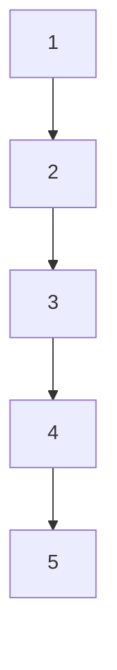
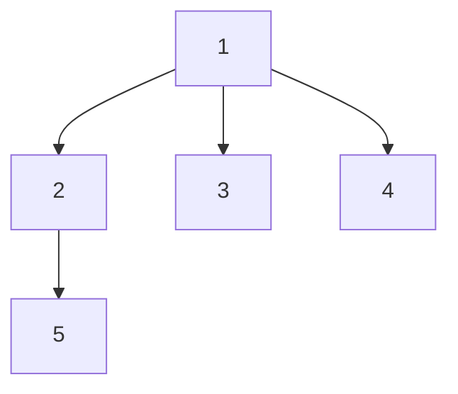

# 图综合应用题：题目与满分解答

> [!tip] 考研应用题统一答题结构
> 1. 先说明图的存储结构，以及遍历时扫描邻接点的方向。
> 2. 给出算法的核心步骤或伪代码。
> 3. 简要说明算法为什么正确。
> 4. 最后写时间复杂度和辅助空间复杂度。

## 01 由邻接表画 DFS、BFS 生成树

### 题目

图 $G=(V,E)$ 以邻接表存储，如下邻接表所示。试画出图 $G$ 的深度优先生成树和广度优先生成树，假设从顶点 1 开始遍历。

邻接表为：

```text
1: 2 -> 3 -> 4
2: 1 -> 3 -> 4 -> 5
3: 1 -> 2 -> 4
4: 1 -> 2 -> 3 -> 5
5: 2 -> 4
```

### 解答

默认按照邻接表中从左到右的顺序扫描邻接点。

#### 深度优先遍历

从 1 出发：

```text
1 -> 2 -> 3 -> 4 -> 5
```

DFS 生成树的树边为：

```text
(1,2), (2,3), (3,4), (4,5)
```

DFS 生成树：



#### 广度优先遍历

队列变化如下：

| 操作 | 访问顶点 | 入队的新顶点 | 队列 |
|---|---:|---|---|
| 初始 | - | 1 | 1 |
| 出队 1 | 1 | 2、3、4 | 2、3、4 |
| 出队 2 | 2 | 5 | 3、4、5 |
| 出队 3 | 3 | 无 | 4、5 |
| 出队 4 | 4 | 无 | 5 |
| 出队 5 | 5 | 无 | 空 |

BFS 遍历序列为：

```text
1 -> 2 -> 3 -> 4 -> 5
```

BFS 生成树的树边为：

```text
(1,2), (1,3), (1,4), (2,5)
```

BFS 生成树：



### 满分作答

在邻接表中按给定顺序扫描邻接点，并在顶点第一次被访问时记录其父顶点。由此得到：

- DFS 序列：$1,2,3,4,5$；
- DFS 生成树边：$(1,2),(2,3),(3,4),(4,5)$；
- BFS 序列：$1,2,3,4,5$；
- BFS 生成树边：$(1,2),(1,3),(1,4),(2,5)$。

## 02 判断无向图是否为二分图

### 题目

给定一个连通无向图，采用邻接表存储，将图的所有顶点分别染成红色或蓝色。若存在一种染色方法，使图中每条边的两个顶点颜色都不相同，则称这个图能被二分。

回答：

1. 判断题图中的两个无向图是否能被二分；若能，标出每个顶点的颜色。
2. 设计一种判断图是否能被二分的算法。
3. 给出算法的时间复杂度和空间复杂度。

### 第 1 问：判断和染色

由于原图顶点没有编号，下面按位置自行编号，颜色整体互换也算正确。

#### 左图

约定：

| 编号 | 位置 |
|---|---|
| A | 最左侧 |
| B | 左上 |
| C | 中间偏左 |
| D | 中央偏右 |
| E | 右上 |
| F | 右侧 |
| G | 下方 |

左图可取如下染色：

```text
红色：A、D、G
蓝色：B、C、E、F
```

检查每条边，边的两个端点颜色均不同，因此左图是二分图。

#### 右图

右图中存在一个奇环：

```text
C -> D -> F -> C
```

这是一个长度为 3 的环。奇环不可能使用两种颜色使每条边两端颜色不同，因此右图不是二分图。

### 第 2 问：基于 BFS 的判定算法

使用 color 数组记录顶点颜色：

- 0：尚未染色；
- 1：红色；
- 2：蓝色。

从任意未染色顶点开始 BFS。访问顶点 u 时，扫描 u 的每个邻接点 w：

1. 若 w 尚未染色，则将 w 染成与 u 相反的颜色并入队；
2. 若 w 已染色且颜色与 u 相同，则存在冲突，图不是二分图；
3. 遍历结束仍无冲突，则图是二分图。

```cpp
bool IsBipartite(ALGraph &G) {
    // color[u] == 0 表示未染色，1 和 2 表示两种颜色
    vector<int> color(G.vexnum, 0);
    queue<int> Q;

    for (int s = 0; s < G.vexnum; ++s) {
        if (color[s] != 0) {
            continue;
        }

        color[s] = 1;
        Q.push(s);

        while (!Q.empty()) {
            int u = Q.front();
            Q.pop();

            for (ArcNode *p = G.vertices[u].firstarc;
                 p != nullptr; p = p->nextarc) {
                int w = p->adjvex;

                if (color[w] == 0) {
                    color[w] = 3 - color[u];
                    Q.push(w);
                } else if (color[w] == color[u]) {
                    return false;
                }
            }
        }
    }

    return true;
}
```

### 第 3 问：复杂度

邻接表中每个顶点表结点和每个边表结点最多被检查一次，因此：

```text
时间复杂度：O(n + e)
辅助空间复杂度：O(n)
```

其中，$n$ 为顶点数，$e$ 为边数。若把颜色数组、队列等辅助结构计入空间，仍为 $O(n)$。

### 满分结论

无向图能被二分，当且仅当图中不存在奇环。采用 BFS 对顶点进行二染色，若遇到一条边的两个端点颜色相同，则图不能二分；若遍历结束没有冲突，则图可以二分。

## 03 判断无向图是否为树

### 题目

试设计一个算法，判断一个无向图 G 是否为一棵树。若是树，算法返回 true，否则返回 false。

### 解题依据

无向图是树，当且仅当同时满足：

1. 图是连通图；
2. 图的边数为顶点数减 1，即 $e=n-1$。

因此，只要使用 DFS 或 BFS 判断连通性，再统计边数即可。

### 参考算法

```cpp
void DFSCount(ALGraph &G, int u,
              vector<bool> &visited, int &count) {
    visited[u] = true;
    ++count;

    for (ArcNode *p = G.vertices[u].firstarc;
         p != nullptr; p = p->nextarc) {
        int w = p->adjvex;
        if (!visited[w]) {
            DFSCount(G, w, visited, count);
        }
    }
}

bool IsTree(ALGraph &G) {
    int n = G.vexnum;
    if (n == 0) {
        return false;
    }

    vector<bool> visited(n, false);
    int visitedCount = 0;
    DFSCount(G, 0, visited, visitedCount);

    // 不是连通图，不是树
    if (visitedCount != n) {
        return false;
    }

    // 无向图的邻接表中，每条边出现两次
    int arcCount = 0;
    for (int u = 0; u < n; ++u) {
        for (ArcNode *p = G.vertices[u].firstarc;
             p != nullptr; p = p->nextarc) {
            ++arcCount;
        }
    }
    int e = arcCount / 2;

    return e == n - 1;
}
```

如果图的结构体中已经直接保存了无向边数 e，则不需要再次扫描邻接表，直接判断 G.arcnum == n - 1 即可。

### 正确性说明

- DFS 访问到全部 n 个顶点，说明图连通；
- 连通且有 n-1 条边的无向图无环；
- 连通、无环的无向图就是树。

### 复杂度

```text
时间复杂度：O(n + e)
辅助空间复杂度：O(n)
```

其中 DFS 的递归栈、访问标记数组均最多占用 O(n) 空间。

### 满分作答

先从任意顶点进行 DFS，若不能访问全部顶点，则图不连通，不是树；然后统计边数。对于无向图，若边数满足 e=n-1，则图为树，否则不是树。因此算法时间复杂度为 O(n+e)，辅助空间复杂度为 O(n)。

## 04 判断有向图中是否存在从 vi 到 vj 的路径

### 题目

分别采用基于深度优先遍历和广度优先遍历的算法，判别以邻接表方式存储的有向图中是否存在由顶点 vi 到顶点 vj 的路径，其中 i 不等于 j。算法中涉及的图的基本操作必须在邻接表上实现。

### 邻接表结点定义

```cpp
struct ArcNode {
    int adjvex;       // 该弧指向的顶点下标
    ArcNode *nextarc; // 同一出发顶点的下一条弧
};

struct VNode {
    int data;
    ArcNode *firstarc; // 第一条出弧
};

struct ALGraph {
    VNode vertices[MAXV];
    int vexnum;
};
```

有向图中只能沿着弧的方向访问，即从 u 扫描到 p->adjvex。

### DFS 算法

```cpp
bool DFSReach(ALGraph &G, int u, int target,
              vector<bool> &visited) {
    if (u == target) {
        return true;
    }

    visited[u] = true;

    for (ArcNode *p = G.vertices[u].firstarc;
         p != nullptr; p = p->nextarc) {
        int w = p->adjvex;
        if (!visited[w] &&
            DFSReach(G, w, target, visited)) {
            return true;
        }
    }

    return false;
}

bool ExistPathByDFS(ALGraph &G, int i, int j) {
    vector<bool> visited(G.vexnum, false);
    return DFSReach(G, i, j, visited);
}
```

### BFS 算法

```cpp
bool ExistPathByBFS(ALGraph &G, int i, int j) {
    vector<bool> visited(G.vexnum, false);
    queue<int> Q;

    visited[i] = true;
    Q.push(i);

    while (!Q.empty()) {
        int u = Q.front();
        Q.pop();

        for (ArcNode *p = G.vertices[u].firstarc;
             p != nullptr; p = p->nextarc) {
            int w = p->adjvex;

            if (visited[w]) {
                continue;
            }

            if (w == j) {
                return true;
            }

            visited[w] = true;
            Q.push(w);
        }
    }

    return false;
}
```

### 正确性说明

DFS 或 BFS 都从 vi 出发，沿有向边方向访问所有可达顶点。如果访问到 vj，则存在从 vi 到 vj 的路径；如果搜索结束仍未访问到 vj，则不存在这样的路径。

访问标记必须在顶点入队或递归访问时设置，以防止有向图中的环导致重复访问。

### 复杂度

```text
DFS 时间复杂度：O(n + e)
BFS 时间复杂度：O(n + e)
辅助空间复杂度：O(n)
```

邻接表中每个顶点和每条弧最多被检查一次。

## 05 输出从 vi 到 vj 的所有简单路径

### 题目

假设图用邻接表表示，设计一个算法，输出从顶点 vi 到顶点 vj 的所有简单路径。

简单路径是指路径中每个顶点至多出现一次。

### 算法思想

采用 DFS 加回溯：

1. 将当前顶点加入 path，并标记为已访问；
2. 如果当前顶点就是 vj，则输出 path；
3. 否则扫描当前顶点的所有邻接点，只递归访问本条路径中尚未出现的顶点；
4. 当前顶点的所有分支处理完后，撤销访问标记并将其从 path 中删除，回溯到上一层。

这里的 visited 表示“当前路径中是否已经出现过”，而不是整个搜索过程中的永久访问标记。回溯时必须取消标记，否则会漏掉其他简单路径。

### 参考代码

```cpp
void PrintPath(const vector<int> &path) {
    for (int i = 0; i < static_cast<int>(path.size()); ++i) {
        if (i > 0) {
            cout << " -> ";
        }
        cout << path[i];
    }
    cout << endl;
}

void DFSAllPaths(ALGraph &G, int u, int target,
                 vector<bool> &visited,
                 vector<int> &path) {
    visited[u] = true;
    path.push_back(u);

    if (u == target) {
        PrintPath(path);
    } else {
        for (ArcNode *p = G.vertices[u].firstarc;
             p != nullptr; p = p->nextarc) {
            int w = p->adjvex;
            if (!visited[w]) {
                DFSAllPaths(G, w, target, visited, path);
            }
        }
    }

    // 回溯：允许该顶点出现在另一条简单路径中
    path.pop_back();
    visited[u] = false;
}

void PrintAllSimplePaths(ALGraph &G, int i, int j) {
    vector<bool> visited(G.vexnum, false);
    vector<int> path;
    DFSAllPaths(G, i, j, visited, path);
}
```

### 正确性说明

path 始终保存从 vi 到当前顶点的一条简单路径，因为只有未出现在当前路径中的顶点才会被递归访问。

当当前顶点为 vj 时，path 就是一条从 vi 到 vj 的简单路径，输出即可。对当前顶点的每个未访问邻接点都进行递归，能够枚举所有可能的路径分支；递归返回时撤销标记，能够继续搜索其他路径。因此算法不会遗漏，也不会重复输出简单路径。

### 复杂度

设从 vi 到 vj 的简单路径条数为 P，每条路径长度最多为 n：

```text
输出本身的时间复杂度至少为 O(Pn)
辅助空间复杂度为 O(n)
```

该算法属于输出敏感算法，实际时间还包括搜索过程的开销。图中简单路径的条数可能很多，最坏情况下达到阶乘级，因此不能把本题时间复杂度简单写成 O(n+e)。

若把所有路径都保存起来而不是边搜索边输出，则还需要 O(Pn) 的输出存储空间；若直接输出，工作空间为 O(n)。

### 满分作答

使用 DFS 进行回溯，设置数组 visited 记录当前路径中的顶点，设置数组 path 保存当前路径。访问顶点 u 时，先将 u 加入 path 并标记；若 u=vj，输出当前路径；否则递归访问所有未在当前路径中出现的邻接点。递归返回时撤销标记并删除路径末尾顶点。这样即可输出所有简单路径。辅助空间复杂度为 O(n)，时间复杂度与输出路径条数有关，最坏为阶乘级。

## 易错总结

### 1. DFS 序列不一定是一条路径

例如：

```text
v0, v3, v2, v1
```

中间可能发生：

```text
v0 -> v3 -> 回溯到 v0 -> v2 -> 回溯到 v0 -> v1
```

因此 v3 和 v2 之间没有边，也不影响它作为 DFS 访问序列。

### 2. DFS 必须先处理当前分支

如果当前顶点还有未访问的邻接点，就不能提前回溯到祖先顶点。

### 3. 有向图必须看方向

有向边 <u,v> 表示 u 到 v，不能反向使用。只有无向边 {u,v} 才能从两个方向访问。

### 4. 普通可达性判断和输出所有简单路径的 visited 含义不同

| 问题 | visited 的含义 | 是否回溯取消标记 |
|---|---|---|
| 判断是否可达 | 整个搜索过程中是否访问过 | 否 |
| 输出所有简单路径 | 当前路径中是否出现过 | 是 |

# 新增应用题（第二批）

## 01 “破圈法”求最小生成树

### 题目

下面是一种称为“破圈法”的求解最小生成树的方法：任取一圈，去掉圈上权最大的边，反复执行此步骤，直到没有圈为止。判断这种方法是否正确。若正确，说明理由；若不正确，举出反例。

### 解答

这种方法正确，称为逆向删除法（Reverse-Delete Algorithm）。

每次选取当前图中的一个环，并删除该环上权值最大的边。删除环上的一条边不会破坏连通性，因为该边的两个端点仍可沿环上的其他边相互到达。

根据最小生成树的环性质：一个环中权值最大的边不必出现在最小生成树中；如果最大边不唯一，删除其中任意一条最大边仍然可以得到某棵最小生成树。

不断删除后，图最终无环且保持连通，因此得到一棵生成树；同时每次删除的边都可以被某棵最小生成树排除，所以最终得到的是最小生成树。

### 满分作答

该方法正确。每次删除当前环上的最大权值边，根据最小生成树的环性质，删除该边不会使最小生成树的最优性丧失；同时由于删除的是环上的边，图仍保持连通。重复删除直到图无环，所得图是连通无环的生成树，并且权值总和最小，因此所得结果为最小生成树。

## 02 有向带权图的遍历、强连通分量、拓扑排序和最小生成树

### 题目

已知有向图如下图所示，边上的数字表示权值：

~~~text
1 -> 2 (3), 1 -> 3 (3), 1 -> 4 (6)
2 -> 3 (4), 2 -> 5 (5)
3 -> 5 (4), 3 -> 6 (3)
5 -> 7 (3), 6 -> 7 (7)
~~~

回答：

1. 写出该图的邻接矩阵，并据此给出从顶点 1 出发的深度优先遍历序列。
2. 求该有向图的强连通分量数目。
3. 给出该图的任意两个拓扑序列。
4. 若将该图视为无向图，分别用 Prim 算法和 Kruskal 算法求最小生成树。

### 1. 邻接矩阵和 DFS 序列

规定：矩阵对角线为 0，没有边的位置为 $infty$，并按顶点编号从小到大的顺序扫描邻接点。

邻接矩阵为：

|  | 1 | 2 | 3 | 4 | 5 | 6 | 7 |
|---|---:|---:|---:|---:|---:|---:|---:|
| 1 | 0 | 3 | 3 | 6 | $infty$ | $infty$ | $infty$ |
| 2 | $infty$ | 0 | 4 | $infty$ | 5 | $infty$ | $infty$ |
| 3 | $infty$ | $infty$ | 0 | $infty$ | 4 | 3 | $infty$ |
| 4 | $infty$ | $infty$ | $infty$ | 0 | $infty$ | $infty$ | $infty$ |
| 5 | $infty$ | $infty$ | $infty$ | $infty$ | 0 | $infty$ | 3 |
| 6 | $infty$ | $infty$ | $infty$ | $infty$ | $infty$ | 0 | 7 |
| 7 | $infty$ | $infty$ | $infty$ | $infty$ | $infty$ | $infty$ | 0 |

从 1 开始 DFS：

~~~text
1 -> 2 -> 3 -> 5 -> 7 -> 6 -> 4
~~~

说明：从 3 访问 5 后，先访问 5 的后继 7；回溯到 3 后再访问 6；最后回溯到 1 访问 4。

### 2. 强连通分量

该图中每条边都从编号较小的顶点指向编号较大的顶点，因此不可能存在有向环。

每个顶点各自构成一个强连通分量，所以：

~~~text
强连通分量数：7
~~~

### 3. 两个拓扑序列

例如：

~~~text
1, 2, 3, 4, 5, 6, 7
1, 2, 4, 3, 6, 5, 7
~~~

这两个序列都满足每条有向边的起点出现在终点之前。

### 4. 视为无向图后的最小生成树

将有向边视为无向边后，边及权值为：

~~~text
(1,2):3  (1,3):3  (1,4):6
(2,3):4  (2,5):5
(3,5):4  (3,6):3
(5,7):3  (6,7):7
~~~

#### Prim 算法

从顶点 1 开始，可以依次选择：

~~~text
(1,2):3
(1,3):3
(3,6):3
(3,5):4
(5,7):3
(1,4):6
~~~

得到最小生成树，总权值为：

$$
3+3+3+4+3+6=22
$$

#### Kruskal 算法

按权值从小到大排序并跳过会形成环的边：

~~~text
(1,2):3
(1,3):3
(3,6):3
(5,7):3
(2,3):4  // 构成环，跳过
(3,5):4
(2,5):5  // 构成环，跳过
(1,4):6
~~~

最终得到的边集合与 Prim 算法相同，总权值为 22。

## 03 Dijkstra 求单源最短路径

### 题目

对图中所示的带权无向图，按照 Dijkstra 算法，写出从顶点 1 到其余各个顶点的最短路径和最短路径长度，顺序不能颠倒。

图的边为：

~~~text
(1,2):7  (1,3):11  (2,3):10
(2,4):9  (3,4):5   (3,5):7
(3,6):8   (5,6):6
~~~

### 解答

从顶点 1 出发：

| 目标顶点 | 最短路径 | 最短路径长度 |
|---|---|---:|
| 2 | 1 -> 2 | 7 |
| 3 | 1 -> 3 | 11 |
| 4 | 1 -> 2 -> 4 或 1 -> 3 -> 4 | 16 |
| 5 | 1 -> 3 -> 5 | 18 |
| 6 | 1 -> 3 -> 6 | 19 |

其中到顶点 4 有两条长度相同的最短路径，写出其中一条即可；写出两条更完整。

### Dijkstra 关键过程

初始：

~~~text
d(1)=0, d(2)=7, d(3)=11, d(4)=∞, d(5)=∞, d(6)=∞
~~~

选定 2 后更新：

~~~text
d(4)=min(∞, 7+9)=16
d(3)=min(11, 7+10)=11
~~~

选定 3 后更新：

~~~text
d(4)=min(16, 11+5)=16
d(5)=11+7=18
d(6)=11+8=19
~~~

之后不会再产生更短的路径。

## 04 AOE 网：邻接表、工程最短工期和关键路径

### 题目

下图是一个用 AOE 网表示的工程，边上的活动及持续时间如下：

~~~text
v1 -> v2: a1=2     v1 -> v3: a2=5     v1 -> v5: a3=5
v2 -> v4: a4=3     v2 -> v3: a5=2
v3 -> v5: a6=1     v3 -> v6: a7=3
v4 -> v6: a8=2
v5 -> v7: a9=6
v6 -> v8: a10=4    v6 -> v7: a11=3
v7 -> v9: a12=4    v8 -> v9: a13=2
~~~

回答：

1. 画出该图的邻接表。
2. 完成该工程至少需要多长时间？
3. 指出关键路径。
4. 哪些活动加速可以缩短完成工程所需的时间？

### 1. 邻接表

~~~text
v1: (v2, a1=2) -> (v3, a2=5) -> (v5, a3=5)
v2: (v4, a4=3) -> (v3, a5=2)
v3: (v5, a6=1) -> (v6, a7=3)
v4: (v6, a8=2)
v5: (v7, a9=6)
v6: (v8, a10=4) -> (v7, a11=3)
v7: (v9, a12=4)
v8: (v9, a13=2)
v9: 空
~~~

### 2. 事件最早发生时间

按拓扑顺序计算：

| 事件 | v1 | v2 | v3 | v4 | v5 | v6 | v7 | v8 | v9 |
|---|---:|---:|---:|---:|---:|---:|---:|---:|---:|
| 最早时间 ve | 0 | 2 | 5 | 5 | 6 | 8 | 12 | 12 | 16 |

所以工程最短工期为：

~~~text
ve(v9)=16
~~~

### 3. 关键路径

关键活动是时间余量为 0 的活动：

~~~text
a2, a6, a9, a12
~~~

关键路径为：

~~~text
v1 --a2(5)--> v3 --a6(1)--> v5 --a9(6)--> v7 --a12(4)--> v9
~~~

工程总工期：

$$
5+1+6+4=16
$$

### 4. 可以加速的活动

能够缩短整个工程工期的，只能是关键活动：

~~~text
a2、a6、a9、a12
~~~

加速非关键活动只会减少其时间余量，不能立即缩短工程总工期。

## 05 由工序前驱关系建立 AOE 网

### 题目

下表给出了某工程各工序之间的优先关系和各工序所需时间，其中“—”表示无先驱工序。

| 工序 | A | B | C | D | E | F | G | H |
|---|---:|---:|---:|---:|---:|---:|---:|---:|
| 所需时间 | 3 | 2 | 2 | 3 | 4 | 3 | 2 | 1 |
| 先驱工序 | — | — | A | A | B | A | C、E | D |

回答：

1. 画出相应的 AOE 网。
2. 列出各事件的最早发生时间和最迟发生时间。
3. 求关键路径并说明完成该工程所需的最短时间。

### 1. 一种合法的 AOE 网

为了表示 G 必须同时等待 C 和 E，设置两个持续时间为 0 的虚活动；为了统一终点，F 也通过一个持续时间为 0 的虚活动接入终点。

~~~text
事件 1 -> 事件 2：A=3
事件 1 -> 事件 3：B=2
事件 2 -> 事件 4：C=2
事件 2 -> 事件 5：D=3
事件 2 -> 事件 6：F=3
事件 3 -> 事件 7：E=4
事件 4 -> 事件 8：虚活动 d1=0
事件 7 -> 事件 8：虚活动 d2=0
事件 8 -> 事件 9：G=2
事件 5 -> 事件 9：H=1
事件 6 -> 事件 9：虚活动 d3=0
~~~

其中：

- C 和 E 都完成后，事件 8 才能发生，因此 G 才能开始；
- H、G、F 都完成后，工程在事件 9 结束。

### 2. 事件时间

正向计算最早发生时间 ve，反向计算最迟发生时间 vl：

| 事件 | 1 | 2 | 3 | 4 | 5 | 6 | 7 | 8 | 9 |
|---|---:|---:|---:|---:|---:|---:|---:|---:|---:|
| ve | 0 | 3 | 2 | 5 | 6 | 6 | 6 | 6 | 8 |
| vl | 0 | 4 | 2 | 6 | 7 | 8 | 6 | 6 | 8 |

### 3. 关键路径和最短工期

活动 B、E、G 的时间余量均为 0，因此关键路径为：

~~~text
1 --B(2)--> 3 --E(4)--> 7 --G(2)--> 9
~~~

最短工期：

~~~text
2+4+2=8
~~~

## 06 Dijkstra 最短路径树是否一定是最小生成树

### 题目

一个连通无向图的边权值非负。问：用 Dijkstra 最短路径算法能否得到一棵生成树，该树是否一定是最小生成树？说明理由。

### 解答

不能保证。

Dijkstra 求的是“从指定源点到各顶点的最短路径”，得到的是最短路径树；最小生成树求的是“覆盖所有顶点且总权值最小的树”。两者优化目标不同。

反例：

~~~text
顶点：1、2、3
边：(1,2)=2, (1,3)=3, (2,3)=2
~~~

从 1 出发运行 Dijkstra：

~~~text
最短路径树：{(1,2),(1,3)}
树的权值和：2+3=5
~~~

但该图的最小生成树为：

~~~text
{(1,2),(2,3)}
最小总权值：2+2=4
~~~

因此 Dijkstra 得到的最短路径树不一定是最小生成树。

## 07 用 DFS 实现有向无环图的拓扑排序

### 题目

试编写利用 DFS 实现有向无环图拓扑排序的算法。

### 算法思想

对每个尚未访问的顶点进行 DFS。顶点的所有后继顶点都访问完成后，再将该顶点加入序列。最后将序列逆置，即得到拓扑序列。

这是因为：若存在边 u 到 v，DFS 会先完成 v，再完成 u，所以后序序列中 u 在 v 后面，逆置后 u 在 v 前面。

### 参考代码

~~~cpp
void DFS_Topo(ALGraph &G, int u,
              vector<bool> &visited,
              vector<int> &order) {
    visited[u] = true;

    for (ArcNode *p = G.vertices[u].firstarc;
         p != nullptr; p = p->nextarc) {
        int v = p->adjvex;
        if (!visited[v]) {
            DFS_Topo(G, v, visited, order);
        }
    }

    // 后序加入
    order.push_back(u);
}

vector<int> TopologicalSortByDFS(ALGraph &G) {
    vector<bool> visited(G.vexnum, false);
    vector<int> order;

    for (int u = 0; u < G.vexnum; ++u) {
        if (!visited[u]) {
            DFS_Topo(G, u, visited, order);
        }
    }

    reverse(order.begin(), order.end());
    return order;
}
~~~

题目已保证图无环，因此不必额外判断环。若题目还要求判断是否为 DAG，可把 visited 改为三色标记：访问中顶点再次被访问时说明存在环。

复杂度：

~~~text
时间复杂度：O(n+e)
辅助空间复杂度：O(n)
~~~

## 08 Dijkstra 方法能否求出指定终点的最短路径

### 题目

带权图的边权值非负。给出一种方法：

1. 最短路径初始只包含源点；
2. 选择距离源点最近且尚未在最短路径中的顶点 v，将 v 加入最短路径，并修改当前距离；
3. 重复步骤 2，直到 v 是目标顶点。

问：上述方法能否求出源点到目标顶点的一条最短路径？若能，证明；否则举反例。

### 解答

该方法可以求出源点到目标顶点的一条最短路径，本质上是 Dijkstra 算法在目标顶点被选定时提前终止。

### 正确性说明

设当前已确定集合为 S。Dijkstra 的不变式是：对每个已经加入 S 的顶点，其当前距离就是源点到它的最短距离。

每次选择 S 外距离最小的顶点 v。由于所有边权非负，任何经过尚未确定顶点的路径，都不可能绕行后得到比当前距离更短的结果。因此 v 的当前距离已经确定为最短距离。

当目标顶点第一次被选入 S 时，其当前距离就是源点到目标顶点的最短距离。因此该方法正确。

若存在负权边，上述结论不成立，Dijkstra 不能处理含负权边的最短路径问题。

## 09 上三角矩阵存储的有向图

### 题目

已知 6 个顶点（编号为 0～5）的有向带权图 G，其邻接矩阵为上三角矩阵，按行优先保存到一维数组中：

~~~text
4, 6, ∞, ∞, ∞, 5, ∞, ∞, 4, 3, ∞, ∞, 3, 3, 3
~~~

回答：

1. 写出图 G 的邻接矩阵；
2. 画出有向带权图 G；
3. 求图 G 的关键路径，并计算关键路径长度。

### 1. 邻接矩阵

对角线为 0，下三角位置没有有向边，记为 $infty$：

|  | 0 | 1 | 2 | 3 | 4 | 5 |
|---|---:|---:|---:|---:|---:|---:|
| 0 | 0 | 4 | 6 | $infty$ | $infty$ | 5 |
| 1 | $infty$ | 0 | $infty$ | $infty$ | 4 | 3 |
| 2 | $infty$ | $infty$ | 0 | $infty$ | $infty$ | 3 |
| 3 | $infty$ | $infty$ | $infty$ | 0 | 3 | 3 |
| 4 | $infty$ | $infty$ | $infty$ | $infty$ | 0 | 3 |
| 5 | $infty$ | $infty$ | $infty$ | $infty$ | $infty$ | 0 |

对应的有向边为：

~~~text
0 -> 1 (4), 0 -> 2 (6), 0 -> 5 (5)
1 -> 4 (4), 1 -> 5 (3)
2 -> 5 (3)
3 -> 4 (3), 3 -> 5 (3)
4 -> 5 (3)
~~~

### 2. 关键路径

该图是有向无环图。由于 0 和 3 都可能是起点，求关键路径时取所有有向路径中的最大长度，或增加一个权值为 0 的虚拟源点连接所有入度为 0 的顶点。

最长路径为：

~~~text
0 -> 1 -> 4 -> 5
~~~

关键路径长度为：

$$
4+4+3=11
$$

## 10 OSPF 链路状态信息的图存储

### 题目

某网络运行 OSPF 路由协议。路由器根据链路状态信息构造网络拓扑图。回答：

1. 本题中的网络可抽象为数据结构中的哪种逻辑结构？
2. 针对表中的内容，设计合理的链式存储结构保存链路状态信息，给出数据类型定义，并画出链式存储结构示意图。
3. 按照 Dijkstra 算法，依次给出 R1 到达各个 192.1.x.x 子网的最短路径及费用。

### 1. 逻辑结构

网络可以抽象为带权无向图：

- 路由器是顶点；
- 路由器之间的链路是边；
- 链路费用是边权值；
- 直连子网可以作为附加的网络结点，或作为路由器顶点的附加信息。

### 2. 链式存储结构

该网络边数相对较少，采用邻接表存储较合适。

~~~cpp
struct LinkNode {
    string neighborID;  // 相邻路由器的 Router ID
    string localIP;     // 本端在该链路上的 IP
    int metric;         // 链路费用
    LinkNode *next;
};

struct NetNode {
    string prefix;      // 直连网络前缀
    int metric;         // 到直连网络的费用
    NetNode *next;
};

struct RouterNode {
    string routerID;
    string ownIP;
    LinkNode *firstLink;
    NetNode *firstNet;
};
~~~

邻接表示意：

~~~text
R1(10.1.1.1)
  -> R2, localIP=10.1.1.1, metric=3
  -> R3, localIP=10.1.1.9, metric=2
  -> Net 192.1.1.0/24, metric=1

R2(10.1.1.2)
  -> R1, localIP=10.1.1.2, metric=3
  -> R4, localIP=10.1.1.13, metric=4
  -> Net 192.1.6.0/24, metric=1

R3(10.1.1.5)
  -> R1, localIP=10.1.1.10, metric=2
  -> R4, localIP=10.1.1.5, metric=6
  -> Net 192.1.5.0/24, metric=1

R4(10.1.1.6)
  -> R2, localIP=10.1.1.14, metric=4
  -> R3, localIP=10.1.1.6, metric=6
  -> Net 192.1.7.0/24, metric=1
~~~

每条无向链路在两个端点的邻接表中各保存一个链结点。

### 3. R1 到各子网的最短路径

路由器之间的链路费用：

~~~text
R1-R2=3, R1-R3=2, R2-R4=4, R3-R4=6
~~~

各路由器到直连子网的费用均为 1。

| 目标子网 | 最短路径 | 费用 |
|---|---|---:|
| 192.1.1.0/24 | R1 -> Net1 | 1 |
| 192.1.5.0/24 | R1 -> R3 -> Net5 | 2+1=3 |
| 192.1.6.0/24 | R1 -> R2 -> Net6 | 3+1=4 |
| 192.1.7.0/24 | R1 -> R2 -> R4 -> Net7 | 3+4+1=8 |

## 11 Prim、Kruskal 和最小生成树唯一性

### 题目

对图中的带权无向图 G：

1. 从顶点 A 开始求 G 的最小生成树，依次给出 Prim 算法选出的边。
2. 图 G 的最小生成树是唯一的吗？
3. 对任意带权连通图，满足什么条件时其最小生成树是唯一的？

图的边为：

~~~text
A-B=6, A-D=4, A-E=5
B-C=4, C-D=6, C-E=5, D-E=4
~~~

### 1. Prim 算法

从 A 开始，一种合法的选择顺序为：

~~~text
A-D=4
D-E=4
E-C=5
C-B=4
~~~

得到最小生成树，总权值为：

~~~text
4+4+5+4=17
~~~

### 2. 是否唯一

是唯一的。

理由：

- 权值为 4 的边 A-D、D-E、B-C 是连接相应割的唯一最小边，必须选取；
- 选取这三条边后，顶点集合 {A,D,E} 与 {B,C} 之间只有 C-E=5 能以最小代价连接两个部分；
- A-E=5 在已经由 A-D、D-E 连接的部分内部，不能代替 C-E 完成连通；
- 其他替代边权值更大。

所以最小生成树唯一。

### 3. 唯一最小生成树的判定条件

带权连通图的最小生成树唯一，当且仅当对于图的每一个割，跨过该割的最小权值边是唯一的。

常用充分条件是：图中所有边的权值互不相同。但边权互不相同不是必要条件。

## 12 光缆网络的最小生成树和 TTL

### 题目

有 8 个城市 XA、BJ、CS、QD、JN、NJ、TL、WH。图中的无向边权值表示两个城市之间铺设光缆的费用。

回答：

1. 仅从铺设费用角度出发，给出所有可能的最经济光缆铺设方案，并计算相应总费用。
2. 该图适合采用哪种图存储结构？给出求解第 1 问所用的算法名称。
3. 假设每个城市采用一个路由器，使用第 1 问得到的最经济方案组网。主机 H1 直接连接 BJ 路由器，主机 H2 直接连接 TL 路由器。若 H1 向 H2 发送 TTL=5 的 IP 分组，H2 是否可以收到？

图的边为：

~~~text
XA-BJ=2, XA-WH=2, BJ-TL=3, WH-BJ=3
WH-CS=4, CS-QD=3, WH-QD=3
TL-JN=2, BJ-JN=4, JN-QD=2
JN-NJ=3, QD-NJ=2
~~~

### 1. 所有最经济方案

先选取所有权值为 2 的边：

~~~text
XA-BJ, XA-WH, TL-JN, JN-QD, QD-NJ
~~~

这 5 条边不会构成环，且必须选取。

还剩下三个连通块：

~~~text
{XA,BJ,WH}, {TL,JN,QD,NJ}, {CS}
~~~

CS 只能通过 CS-QD=3 接入。前两个连通块之间可以选择：

- BJ-TL=3；
- WH-QD=3。

因此有两棵最小生成树：

方案一：

~~~text
{XA-BJ, XA-WH, TL-JN, JN-QD, QD-NJ,
 BJ-TL, CS-QD}
~~~

方案二：

~~~text
{XA-BJ, XA-WH, TL-JN, JN-QD, QD-NJ,
 WH-QD, CS-QD}
~~~

两种方案的总费用均为：

$$
5	imes 2+2	imes 3=16
$$

### 2. 存储结构和算法

该图是稀疏带权无向图，适合使用邻接表存储；求最小生成树可使用 Kruskal 算法。Kruskal 能够直观看出相同权值边导致的两种方案。

### 3. TTL 判断

方案一中：

~~~text
H1 -> BJ -> TL -> H2
~~~

路径很短，TTL=5 足够，H2 可以收到。

方案二中：

~~~text
H1 -> BJ -> XA -> WH -> QD -> JN -> TL -> H2
~~~

按照 IP 的标准 TTL 规则，每经过一个路由器 TTL 减 1。该路径需要经过较多路由器，TTL=5 会在到达 TL 前耗尽，因此 H2 收不到。

所以若题目没有指定采用哪一棵最小生成树，答案不是唯一的：

~~~text
采用方案一：可以收到；
采用方案二：不能收到。
~~~

## 13 判断有向图是否存在唯一拓扑序列

### 题目

有向图 G 采用邻接矩阵存储，类型定义如下：

~~~cpp
typedef struct {
    int numVertices, numEdges;
    char VerticesList[MAXV];
    int Edge[MAXV][MAXV];
} MGraph;
~~~

请设计算法：int uniquely(MGraph G)，判断 G 是否存在唯一的拓扑序列。若存在，返回 1；否则返回 0。要求：

1. 给出算法的基本设计思想；
2. 根据设计思想，用 C 或 C++ 描述算法，关键之处给出注释。

### 算法思想

拓扑排序每一步都只能从当前入度为 0 的顶点中选择一个：

- 如果当前有两个或以上入度为 0 的顶点，则至少有两种选择，拓扑序列不唯一；
- 如果当前没有入度为 0 的顶点，则图有环，不存在拓扑序列，也不唯一；
- 如果每一步始终恰好有一个入度为 0 的顶点，并且最终处理完所有顶点，则拓扑序列唯一。

### 参考代码

下面假设 Edge[u][v] 不为 0 表示存在边；如果教材用 $infty$ 表示无边，只需把判断条件替换为 Edge[u][v] != INF。

~~~cpp
int uniquely(MGraph G) {
    int n = G.numVertices;
    int indegree[MAXV] = {0};
    bool removed[MAXV] = {false};

    // 计算每个顶点的入度
    for (int u = 0; u < n; ++u) {
        for (int v = 0; v < n; ++v) {
            if (G.Edge[u][v] != 0) {
                ++indegree[v];
            }
        }
    }

    for (int k = 0; k < n; ++k) {
        int zero = -1;
        int count = 0;

        // 查找当前尚未删除的入度为 0 的顶点
        for (int u = 0; u < n; ++u) {
            if (!removed[u] && indegree[u] == 0) {
                zero = u;
                ++count;
            }
        }

        // 没有零入度顶点：有环
        if (count == 0) {
            return 0;
        }

        // 有多个零入度顶点：选择不唯一
        if (count > 1) {
            return 0;
        }

        removed[zero] = true;

        // 删除 zero 发出的边
        for (int v = 0; v < n; ++v) {
            if (G.Edge[zero][v] != 0) {
                --indegree[v];
            }
        }
    }

    return 1;
}
~~~

时间复杂度为 $O(n^2)$，辅助空间复杂度为 $O(n)$。

## 14 AOE 网的关键活动、时间余量和工期调整

### 题目

某工程包含 12 个活动，活动及持续时间如下：

~~~text
a: 1 -> 3, duration=2
b: 1 -> 2, duration=5
c: 3 -> 6, duration=1
d: 1 -> 4, duration=3
e: 3 -> 4, duration=3
f: 4 -> 2, duration=4
g: 4 -> 6, duration=1
h: 6 -> 7, duration=1
j: 4 -> 5, duration=1
k: 2 -> 5, duration=2
m: 4 -> 7, duration=4
n: 7 -> 5, duration=3
~~~

回答：

1. 完成工程的最短时间是多少？哪些活动是关键活动？
2. 若以最短时间完成工程，则与活动 e 同时进行的活动可能有哪些？
3. 时间余量最大的活动是哪一个？其时间余量是多少？
4. 假设工程从时刻 0 启动，因某种原因活动 b 在时刻 6 开始。为了保证工程按期完工，在其他活动持续时间不变的情况下，b 的持续时间最多是多少？若不改变 b 的持续时间，则应缩短哪个活动的持续时间才能保证工程不延期？

### 1. 事件最早、最迟时间

正向计算得到事件最早发生时间：

| 事件 | 1 | 2 | 3 | 4 | 5 | 6 | 7 |
|---|---:|---:|---:|---:|---:|---:|---:|
| ve | 0 | 9 | 2 | 5 | 12 | 6 | 9 |

反向计算得到事件最迟发生时间：

| 事件 | 1 | 2 | 3 | 4 | 5 | 6 | 7 |
|---|---:|---:|---:|---:|---:|---:|---:|
| vl | 0 | 10 | 2 | 5 | 12 | 8 | 9 |

工程最短工期为：

~~~text
12
~~~

### 2. 活动时间余量和关键活动

活动时间余量计算公式：

$$
TF(i,j)=vl(j)-D(i,j)-ve(i)
$$

| 活动 | 持续时间 | 最早开始 | 最迟开始 | 时间余量 |
|---|---:|---:|---:|---:|
| a | 2 | 0 | 0 | 0 |
| b | 5 | 0 | 5 | 5 |
| c | 1 | 2 | 7 | 5 |
| d | 3 | 0 | 2 | 2 |
| e | 3 | 2 | 2 | 0 |
| f | 4 | 5 | 6 | 1 |
| g | 1 | 5 | 7 | 2 |
| h | 1 | 6 | 8 | 2 |
| j | 1 | 5 | 11 | 6 |
| k | 2 | 9 | 10 | 1 |
| m | 4 | 5 | 5 | 0 |
| n | 3 | 9 | 9 | 0 |

时间余量为 0 的活动是关键活动：

~~~text
a、e、m、n
~~~

关键路径为：

~~~text
1 --a(2)--> 3 --e(3)--> 4 --m(4)--> 7 --n(3)--> 5
~~~

关键路径长度：

$$
2+3+4+3=12
$$

### 3. 与活动 e 同时进行的活动

在最早安排下：

~~~text
e：时刻 2 到时刻 5
b：时刻 0 到时刻 5
c：时刻 2 到时刻 3
d：时刻 0 到时刻 3
~~~

所以与活动 e 有时间重叠、可能同时进行的活动为：

~~~text
b、c、d
~~~

### 4. 最大时间余量和延期开工

活动 j 的时间余量最大：

~~~text
TF(j)=6
~~~

如果 b 在时刻 6 才开始，b 完成后还要执行 k，且工程必须在时刻 12 前完成。因此：

$$
6+D_b+2le 12
$$

所以：

~~~text
b 的持续时间最多为 4
~~~

若 b 的持续时间仍为原来的 5，则 b 从时刻 6 开始，在时刻 11 结束；活动 k 还需 2 个时间单位，将在时刻 13 完成。为了保证工程不延期，应将活动 k 的持续时间从 2 缩短为 1，至少缩短 1 个时间单位。
