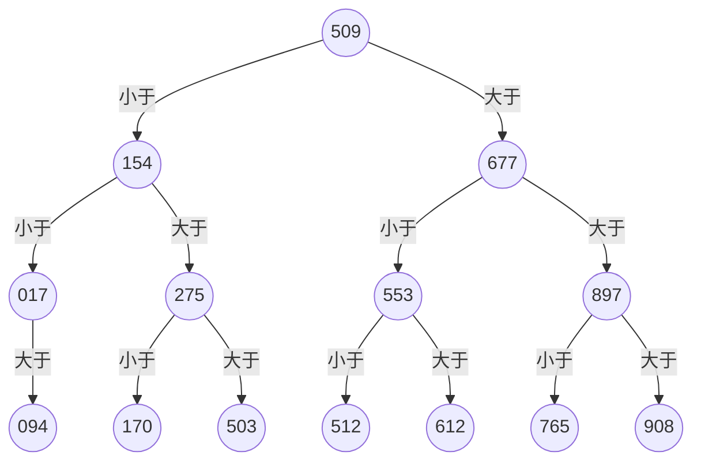
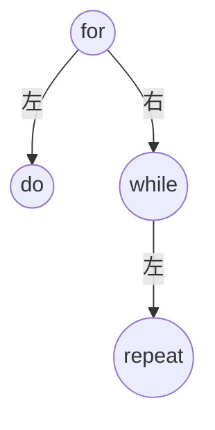

# 查找综合应用题：题目与满分解答

> [!tip] 考研查找题统一答题结构
> 1. 先明确查找表是否有序、采用何种存储结构，以及下标从 0 还是从 1 开始。
> 2. 涉及平均查找长度时，先写出各结点的查找长度，再按概率求期望。
> 3. 涉及折半查找时，先约定中点取法，再画判定树或写比较序列。
> 4. 算法设计题应依次写出基本思想、代码、正确性说明和复杂度。

> [!note] 本文的计数约定
> 平均查找长度（ASL）统计待查关键字与表中关键字的比较次数，不把数组下标计算、指针移动等操作计入 ASL。若未特别说明，成功查找各元素等概率，失败查找各失败区间等概率。

## 01 有序表与无序表的顺序查找比较

### 题目

若对有 `n` 个元素的有序顺序表和无序顺序表进行顺序查找，试就下列三种情况分别讨论两者在相等查找概率时的平均查找长度是否相同。

1. 查找失败；
2. 查找成功，且表中只有一个关键字等于给定值 `k` 的元素；
3. 查找成功，且表中有若干关键字等于给定值 `k` 的元素，要求一次查找能找出所有元素。

### 第 1 问：查找失败

两者的平均查找长度不同。

对于无序顺序表，只有检查完全部 `n` 个元素后，才能确定查找失败，因此：

```text
ASL(无序，失败) = n
```

对于递增有序顺序表，一旦遇到第一个关键字大于 `k` 的元素，就可立即判定查找失败。若把待查关键字落入的 `n+1` 个失败区间视为等概率事件，则各区间所需的比较次数依次为：

```text
1, 2, 3, ..., n, n
```

因此：

```text
ASL(有序，失败)
= (1 + 2 + ... + n + n)/(n+1)
= n(n+3)/[2(n+1)]
= n/2 + n/(n+1)
```

当 `n > 1` 时，该值小于 `n`，所以有序表的失败查找通常更短。

> [!note] 关于哨兵的计数
> 若某教材把哨兵也计作一次关键字比较，无序表的失败查找长度会写成 `n+1`。只要统一计数口径，“有序表可以提前停止、两者不相同”的结论不变。

### 第 2 问：成功且只有一个匹配元素

两者的平均查找长度相同。

顺序查找在第一次遇到关键字等于 `k` 的元素时结束。各元素等概率被查找时，无论表中元素如何排列，其位置仍是 `1, 2, ..., n` 的一个排列，因此：

```text
ASL(成功) = (1 + 2 + ... + n)/n = (n+1)/2
```

有序性在这种情况下不改变成功查找的平均比较次数。

### 第 3 问：成功且要找出全部重复元素

两者的平均查找长度通常不同。

- 在有序表中，相同关键字的元素连续存放。找到第一个匹配元素后，只需继续扫描到该连续段结束；
- 在无序表中，相同关键字可能散布在任意位置。为了保证一个不漏，必须扫描完整张表，查找长度为 `n`。

设有序表中等于 `k` 的连续段从第 `s` 个位置开始，共有 `r` 个元素：

- 若该连续段不在表尾，比较到第 `s+r` 个元素时发现关键字已经大于 `k`，查找长度为 `s+r`；
- 若该连续段恰好到达表尾，查找长度为 `n`。

因此，有序表的查找长度不超过 `n`，并且在匹配段不靠近表尾时明显小于无序表。

### 满分作答

1. 查找失败时不同。有序表遇到第一个大于 `k` 的关键字即可停止，无序表必须检查全表。
2. 只有一个匹配元素且各元素等概率时相同，二者均为 `(n+1)/2`。
3. 要找出全部重复元素时不同。有序表中的重复关键字连续，可在越过该连续段后停止；无序表必须扫描全表。

## 02 折半查找的判定树与平均查找长度

### 题目

有序顺序表中的元素依次为：

```text
017, 094, 154, 170, 275, 503, 509,
512, 553, 612, 677, 765, 897, 908
```

回答：

1. 画出对该表进行折半查找的判定树；
2. 若查找 275 或 684，将依次与表中的哪些元素比较？
3. 计算查找成功的平均查找长度和查找不成功的平均查找长度。

### 折半查找约定

表中元素按位序 `1～14` 编号，采用：

```text
mid = floor((low + high)/2)
```

因此第一次取 `mid=7`，根结点为 509。

### 第 1 问：判定树



判定树各层的成功结点数为：

| 层次，即查找长度 | 1 | 2 | 3 | 4 |
|---|---:|---:|---:|---:|
| 结点数 | 1 | 2 | 4 | 7 |

### 第 2 问：比较序列

#### 查找 275

```text
509 -> 154 -> 275
```

共进行 3 次关键字比较，查找成功。

#### 查找 684

```text
509 -> 677 -> 897 -> 765
```

比较 765 后查找区间变空，共进行 4 次关键字比较，查找失败。

### 第 3 问：平均查找长度

#### 查找成功

14 个元素等概率被查找，因此：

```text
ASL(成功)
= (1×1 + 2×2 + 4×3 + 7×4)/14
= 45/14
≈ 3.214
```

#### 查找失败

14 个关键字将数轴分成 15 个失败区间。小于 017 的失败区间需要比较 3 次，其余 14 个失败区间均需比较 4 次。因此：

```text
ASL(失败)
= (1×3 + 14×4)/15
= 59/15
≈ 3.933
```

### 满分作答

在 `mid=floor((low+high)/2)` 的约定下，判定树以 509 为根。查找 275 时依次比较 509、154、275；查找 684 时依次比较 509、677、897、765。等概率时：

```text
查找成功 ASL = 45/14
查找失败 ASL = 59/15
```

## 03 先顺序定位分组、再折半查找

### 题目

已知一个有序顺序表 `A[0...8n-1]` 的表长为 `8n`，并且表中没有关键字相同的数据元素。按下述方法查找关键字值等于给定值 `X` 的元素：

先在

```text
A[7], A[15], A[23], ..., A[8k-1], ..., A[8n-1]
```

中进行顺序查找。若查找成功，则报告成功位置并返回；若未与这些元素相等，并且

```text
A[8k-1] < X < A[8(k+1)-1]
```

则可把范围缩小到

```text
A[8k] ～ A[8(k+1)-2]
```

再在该范围内执行折半查找。若 `X > A[8n-1]`，则查找失败。

回答：

1. 画出描述上述查找过程的判定树；
2. 计算相等查找概率下查找成功的平均查找长度。

### 算法结构

把原表划分成 `n` 组，每组 8 个元素。第 `i` 组为：

```text
A[8(i-1)] ～ A[8i-1]，1 ≤ i ≤ n
```

其中每组的最后一个元素：

```text
M_i = A[8i-1]
```

组成第一阶段的顺序索引。算法先依次比较 `M_1, M_2, ...`，再在确定组内的前 7 个元素中折半查找。

### 第 1 问：判定树

第一阶段是一条向右延伸的顺序判定链：

```mermaid
graph LR
    m1((M1)) -->|X 大于 M1| m2((M2))
    m2 -->|X 大于 M2| m3((M3))
    m3 -->|继续| mdots[...]
    mdots --> mn((Mn))
    mn -->|X 大于 Mn| fail[查找失败]

    m1 -->|X 小于 M1| b1[在第 1 组前 7 项折半查找]
    m2 -->|M1 小于 X 小于 M2| b2[在第 2 组前 7 项折半查找]
    m3 -->|M2 小于 X 小于 M3| b3[在第 3 组前 7 项折半查找]
    mn -->|M(n-1) 小于 X 小于 Mn| bn[在第 n 组前 7 项折半查找]
```

在任意第 `i` 组中，令组首下标为：

```text
s = 8(i-1)
```

对 `A[s]～A[s+6]` 进行折半查找时，组内判定树为一棵 7 个结点的满二叉树：

```mermaid
graph TD
    a3((A[s+3])) -->|小于| a1((A[s+1]))
    a3 -->|大于| a5((A[s+5]))
    a1 -->|小于| a0((A[s]))
    a1 -->|大于| a2((A[s+2]))
    a5 -->|小于| a4((A[s+4]))
    a5 -->|大于| a6((A[s+6]))
```

这棵组内判定树的结点层数分布为：

| 组内比较次数 | 1 | 2 | 3 |
|---|---:|---:|---:|
| 元素个数 | 1 | 2 | 4 |

### 第 2 问：成功查找的 ASL

对于第 `i` 组：

- 查找组尾元素 `M_i=A[8i-1]`，需在第一阶段比较 `i` 次；
- 查找该组前 7 个元素，都要先经过 `i` 次索引比较；
- 这 7 个元素在组内折半查找的比较次数总和为：

```text
1×1 + 2×2 + 4×3 = 17
```

所以第 `i` 组 8 个元素的成功查找长度总和为：

```text
i + 7i + 17 = 8i + 17
```

全部 `8n` 个元素的查找长度总和为：

```text
sum(i=1...n, 8i+17)
= 8×n(n+1)/2 + 17n
= 4n² + 21n
```

因此，在 `8n` 个元素等概率被查找时：

```text
ASL(成功)
= (4n² + 21n)/(8n)
= (4n + 21)/8
= n/2 + 21/8
```

### 满分作答

判定树由两部分组成：第一部分是以每组最大元素 `A[8i-1]` 构成的顺序判定链；第二部分是每组前 7 个元素构成的三层满二叉判定树。第 `i` 组的查找长度总和为 `8i+17`，故等概率成功查找的平均查找长度为：

```text
ASL(成功) = (4n+21)/8
```

## 04 折半查找的递归算法

### 题目

写出折半查找的递归算法。初始调用时，`low` 为 1，`high` 为 `ST.length`。

### 算法思想

对于当前查找区间 `[low, high]`：

1. 若 `low > high`，区间为空，查找失败；
2. 取中点 `mid=low+(high-low)/2`；
3. 若待查关键字等于中间元素，返回其位置；
4. 若待查关键字较小，递归查找左半区间；
5. 若待查关键字较大，递归查找右半区间。

### 参考代码

下面假设顺序表采用 1 开始的下标，失败时返回 0。

```cpp
typedef int KeyType;

typedef struct {
    KeyType key;
    // 其他数据域
} ElemType;

typedef struct {
    ElemType elem[MAXSIZE + 1];  // elem[1] 到 elem[length] 有效
    int length;
} SSTable;

int BinarySearchRec(const SSTable &ST, KeyType key,
                    int low, int high) {
    if (low > high) {
        return 0;  // 当前区间为空，查找失败
    }

    int mid = low + (high - low) / 2;

    if (key == ST.elem[mid].key) {
        return mid;
    }
    if (key < ST.elem[mid].key) {
        return BinarySearchRec(ST, key, low, mid - 1);
    }
    return BinarySearchRec(ST, key, mid + 1, high);
}

int BinarySearch(const SSTable &ST, KeyType key) {
    return BinarySearchRec(ST, key, 1, ST.length);
}
```

### 正确性说明

每次比较后：

- 若 `key < ST.elem[mid].key`，由表的递增有序性，目标只可能在 `[low, mid-1]`；
- 若 `key > ST.elem[mid].key`，目标只可能在 `[mid+1, high]`。

因此递归调用不会排除任何可能的目标元素，同时区间长度严格减小。最终要么命中目标，要么区间为空并正确报告失败。

### 复杂度

每次递归把查找范围缩小约一半，因此：

```text
时间复杂度：O(log n)
递归辅助空间复杂度：O(log n)
```

## 05 带“前移一步”策略的顺序查找

### 题目

线性表中各结点的查找概率不等时，可采用如下策略提高顺序查找效率：若找到指定结点，则将该结点和它的前驱结点（若存在）交换，使经常被查找的结点尽量位于表的前端。

试设计在顺序存储结构和链式存储结构的线性表上实现上述策略的顺序查找算法。

### 算法思想

从表头开始顺序查找目标关键字：

- 查找失败时不修改线性表；
- 查找成功且目标已经位于表头时，直接返回；
- 查找成功且目标存在前驱时，将目标与前驱交换，再返回目标的新位置。

一次访问只前移一步。一个结点若被频繁访问，就会在多次访问后逐渐移动到表的前部。

### 顺序表算法

```cpp
typedef int KeyType;

typedef struct {
    KeyType key;
    // 其他数据域
} ElemType;

typedef struct {
    ElemType data[MAXSIZE];
    int length;
} SqList;

// 成功时返回元素交换后的下标，失败时返回 -1
int SearchAndMoveForward(SqList &L, KeyType key) {
    for (int i = 0; i < L.length; ++i) {
        if (L.data[i].key == key) {
            if (i > 0) {
                ElemType temp = L.data[i - 1];
                L.data[i - 1] = L.data[i];
                L.data[i] = temp;
                return i - 1;
            }
            return 0;
        }
    }
    return -1;
}
```

### 单链表算法

下面的单链表带头结点。代码通过修改指针交换相邻结点，不依赖数据域是否允许整体复制。

```cpp
typedef struct LNode {
    ElemType data;
    struct LNode *next;
} LNode, *LinkList;

// 成功时返回前移后的目标结点，失败时返回 nullptr
LNode *SearchAndMoveForward(LinkList &L, KeyType key) {
    if (L == nullptr || L->next == nullptr) {
        return nullptr;
    }

    LNode *prepre = L;       // pre 的前驱
    LNode *pre = L->next;    // cur 的前驱

    // 第一个数据结点没有数据前驱，不需要交换
    if (pre->data.key == key) {
        return pre;
    }

    LNode *cur = pre->next;
    while (cur != nullptr && cur->data.key != key) {
        prepre = pre;
        pre = cur;
        cur = cur->next;
    }

    if (cur == nullptr) {
        return nullptr;
    }

    // prepre -> pre -> cur -> next
    // 调整为 prepre -> cur -> pre -> next
    pre->next = cur->next;
    cur->next = pre;
    prepre->next = cur;

    return cur;
}
```

### 正确性说明

顺序扫描保证返回前已经检查了目标之前的全部结点。查找成功时，算法只交换目标与其直接前驱：

- 目标恰好前移一个位置；
- 除这两个相邻结点外，其余结点的相对次序不变；
- 顺序表的元素集合和链表的结点集合均不变。

因此算法正确实现了题目要求的自组织策略。

### 复杂度

最坏情况下要扫描整张表，交换本身只需常数次赋值或指针修改：

```text
时间复杂度：O(n)
辅助空间复杂度：O(1)
```

## 06 在行、列均递增的矩阵中查找

### 题目

已知一个 `n` 阶矩阵 `A` 和目标值 `k`。矩阵无重复元素，每行从左到右升序排列，每列从上到下升序排列。请设计一个时间上尽可能高效的算法，判断矩阵中是否存在目标值 `k`。

例如：

```text
A = [1  4  7]
    [2  5  8]
    [3  6  9]
```

当目标值为 8 时，判断结果为存在。

要求：

1. 给出算法的基本设计思想；
2. 采用 C 或 C++ 语言描述算法，关键之处给出注释；
3. 说明算法的时间复杂度和空间复杂度。

### 第 1 问：基本设计思想

从矩阵右上角 `A[0][n-1]` 开始比较。设当前位置为 `A[i][j]`：

- 若 `A[i][j] = k`，查找成功；
- 若 `A[i][j] > k`，则第 `j` 列从当前位置向下的元素都大于 `k`，排除该列，令 `j--`；
- 若 `A[i][j] < k`，则第 `i` 行从当前位置向左的元素都小于 `k`，排除该行，令 `i++`。

每次比较至少排除一整行或一整列，直到找到目标或越过矩阵边界。

### 第 2 问：参考代码

```cpp
#define MAXN 1000

// 找到时返回 true，并通过 row、col 返回目标位置
bool FindInSortedMatrix(const int A[][MAXN], int n, int k,
                        int &row, int &col) {
    int i = 0;
    int j = n - 1;  // 从右上角开始

    while (i < n && j >= 0) {
        if (A[i][j] == k) {
            row = i;
            col = j;
            return true;
        }

        if (A[i][j] > k) {
            --j;  // 排除当前列
        } else {
            ++i;  // 排除当前行
        }
    }

    row = -1;
    col = -1;
    return false;
}
```

对题目中的示例矩阵查找 8：

```text
A[0][2]=7 < 8，排除第 0 行
A[1][2]=8，查找成功
```

### 正确性说明

在每轮循环开始时，若 `k` 存在，则它只可能位于尚未排除的子矩阵：

```text
A[i...n-1][0...j]
```

比较右上角 `A[i][j]`：

- 若它大于 `k`，由列递增性可知该列剩余元素全都更大，删除该列不会漏掉 `k`；
- 若它小于 `k`，由行递增性可知该行剩余元素全都更小，删除该行不会漏掉 `k`。

循环始终保持上述不变式。若越界仍未命中，则候选子矩阵为空，故矩阵中不存在 `k`。

### 第 3 问：复杂度

行下标最多增加 `n` 次，列下标最多减少 `n` 次，路径长度最多为 `2n-1`：

```text
时间复杂度：O(n)
辅助空间复杂度：O(1)
```

该算法优于逐元素扫描的 `O(n²)`。

## 07 按查找概率组织顺序表和链式结构

### 题目

【2013 统考真题】设包含 4 个数据元素的集合：

```text
S = {"do", "for", "repeat", "while"}
```

各元素的查找概率依次为：

```text
p1 = 0.35, p2 = 0.15, p3 = 0.15, p4 = 0.35
```

将 `S` 保存在一个长度为 4 的顺序表中，采用折半查找法，查找成功时的平均查找长度为 2.2。回答：

1. 若采用顺序存储结构保存 `S`，且要求平均查找长度更短，则元素应如何排列？采用何种查找方法？查找成功时的平均查找长度是多少？
2. 若采用链式存储结构保存 `S`，且要求平均查找长度更短，则元素应如何排列？采用何种查找方法？查找成功时的平均查找长度是多少？

### 第 1 问：顺序存储结构

采用顺序查找，并按查找概率非递增排列：

```text
do, while, for, repeat
```

其中两个概率为 0.35 的元素可以互换，两个概率为 0.15 的元素也可以互换。

平均查找长度为：

```text
ASL
= 0.35×1 + 0.35×2 + 0.15×3 + 0.15×4
= 2.10
```

因为 `2.10 < 2.20`，满足题目要求。

#### 为什么按概率降序最优

若相邻两个位置 `i`、`i+1` 上元素的查找概率分别为 `p`、`q`，且 `p < q`，交换前后两者对 ASL 的贡献之差为：

```text
[p×i + q(i+1)] - [q×i + p(i+1)] = q - p > 0
```

所以把概率较大的元素放在更靠前的位置总不会使 ASL 增大。不断消除这种逆序，最终得到按概率非递增排列的最优顺序。

### 第 2 问：链式存储结构

本题有两种常见满分方案。

#### 方案一：单链表加顺序查找

按查找概率非递增组织单链表：

```text
do -> while -> for -> repeat
```

采用顺序查找，平均查找长度同样为：

```text
ASL = 2.10
```

#### 方案二：二叉链表存储二叉排序树

按字符串字典序构造如下二叉排序树：



各元素的成功查找长度为：

| 元素 | 查找概率 | 查找长度 |
|---|---:|---:|
| for | 0.15 | 1 |
| do | 0.35 | 2 |
| while | 0.35 | 2 |
| repeat | 0.15 | 3 |

所以：

```text
ASL
= 0.15×1 + 0.35×2 + 0.35×2 + 0.15×3
= 2.00
```

该方案比单链表顺序查找的 2.10 还短。

### 满分作答

1. 顺序存储时，将元素按查找概率非递增排列，例如 `do, while, for, repeat`，采用顺序查找，成功 ASL 为 2.10。
2. 链式存储时，可按相同次序组织单链表并顺序查找，成功 ASL 为 2.10；也可用二叉链表构造以 `for` 为根、`do` 为左孩子、`while` 为右孩子、`repeat` 为 `while` 左孩子的二叉排序树，成功 ASL 为 2.00。

## 易错总结

### 1. ASL 统计的是关键字比较次数

数组下标计算、指针移动、队列操作等通常不计入 ASL。使用哨兵时，应先说明是否把哨兵比较计入。

### 2. 查找成功和查找失败必须分开计算

成功 ASL 按成功结点的查找长度计算；失败 ASL 按失败区间对应的比较次数计算。含 `n` 个关键字的有序表共有 `n+1` 个失败区间。

### 3. 折半查找必须说明中点取法

当区间含偶数个元素时，向下取整和向上取整会产生不同的判定树与比较序列。只要约定一致，按对应判定树计算即可。

### 4. 有序顺序查找可以提前报告失败

递增表中一旦遇到关键字大于待查值的元素，就无需继续扫描；普通无序表则必须扫描到表尾。

### 5. 找出全部重复元素不能在首次命中后立即返回

有序表可以利用相同关键字连续的性质，在越过连续段后停止；无序表必须检查全表。

### 6. 二维有序矩阵不能直接按一维数组折半

仅有“行递增、列递增”并不意味着按行展开后整体有序。应从右上角或左下角开始，每次排除一行或一列。

### 7. 链表不适合普通折半查找

折半查找需要高效随机访问中间元素。单链表访问中点本身需要顺序移动，因此不能获得顺序表折半查找的效率。
