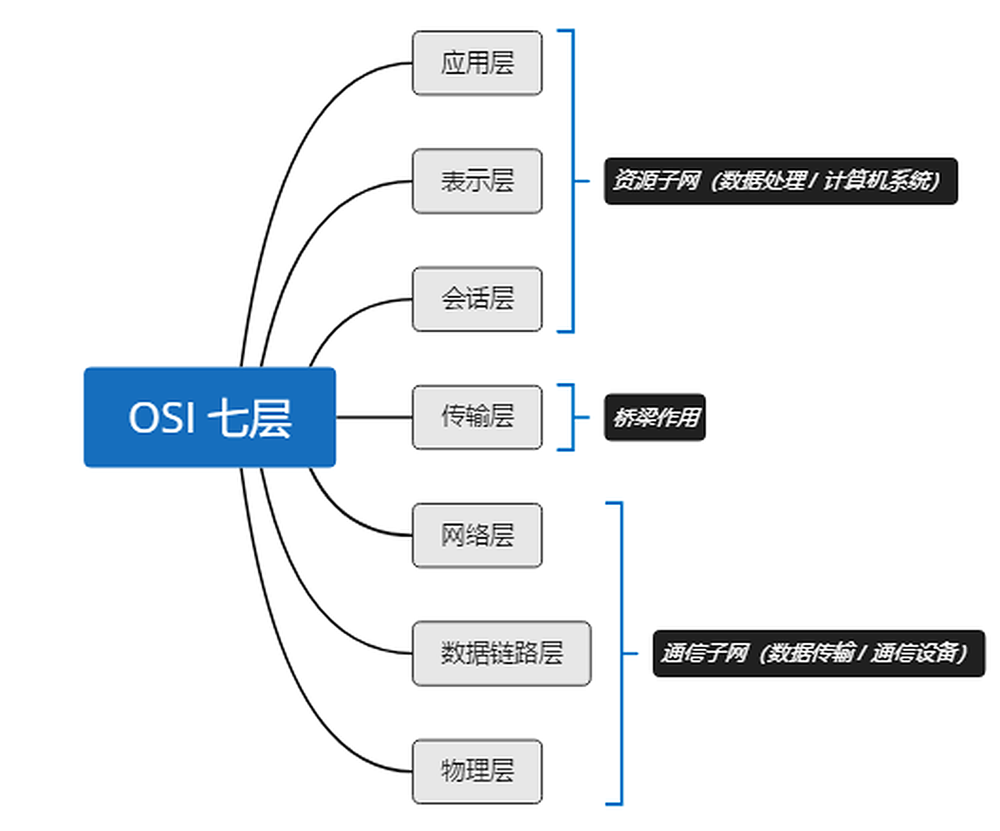

# 一 体系结构

## 1 性能指标（★计算高频）

| 指标 | 定义 / 公式 |
|---|---|
| 带宽 | 通信领域：频带宽度(Hz)；计网领域：最高数据率(bps) |
| **时延** | 发送时延 + 传播时延 + 排队时延 + 处理时延 |
| 发送时延 | `分组长度 / 信道带宽` ← **总时延的主要优化对象** |
| 时延带宽积 | `传播时延 × 带宽`，即"管道"可容纳的比特数 |
| RTT | 发数据起 → 收到确认止 |
| 吞吐量 | 单位时间通过网络的数据量 |
| 利用率 | `D = D₀ / (1 − U)`，**U 超 50% 时延剧增** |

**码元**：一个固定时长的信号波形，表示 k 进制的一位。k 进制码元携带 `log₂k` bit。

## 2 分类要点

- **按传输技术**：点对点（交换技术，分组转发+路由选择）／广播（以太技术，共享公共信道）
- **按交换技术**：电路交换／报文交换／分组交换
- **功能组成**：通信子网（下三层）＋资源子网（应用层）
- **工作方式**：边缘部分（主机）＋核心部分（路由器）

## 3 分层核心概念

- **PDU = PCI（协议控制信息）+ SDU（服务数据单元）**
- **协议是水平的**（对等实体间规则）；**服务是垂直的**（下层为上层提供）
- 接口通过 **服务访问点 SAP** 交互；服务原语：请求、指示、响应、应答
- 服务分类：面向连接／无连接 · 可靠／不可靠 · 有应答／无应答

## 4 OSI 与 TCP/IP

| 层 | 功能 | 寻址 | 典型协议 | PDU |
|---|---|---|---|---|
| 应用 | 用户与网络接口，协议最多 | — | FTP SMTP HTTP DNS | 报文 |
| 表示 | 数据压缩、加密解密 | — | — | — |
| 会话 | 建立/管理/终止会话，同步 | — | — | — |
| 传输 | **端到端（进程到进程）**，复用分用、流量/差错控制 | **端口号** | TCP UDP | 报文段/用户数据报 |
| 网络 | **点到点（主机到主机）**，路由选择、拥塞控制、网际互连 | **IP 地址** | IP ICMP IGMP ARP OSPF | 分组/数据报 |
| 数据链路 | 封装成帧、差错控制、流量控制 | **MAC 地址** | PPP HDLC STP | 帧 |
| 物理 | 比特传输（物理媒体算第 0 层） | — | EIA-232C RS-449 | 比特 |

**两模型关键差异**：

| | OSI | TCP/IP |
|---|---|---|
| 产生 | 协议**发明前**，力求完美，实现慢 | 协议**发明后**，考虑异构互连 |
| 网络层 | 面向连接 + 无连接 | **仅无连接** |
| 传输层 | 仅面向连接 | 面向连接 + 无连接 |

> TCP/IP 成为事实标准。TCP/IP 网络接口层只规定"用什么协议接入"，不定义具体内容。

---
