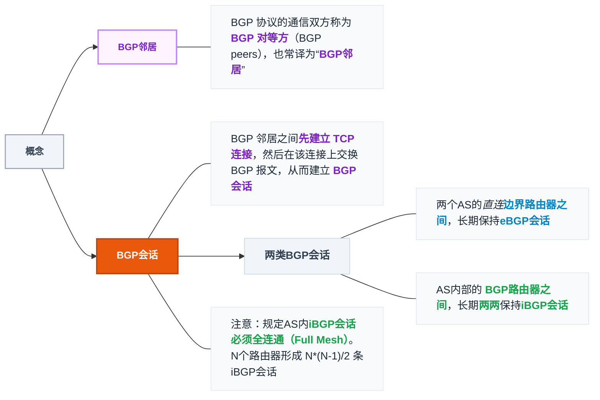

## 4.1 功能

- **异构网络互连**：中间设备互联，各机使用相同 **IP** 协议，构成**虚拟互联网**
- **路由与转发**：路由选择（由路由协议构造**路由表**）+ 分组转发（依路由表生成**转发表**对数据流转发）
- **拥塞控制**：开环（事先设计避免）／闭环（检测到再调整）

> 封装IP数据报，‘’主机‘’到‘’主机‘’传播，无连接的数据报服务


## 4.2 路由算法

 静态路由: 由网络管理员手动配置路由表条目，路由器不会自动更新路由信息。
 动态路由: 路由器之间通过路由协议自动交换信息，动态学习和维护路由表。
 - 路由器相互通告链路状态/可达性信息
 - 网络拓扑变化（如某链路断开）时，自动重新计算路由（收敛）
 - 常见协议：RIP、OSPF、IS-IS、BGP、EIGRP

|      | 距离-向量                     | 链路状态路由算法               |
| ---- | ------------------------- | ---------------------- |
| 交谈对象 | **仅直接邻居**                 | **广播给所有结点**            |
| 交换内容 | **整个路由表**                 | 本结点链路状态                |
| 时机   | **定期**（如 30s）             | **仅链路状态变化时**           |
| 计算   | 接受邻居告知的路由（Bellman-Ford算法) | 用原始数据**自己算**（Dijkstra） |
| 报文量  | 与子网结点数成正比                 | 泛洪但仅变化时                |
| 代表   | RIP、BGP(路径向量)             | OSPF                   |

- 链路状态路由算法： 需要知道完整的网络拓扑结构

## 4.3 路由协议

分层次的网络协议：

自治系统AS： 划分的结果，每个自治系统有全球唯一的AS编号（ASN), 每个AS至少有一台自治系统边界路由器和其他AS相连。

外部网关协议（EGP)：用于AS之间的路由选择


|     | RIP                        | OSPF            | BGP              |
| --- | -------------------------- | --------------- | ---------------- |
| 类型  | 内部 IGP，距离向量                | 内部 IGP，**链路状态** | **外部 EGP，路径向量**  |
| 承载  | **UDP**（端口520）             | **直接 IP 数据报**   | **TCP**          |
| 度量  | **跳数，最多 15，16 = 不可达**      | 链路代价（Dijkstra）  | 自治系统序列           |
| 更新  | **每 30s 广播全表**，180s 超时判不可达 | 变化时**泛洪**       | 初次全表，之后仅变化       |
| 表项  | `目的网络 距离 下一跳`              | 全网拓扑图 → 下一跳     | `网络前缀 下一跳 AS 序列` |
| 缺点  | **收敛慢，坏消息传得慢**             | 实现复杂            | —                |

### RIP 

>1）RIP 使用**跳数**（Hop Count）（或称**距离**）来衡量到达目的网络的距离。  规定：路由器到直连网络的距离为 1；而每经过一个路由器，距离就加 1。
>2）RIP 认为好的路由就是**跳数最少**的。
>3）RIP 允许一条合法路径距离不能超过 15。**距离等于 16 时表示网络不可达**。可见 **RIP 只适用于小型自治系统**。
>4）每个路由器都要维护自己的**路由表**，路由表项有三个关键字段：<目的网络 N，距离 d，下一跳路由器地址 X>。
>注意: 目的网络常用CIDR记法,  下一跳路由器地址常用IP地址表示.
>5）每个路由器都要维护从它自身到其他每个目的网络的距离记录，即**距离向量**（事实上，距离向量信息包含在路由表中，RIP 协议使用“距离向量路由算法”计算最短路径）

**RIP的工作过程**  :
>初始时刻,每个路由器同时开机,将直接相连的节点信息,填入到自己的路由表中.
>0时刻, 每个路由器仅和相邻路由器周期性地交换并更新路由信息. 更新方式如下:  (注意是同时交换) 
- 加入R2与R1交换, 以R1视角来看,  先对R2发来的路由表修改,  第一项不变, 第二项加1, 第三项变成发送者R2(表示请求R2帮忙转发)
- 将修改后表和自己进行比对,  做到没有的就加入, 更好的就更新.
>每隔30s进行迭代(迭代不出新变化意味着收敛),  超过180s没收到,只能标记为不可达(跳数更新为16)

RIP 的优点：
1）实现简单、开销小、收敛过程较快。
2）若一个路由器发现了更短的路由，则这种更新信息就传播得很快，在较短时间内便可被传至所有路由器，俗称“好消息传播得快”。

RIP 的缺点：
1）RIP 限制了网络的规模，它能使用的最大距离为 15（16 表示不可达）。
2）路由器之间交换的是路由器中的完整路由表，因此网络规模越大，开销也越大。
3）当网络出现故障时，路由器之间需反复多次交换信息才能完成收敛，要经过较长时间才能将故障消息传送到所有路由器（慢收敛现象），俗称坏消息传播得慢。

注：距离向量路由可能会出现环路的情况，RIP规定路径上的最高跳数=16 是一种防止环路的简单粗暴的方式。
**RIPv1 不支持子网掩码**（各网掩码须相同）；**RIPv2 支持 VLSM、CIDR**
### OSPF

- OSPF属于网络层
- OSPF使用IP协议提供的服务，IP首部的协议字段=89
- OSPF 的 PDU 常译为“OSPF分组”或“OSPF数据报”
- OSPF 允许自治系统灵活地自定义链路“代价”
- OSPF 支持等价多路径转发
- OSPF 分组支持鉴别功能，防止非法路由信息在自治系统内传播
- OSPF 支持变长子网划分、CIDR
- OSPF中 路由器 转发的是单链表(邻接表) .

OSPF 允许对每条路由设置成不同的代价，对于不同类型的业务可计算出不同的路由。

例如，OSPF 默认基于带宽计算链路代价：  metric=参考带宽/接口带宽
注：参考带宽默认为 100Mbps
在现实应用中：
- 一段链路的两个方向，权值可能不同
- 【直连网络 →路由器】方向的权值通常 =0

虽然使用 Dijkstra 算法(改进) 能计算出完整的最优路径，但路由表中不会存储完整路径，而只存储“下一跳”
若网络拓扑发生变化，就会立即引起洪泛，从而引起各台路由器的 LSDB 变化，并再次运行 Dijkstra 算法，构造新的路由表

| Type 值 | 英文缩写         | 中文译名     | 作用                                 | 考研核心记忆要点                      |
| ------ | ------------ | -------- | ---------------------------------- | ----------------------------- |
| 1      | Hello Packet | 问候分组     | 建立 & 维持邻居关系（每隔 10 秒发一次，40 秒超时）     | 发现/维持邻居（死活检测）                 |
| 2      | DD Packet    | 数据库描述分组  | 邻居建立时，向邻居给出自己的 LSDB 摘要（即 LSA 的头信息） | 只给目录/摘要，不给完整数据                |
| 3      | LSR Packet   | 链路状态请求分组 | 向邻居请求缺少的 LSA（指明头信息即可）              | 缺啥要啥（请求目录里缺的条目）               |
| 4      | LSU Packet   | 链路状态更新分组 | 向邻居传输具体的 LSA（可能引发全网洪泛）             | 真正传数据的分组，负责洪泛扩散               |
| 5      | LSAck Packet | 链路状态确认分组 | 收到邻居发来的 LSU 后，向邻居确认收到了哪些 LSA（头信息）  | 保证可靠传输（OSPF 运行在 IP 上无 TCP 保证） |
### BGP

- BGP 是一种外部网关协议，用于在自治系统（AS）之间交换路由信息，实现路由选择.
- BGP不求最优.
- BGP采用路径向量路由算法——路由器之间通告BGP路由信息时，不仅告知目的地，还告知到达该目的地的完整路径（即需要经过哪些自治系统）
- BGP 是应用层协议，基于 TCP（端口号179）
- 在一个自治系统中，边界路由器一定要运行BGP协议，内部的一些核心路由器也要运行BGP协议。



BGP 邻居只要 **TCP 可达** 即可（尤其是 iBGP 邻居通常不直连）。
- **eBGP**：跨 AS 的**直连边界路由器**之间建立。
- **iBGP**：同属一个 AS 内部的 BGP 路由器之间建立。
若一个 AS 内部有 N 个 BGP 路由器，为了防止环路，默认需要建立全连通的 iBGP 会话网状网，总会话数为： $\frac{N(N-1)}{2}$


- **AS 1**：**中国**（一个自治系统，内部可以用 OSPF/RIP 跑国内快递）。
- **AS 2**：**美国**（另一个自治系统）。
- **边界路由器（Border Router）**：**海关/国际机场**（负责跨国对接）。
- **AS 内部的核心路由器**：**省/市级转运中心**（负责国内分流）。​

![[BGP全景高清重绘图.png]]


 - iBGP 学到的路由不能再通过 iBGP 传播给其他 iBGP 邻居（避免环路传播）
 - 注：AS 内 iBGP 会话是全连通（Full Mesh）的，这样可以确保 AS 内所有路由器都能收到从外部学来的、一致的 BGP 路由信息
- 
![[BGP路由选择要点总结.png]]
- BGP 四种报文：**打开、更新、保活、通知**；每 AS 至少一个"发言人"与外部发言人建 TCP 连接

## 4.4 IPv4

### 分组与分片（★计算）

- 首部**固定 20 B，最长 60 B**
- 以太网 MTU = **1500 B**；许多广域网 ≤ 576 B
- **DF = 1 禁止分片，DF = 0 允许**；**MF = 1 后面还有分片，MF = 0 是最后一片**
- **片偏移以 8 B 为单位**：分片起始位置 = `片偏移 × 8`。除最后一片，各片数据长度须为 8 的倍数

### IPv4 数据报格式

<div style="font-family: -apple-system, BlinkMacSystemFont, 'Segoe UI', 'PingFang SC', 'Microsoft YaHei', sans-serif; max-width: 760px; margin: 20px auto; color: var(--text-normal, #333);">

  <!-- 顶部 32位 刻度尺 -->
  <div style="position: relative; margin-bottom: 2px; font-size: 12px; margin-left: 28px; margin-right: 84px;">
    <div style="display: flex; justify-content: space-between; border-bottom: 1px solid var(--text-muted, #888); padding-bottom: 2px;">
      <span>0</span>
      <span>4</span>
      <span>8</span>
      <span>16</span>
      <span>19</span>
      <span>31</span>
    </div>
    <span style="position: absolute; left: -26px; top: 0; font-weight: bold;">位</span>
  </div>

  <!-- 主体表格 -->
  <table style="border-collapse: collapse; text-align: center; font-size: 13px; table-layout: fixed; width: 100%;">
    <colgroup>
      <col span="32" style="width: 2.7%;">
      <col style="width: 13.6%;">
    </colgroup>
    <tbody>

      <!-- 第 1 行：版本(4) + 首部长度(4) + 区分服务(8) + 总长度(16) -->
      <tr style="height: 38px;">
        <td colspan="4" style="border: 1.5px solid var(--text-normal, #333); font-weight: 500;">版本<br><span style="font-size: 10px; color: var(--text-muted, #888);">(4位)</span></td>
        <td colspan="4" style="border: 1.5px solid var(--text-normal, #333); font-weight: 500;">首部长度<br><span style="font-size: 10px; color: var(--text-muted, #888);">(4位)</span></td>
        <td colspan="8" style="border: 1.5px solid var(--text-normal, #333); font-weight: 500;">区分服务<br><span style="font-size: 10px; color: var(--text-muted, #888);">(8位)</span></td>
        <td colspan="16" style="border: 1.5px solid var(--text-normal, #333); font-weight: 500;">总长度<br><span style="font-size: 10px; color: var(--text-muted, #888);">(16位)</span></td>
        <!-- 跨 5 行合并：固定首部 20B -->
        <td rowspan="5" style="border: 1.5px solid var(--text-muted, #888); border-left: 2.5px solid var(--text-accent, #3b82f6); background: var(--background-secondary, rgba(128,128,128,0.06)); font-weight: bold; color: var(--text-accent, #3b82f6); font-size: 12px; padding: 4px;">
          固定部分<br><b>20 字节</b>
        </td>
      </tr>

      <!-- 第 2 行：标识(16) + 标志(3) + 片偏移(13) -->
      <tr style="height: 38px;">
        <td colspan="16" style="border: 1.5px solid var(--text-normal, #333); font-weight: 500;">标 识 (16位)</td>
        <td colspan="3" style="border: 1.5px solid var(--text-normal, #333); font-size: 11px; font-weight: bold; color: #ef4444;">标志<br>3位</td>
        <td colspan="13" style="border: 1.5px solid var(--text-normal, #333); font-weight: 500;">片 偏 移 (13位)</td>
      </tr>

      <!-- 第 3 行：生存时间(8) + 协议(8) + 首部检验和(16) -->
      <tr style="height: 38px;">
        <td colspan="8" style="border: 1.5px solid var(--text-normal, #333); font-weight: 500;">生存时间 TTL<br><span style="font-size: 10px; color: var(--text-muted, #888);">(8位)</span></td>
        <td colspan="8" style="border: 1.5px solid var(--text-normal, #333); font-weight: 500;">协 议<br><span style="font-size: 10px; color: var(--text-muted, #888);">(8位)</span></td>
        <td colspan="16" style="border: 1.5px solid var(--text-normal, #333); font-weight: 500;">首 部 检 验 和 (16位)</td>
      </tr>

      <!-- 第 4 行：源 IP 地址 -->
      <tr style="height: 38px;">
        <td colspan="32" style="border: 1.5px solid var(--text-normal, #333); font-weight: 600; letter-spacing: 4px;">源 IP 地 址 (32位)</td>
      </tr>

      <!-- 第 5 行：目的 IP 地址 -->
      <tr style="height: 38px;">
        <td colspan="32" style="border: 1.5px solid var(--text-normal, #333); font-weight: 600; letter-spacing: 4px;">目 的 IP 地 址 (32位)</td>
      </tr>

      <!-- 第 6 行：可选字段 + 填充 -->
      <tr style="height: 38px;">
        <td colspan="24" style="border: 1.5px solid var(--text-normal, #333); font-weight: 500;">可 选 字 段（长度可变，0 ~ 40 字节）</td>
        <td colspan="8" style="border: 1.5px solid var(--text-normal, #333);">填 充</td>
        <td style="border: 1.5px solid var(--text-muted, #888); border-left: 2px solid #10b981; font-size: 11px; color: #10b981; font-weight: 500;">
          可变部分<br>(0~40B)
        </td>
      </tr>

      <!-- 第 7 行：数据部分 -->
      <tr style="height: 54px;">
        <td colspan="32" style="border: 1.5px dashed var(--text-muted, #888); background: var(--background-secondary, rgba(128,128,128,0.04)); font-size: 14px; letter-spacing: 4px; color: var(--text-muted, #666);">
          数 据 部 分（上层传输层报文段）
        </td>
        <td style="font-size: 11px; color: var(--text-muted, #888);">
          长度可变
        </td>
      </tr>

    </tbody>
  </table>

</div>

---


### 地址

| 类 | 首字节范围 | 默认掩码 |
|---|---|---|
| A | 1 – 126 | /8 |
| B | 128 – 191 | /16 |
| C | 192 – 223 | /24 |
| D | 224 – 239 | 组播 |
| E | 240 – 255 | 保留 |

**特殊地址**：

- `127.0.0.0/8` 回环自检，**不出现在任何网络上**
- `255.255.255.255` **受限广播**（不被路由器转发）
- `0.0.0.0` ①未确定地址（DHCP 分配前）②服务监听所有地址 ③**默认路由 0.0.0.0/0**
  > 默认路由原理：掩码全 0 与任意目的地址相"与"得 0.0.0.0，恰匹配默认路由 ⇒ **匹配任意目的网络**
- 私有网段：`10.0.0.0/8`、`172.16.0.0/12`、`192.168.0.0/16`

### 子网划分、VLSM、CIDR

- **子网掩码**：`网络号 + 子网号 + 主机号` 三级地址，对外表现为一个未划分子网的网络
- 路由器交换路由信息时**必须同时告知子网掩码**；路由表项须含目的网络地址**和**掩码
- 一个路由器连两个子网就有两个网络地址和两个掩码；**一个网络地址只有一个固定掩码**
- **VLSM**：允许一个主类网内使用**多个掩码**，可对子网再划分 → 提高利用率、便于路由归纳
- **CIDR**：建立在 VLSM 上，用 `网络前缀 + 主机号`，路由表为 `网络前缀 下一跳`，采用**最长前缀匹配**

> **CIDR 与 VLSM 是逆过程**：CIDR **聚合**小网为大网（减少路由条目）；VLSM **细分**大网为小网（减少地址浪费）。

### 路由转发过程（★顺序必背）

```
直接交付 → 特定主机路由 → 匹配的网络路由 → 默认路由
（后三者均为间接交付）
```

匹配方法：目的 IP 与表项掩码/前缀做"与"，结果与表项网络地址比较；CIDR 下选**前缀最长**者。

### NAT

通过 `IP : 端口` 映射，使多个私有地址复用少量公有地址。


### ARP / DHCP / ICMP

| 协议 | 层次 | 要点 |
|---|---|---|
| **ARP** | 网络层 | IP → MAC。主机有 ARP 高速缓存，动态维护映射；缺失则**广播 ARP 请求**，目的主机**单播回复** |
| **DHCP** | **应用层，基于 UDP**，C/S | 客户**广播**发现 → 服务器**广播**提供 → 客户**广播**请求 → 服务器**广播**确认 |
| **ICMP** | **网络层（IP 层）** | 主机/路由器报告差错与异常。差错报告报文 + 询问报文 |


## 4.5 IPv6

- **128 bit**，每 16 bit 用冒号分隔（8 组），16进制。
- 缩写规则：连续全 0 组缩为 `::`（**只能出现一次**）；单组全 0 写 `0`；**前置 0 可省略**
- IPv6 **只允许源主机分片**，中间路由器不分片（发现超长直接丢弃并返回 ICMPv6 Packet Too Big 报文）。分片功能转移到了“扩展首部”中提供。
- 内建安全性（身份验证、保密）
- 与 IPv4 **不兼容**，过渡靠**双协议栈**和**隧道技术**（IPv6 报文封装进 IPv4）
- **三种地址：单播、组播、任播**（任播送到路由协议判定的**最近**一个接口）；**没有广播地址**

<div style="font-family: -apple-system, BlinkMacSystemFont, 'Segoe UI', 'PingFang SC', sans-serif; max-width: 720px; margin: 24px auto; color: var(--text-normal, #333);">

  <!-- 1. 顶部标注：IPv6数据报总区间 -->
  <div style="position: relative; margin-left: 100px; margin-right: 20px; margin-bottom: 6px;">
    <div style="display: flex; align-items: center; justify-content: center;">
      <div style="flex: 1; border-bottom: 1.5px solid var(--text-muted, #666); position: relative;">
        <span style="position: absolute; left: 0; top: -6px; font-size: 10px;">◀</span>
      </div>
      <span style="padding: 0 12px; font-size: 13px; font-weight: bold; white-space: nowrap;">IPv6 数据报</span>
      <div style="flex: 1; border-bottom: 1.5px solid var(--text-muted, #666); position: relative;">
        <span style="position: absolute; right: 0; top: -6px; font-size: 10px;">▶</span>
      </div>
    </div>
  </div>

  <!-- 2. 主体框层 -->
  <div style="display: flex; align-items: stretch; margin-left: 20px; margin-right: 20px;">
    <!-- 左侧：发送在前箭头指示 -->
    <div style="width: 80px; display: flex; flex-direction: column; justify-content: center; align-items: center; margin-right: 12px;">
      <span style="font-size: 12px; color: var(--text-muted, #888); margin-bottom: 4px;">发送在前</span>
      <span style="font-size: 20px; line-height: 1; font-weight: bold;">⬅ ⬛</span>
    </div>

    <!-- 中间整个大框 -->
    <div style="flex: 1;">
      <!-- 上层：基本首部 + 有效载荷 (净负荷) -->
      <div style="display: flex; border: 2px solid var(--text-normal, #222); border-bottom: none; height: 50px;">
        <!-- 基本首部 -->
        <div style="width: 22%; display: flex; align-items: center; justify-content: center; background: var(--background-secondary, #e2e8f0); color: var(--text-normal, #0f172a); font-weight: bold; font-size: 13px; border-right: 1.5px solid var(--text-normal, #222);">
          基本首部
        </div>
        <!-- 有效载荷 -->
        <div style="width: 78%; display: flex; align-items: center; justify-content: center; background: #475569; color: #f8fafc; font-weight: bold; font-size: 14px; letter-spacing: 6px;">
          有 效 载 荷
        </div>
      </div>

      <!-- 中间标注层：40字节 与 不超过65535字节 双向尺寸线 -->
      <div style="display: flex; height: 26px; border-left: 1px dashed var(--text-muted, #888); border-right: 1px dashed var(--text-muted, #888);">
        <div style="width: 22%; border-right: 1px dashed var(--text-muted, #888); display: flex; align-items: center; justify-content: center; font-size: 12px; color: var(--text-muted, #666); font-weight: 500;">
          40 字节
        </div>
        <div style="width: 78%; display: flex; align-items: center; justify-content: center; font-size: 12px; color: var(--text-muted, #666); font-weight: 500; position: relative;">
          <div style="position: absolute; left: 4px; right: 4px; top: 12px; border-bottom: 1px solid var(--text-muted, #999);"></div>
          <span style="position: absolute; left: 2px; top: 6px; font-size: 10px;">◀</span>
          <span style="background: var(--background-primary, #fff); padding: 0 8px; position: relative; z-index: 1;">不超过 65535 字节</span>
          <span style="position: absolute; right: 2px; top: 6px; font-size: 10px;">▶</span>
        </div>
      </div>

      <!-- 下层展开：扩展首部1 ~ N + 数据部分 -->
      <div style="display: flex; margin-left: 22%; border: 1.5px solid var(--text-normal, #222); height: 50px;">
        <div style="width: 14%; display: flex; align-items: center; justify-content: center; border-right: 1px solid var(--text-normal, #444); font-size: 11px; text-align: center; line-height: 1.2; background: var(--background-secondary, #f1f5f9);">
          扩展<br>首部 1
        </div>
        <div style="width: 9%; display: flex; align-items: center; justify-content: center; border-right: 1px solid var(--text-normal, #444); font-size: 13px; letter-spacing: 1px;">
          …
        </div>
        <div style="width: 14%; display: flex; align-items: center; justify-content: center; border-right: 1.5px solid var(--text-normal, #444); font-size: 11px; text-align: center; line-height: 1.2; background: var(--background-secondary, #f1f5f9);">
          扩展<br>首部 N
        </div>
        <div style="flex: 1; display: flex; align-items: center; justify-content: center; font-size: 14px; font-weight: 500; letter-spacing: 6px;">
          数 据 部 分
        </div>
      </div>
    </div>
  </div>

  <!-- 底部图注 -->
  <div style="text-align: center; font-size: 13px; font-weight: bold; margin-top: 14px; color: var(--text-muted, #555);">
    图 4.12 具有多个可选扩展首部的 IPv6 数据报的一般形式
  </div>

</div>


<div style="font-family: -apple-system, BlinkMacSystemFont, 'Segoe UI', 'PingFang SC', sans-serif; max-width: 720px; margin: 24px auto; color: var(--text-normal, #333);">

  <!-- 顶部 0 ~ 31 位刻度标尺 -->
  <div style="position: relative; margin-bottom: 3px; font-size: 12px; margin-left: 90px; margin-right: 10px;">
    <div style="display: flex; justify-content: space-between; border-bottom: 1px solid var(--text-muted, #888); padding-bottom: 2px;">
      <span>0</span>
      <span style="margin-left: 10px;">4</span>
      <span style="margin-left: 50px;">12</span>
      <span>16</span>
      <span style="margin-right: 40px;">24</span>
      <span>31</span>
    </div>
    <span style="position: absolute; left: -26px; top: 0; font-weight: bold;">位</span>
  </div>

  <!-- 主体部分：左侧大括号标注 + 32位栅格表格 -->
  <div style="display: flex; align-items: stretch;">

    <!-- 左侧大括号与 40B 标注 -->
    <div style="width: 90px; display: flex; align-items: center; justify-content: flex-end; padding-right: 8px; box-sizing: border-box;">
      <div style="text-align: center; font-size: 12px; font-weight: 600; line-height: 1.3; color: var(--text-normal, #333);">
        IPv6 的<br>基本首部<br><span style="color: var(--text-accent, #3b82f6);">(40 B)</span>
      </div>
      <div style="font-size: 54px; font-weight: 200; line-height: 1; color: var(--text-muted, #888); margin-left: 4px;">
        &#125;
      </div>
    </div>

    <!-- 32位 表格核心 (精确 32 列划分) -->
    <table style="flex: 1; border-collapse: collapse; text-align: center; font-size: 13px; table-layout: fixed; width: 100%; border: 2px solid var(--text-normal, #222);">
      <colgroup>
        <col span="32" style="width: 3.125%;">
      </colgroup>
      <tbody>

        <!-- 第 1 行：版本(4) + 通信量类(8) + 流标号(20) = 32位 (4B) -->
        <tr style="height: 40px;">
          <td colspan="4" style="border: 1.5px solid var(--text-normal, #333); font-weight: 500;">版 本<br><span style="font-size: 10px; color: var(--text-muted, #888);">4位</span></td>
          <td colspan="8" style="border: 1.5px solid var(--text-normal, #333); font-weight: 500;">通 信 量 类<br><span style="font-size: 10px; color: var(--text-muted, #888);">8位</span></td>
          <td colspan="20" style="border: 1.5px solid var(--text-normal, #333); font-weight: 500; letter-spacing: 4px;">流 标 号<br><span style="font-size: 10px; letter-spacing: normal; color: var(--text-muted, #888);">20位</span></td>
        </tr>

        <!-- 第 2 行：有效载荷长度(16) + 下一个首部(8) + 跳数限制(8) = 32位 (4B) -->
        <tr style="height: 40px;">
          <td colspan="16" style="border: 1.5px solid var(--text-normal, #333); font-weight: 500;">有 效 载 荷 长 度<br><span style="font-size: 10px; color: var(--text-muted, #888);">16位</span></td>
          <td colspan="8" style="border: 1.5px solid var(--text-normal, #333); font-weight: 500;">下一个首部<br><span style="font-size: 10px; color: var(--text-muted, #888);">8位</span></td>
          <td colspan="8" style="border: 1.5px solid var(--text-normal, #333); font-weight: 500;">跳数限制<br><span style="font-size: 10px; color: var(--text-muted, #888);">8位</span></td>
        </tr>

        <!-- 第 3 行：源地址 (128位 = 16B，相当于 4 行 32 位) -->
        <tr style="height: 52px;">
          <td colspan="32" style="border: 1.5px solid var(--text-normal, #333); font-weight: 600; font-size: 14px; letter-spacing: 4px;">
            源 地 址 (128 位)
          </td>
        </tr>

        <!-- 第 4 行：目的地址 (128位 = 16B，相当于 4 行 32 位) -->
        <tr style="height: 52px;">
          <td colspan="32" style="border: 1.5px solid var(--text-normal, #333); font-weight: 600; font-size: 14px; letter-spacing: 4px;">
            目 的 地 址 (128 位)
          </td>
        </tr>

      </tbody>
    </table>

  </div>

  <!-- 底部图注 -->
  <div style="text-align: center; font-size: 13px; font-weight: bold; margin-top: 14px; color: var(--text-muted, #555);">
    图 4.13 IPv6 数据报的基本首部的格式
  </div>

</div>

| IPv4 字段   | IPv6 的对应调整                     | 考点核心原因                         |
| --------- | ------------------------------ | ------------------------------ |
| 首部长度      | 取消                             | 基本首部固定为 40B，无需再用首部长度指示         |
| 区分服务      | 改为 通信量类 (8 bit) + 流标号 (20 bit) | 更好支持 QoS 和多媒体实时音视频“流”传输        |
| 总长度       | 改为 有效载荷长度 (16 bit)             | 仅指基本首部后面的所有字节数（含扩展首部）          |
| 标识/标志/片偏移 | 取消（从基本首部移出）                    | 移至分片扩展首部，且只由源端分片，路由器不分片        |
| 生存时间 TTL  | 更名为 跳数限制 (Hop Limit, 8 bit)    | 功能完全相同，但“跳数”含义更贴合实现            |
| 协议        | 改为 下一个首部 (Next Header, 8 bit)  | 指向下一个扩展首部，或最终指向 TCP/UDP 等传输层协议 |
| 首部检验和     | 取消                             | 传输层已提供校验，取消可大大加快路由器转发处理速度      |
-  **基本首部固定 40B**：因此 IPv6 **取消了首部长度字段**。
- IPv6减少了首部字段数量，仅包含8个字段。
- IPv6可以不使用DHCP
## 4.6 IP 多播

- 单播（一对一）／多播（一对多）／广播（一对所有）
- 多播：源只发一份数据，仅在分叉路口由路由器复制转发。（明显依赖路由器的支持）
- IP多播分为：①只在本局域网上进行硬件多播 ②在互联网的范围内进行多播
-  D 类 IP 地址：224.0.0.0 ~ 239.255.255.255， 前 4 位是 1110 → 点分十进制第一段必然是 224~239
-  D 类地址只能作目的地址，不能作源地址；对多播数据报不产生 ICMP 差错报文， 多播机制仅适用于UDP。
- 多播地址（D 类）相当于（QQ群号）：源发一次，到达一组地址标识的所有主机(QQ号)
- **IGMP**：管理组播组成员的**加入与离开**（本地局域网范围），IGMP 封装在 IP 数据报中传送(IPv4 中协议字段 = 2),和 ICMP 一样属于网络层协议
- 多播路由协议**：在路由器间建立**多播转发树**（避免路由环路）；可基于链路状态、距离向量，或协议无关组播 **PIM**

> MAC 多播地址 = 01-00-5E + (IP 多播地址的低 23 位)

## 4.7 移动 IP
概念： 主机换子网接入后 自身IP 不变（以手机卡为例，办理北京连通，去往上海工作）

三种功能实体：**移动结点**（有永久 IP）· **本地/归属代理**（代收数据通过’‘隧道‘’转发给新位置）· **外部代理**（在外地网络协助移动管理）
- 漫游： 通过‘’外地代理‘’ 上网。
- 永久地址： 老家地址，绑定的，唯一的。
- 转交地址： 现住址，被分配的临时IP地址
通信过程：
>移动站到达外地网络： ① 移动站向外地代理登记，并获得临时的转交地址 ② 外地代理向本地代理登记该移动站的转交地址
>移动站作为接收方： 发送方构建原始IP分组，归属代理收到后封装，通过隧道发给外地代理，外地代理拆封转交给移动站。
>移动站作为发送方：移动站构造IP分组，直接交由外地代理转发到目的网络（不经过本地代理）
>移动站回到本地网络：向本地代理登记，注销转交地址。

原生支持(MIPv6),无需外地代理，还有路由优化。
## 4.8 网络层设备 (路由器)   

>局域网在逻辑上等同于一个广播域，路由器用于连接不同的LAN， 即分离广播域

- 路由器 = **路由选择**（运行路由选择协议（RIP/OSPF/BCG)生成路由表）+ **分组转发**（依转发表解封装再封装转发）
- 路由器的路由选择部分包括： 路由选择处理机， 路由选择协议，路由表；
- 路由表标准表项：**目的网络 IP、子网掩码、下一跳 IP、接口** （不严格区分的话，认为转发表和路由表一样）
- 默认路由的目的地址和子网掩码：  0.0.0.0 , 0.0.0.0
- 路由器的分组转发部分包括：交换结构， 输入端口，输出端口（接口标识符决定）
- 接口标识符：
- 输入端口在物理层收比特 → 链路层拆帧 → 网络层查表，三层功能都在端口内完成。
- 互联多个**广播域**必须用路由器
- **★不考虑 NAT 时**：IP 数据报的源/目的 **IP 地址始终不变**；帧的源/目的 **MAC 地址每经过一个路由器就变化**

---
<div style="max-width: 960px; margin: 16px auto; font-family: -apple-system, BlinkMacSystemFont, 'Segoe UI', 'PingFang SC', sans-serif;">
  <table style="width: 100%; border-collapse: collapse; font-size: 13px; border: 1.5px solid var(--text-muted, #555); text-align: left;">
    <thead>
      <tr style="border-bottom: 1.5px solid var(--text-muted, #555); background: var(--background-secondary, rgba(128,128,128,0.08));">
        <th style="padding: 10px 8px; border-right: 1px solid var(--text-muted, #444); width: 11%;">设备</th>
        <th style="padding: 10px 8px; border-right: 1px solid var(--text-muted, #444); width: 15%;">工作层次</th>
        <th style="padding: 10px 8px; border-right: 1px solid var(--text-muted, #444); width: 22%;">转发依据</th>
        <th style="padding: 10px 8px; border-right: 1px solid var(--text-muted, #444); width: 11%; text-align: center;">冲突域</th>
        <th style="padding: 10px 8px; border-right: 1px solid var(--text-muted, #444); width: 17%; text-align: center;">广播域</th>
        <th style="padding: 10px 8px;">核心特点</th>
      </tr>
    </thead>
    <tbody>
      <tr style="border-bottom: 1px solid var(--text-muted, #333);">
        <td style="padding: 8px; border-right: 1px solid var(--text-muted, #333); font-weight: 600;">中继器</td>
        <td style="padding: 8px; border-right: 1px solid var(--text-muted, #333);">物理层</td>
        <td style="padding: 8px; border-right: 1px solid var(--text-muted, #333);">无（信号再生）</td>
        <td style="padding: 8px; border-right: 1px solid var(--text-muted, #333); text-align: center; color: #ef4444;">❌ 不隔离</td>
        <td style="padding: 8px; border-right: 1px solid var(--text-muted, #333); text-align: center; color: #ef4444;">❌ 不隔离</td>
        <td style="padding: 8px;">放大整形，两端可不同媒介；只连同种网段</td>
      </tr>
      <tr style="border-bottom: 1px solid var(--text-muted, #333);">
        <td style="padding: 8px; border-right: 1px solid var(--text-muted, #333); font-weight: 600;">集线器</td>
        <td style="padding: 8px; border-right: 1px solid var(--text-muted, #333);">物理层</td>
        <td style="padding: 8px; border-right: 1px solid var(--text-muted, #333);">无（广播到所有端口）</td>
        <td style="padding: 8px; border-right: 1px solid var(--text-muted, #333); text-align: center; color: #ef4444;">❌ 不隔离</td>
        <td style="padding: 8px; border-right: 1px solid var(--text-muted, #333); text-align: center; color: #ef4444;">❌ 不隔离</td>
        <td style="padding: 8px;">多端口中继器，所有端口共享带宽（平分）</td>
      </tr>
      <tr style="border-bottom: 1px solid var(--text-muted, #333);">
        <td style="padding: 8px; border-right: 1px solid var(--text-muted, #333); font-weight: 600;">网桥</td>
        <td style="padding: 8px; border-right: 1px solid var(--text-muted, #333);">数据链路层</td>
        <td style="padding: 8px; border-right: 1px solid var(--text-muted, #333);">MAC 地址表</td>
        <td style="padding: 8px; border-right: 1px solid var(--text-muted, #333); text-align: center; color: #a855f7;">✔️ 隔离</td>
        <td style="padding: 8px; border-right: 1px solid var(--text-muted, #333); text-align: center; color: #ef4444;">❌ 不隔离</td>
        <td style="padding: 8px;">互连两个局域网段，帧的存储转发</td>
      </tr>
      <tr style="border-bottom: 1px solid var(--text-muted, #333);">
        <td style="padding: 8px; border-right: 1px solid var(--text-muted, #333); font-weight: 600;">以太网交换机</td>
        <td style="padding: 8px; border-right: 1px solid var(--text-muted, #333);">数据链路层</td>
        <td style="padding: 8px; border-right: 1px solid var(--text-muted, #333);">MAC 地址表</td>
        <td style="padding: 8px; border-right: 1px solid var(--text-muted, #333); text-align: center; color: #a855f7;">✔️ 隔离</td>
        <td style="padding: 8px; border-right: 1px solid var(--text-muted, #333); text-align: center; color: #ef4444;">❌ 不隔离</td>
        <td style="padding: 8px;">多端口网桥，并行转发，每个端口独占带宽</td>
      </tr>
      <tr style="border-bottom: 1px solid var(--text-muted, #333);">
        <td style="padding: 8px; border-right: 1px solid var(--text-muted, #333); font-weight: 600;">三层交换机</td>
        <td style="padding: 8px; border-right: 1px solid var(--text-muted, #333);">网络层（带二层）</td>
        <td style="padding: 8px; border-right: 1px solid var(--text-muted, #333);">IP + 硬件 ASIC</td>
        <td style="padding: 8px; border-right: 1px solid var(--text-muted, #333); text-align: center; color: #a855f7;">✔️</td>
        <td style="padding: 8px; border-right: 1px solid var(--text-muted, #333); text-align: center; color: #a855f7;">✔️ 隔离（VLAN 间路由）</td>
        <td style="padding: 8px;">局域网内高速路由</td>
      </tr>
      <tr style="border-bottom: 1px solid var(--text-muted, #333);">
        <td style="padding: 8px; border-right: 1px solid var(--text-muted, #333); font-weight: 600;">路由器</td>
        <td style="padding: 8px; border-right: 1px solid var(--text-muted, #333);">网络层</td>
        <td style="padding: 8px; border-right: 1px solid var(--text-muted, #333);">路由表（最长前缀匹配）</td>
        <td style="padding: 8px; border-right: 1px solid var(--text-muted, #333); text-align: center; color: #a855f7;">✔️</td>
        <td style="padding: 8px; border-right: 1px solid var(--text-muted, #333); text-align: center; color: #a855f7;">✔️ 隔离</td>
        <td style="padding: 8px;">异构网络互连，广域网主力</td>
      </tr>
      <tr>
        <td style="padding: 8px; border-right: 1px solid var(--text-muted, #333); font-weight: 600;">网关</td>
        <td style="padding: 8px; border-right: 1px solid var(--text-muted, #333);">高层（传输/应用层）</td>
        <td style="padding: 8px; border-right: 1px solid var(--text-muted, #333);">协议转换</td>
        <td style="padding: 8px; border-right: 1px solid var(--text-muted, #333); text-align: center; color: #a855f7;">✔️</td>
        <td style="padding: 8px; border-right: 1px solid var(--text-muted, #333); text-align: center; color: #a855f7;">✔️</td>
        <td style="padding: 8px;">不同协议栈之间翻译（如 OSI -- TCP/IP）</td>
      </tr>
    </tbody>
  </table>
</div>
