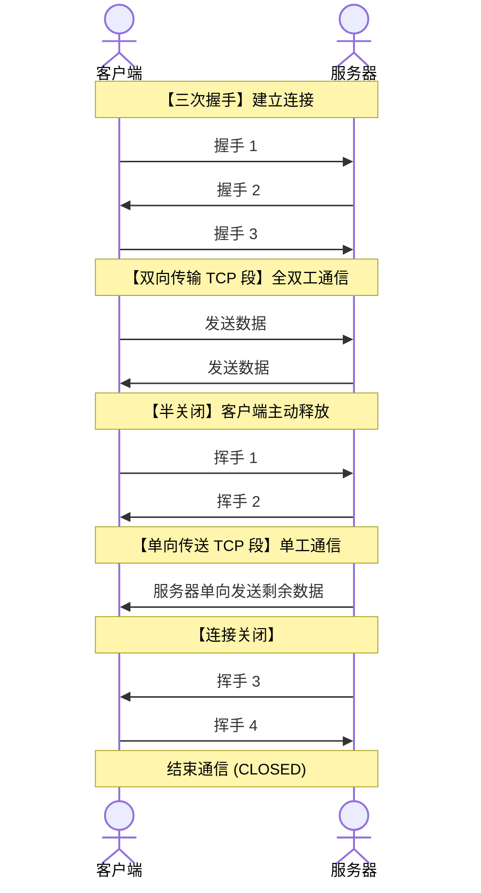

## 5.1 功能与寻址

### 一、端口的作用

- 通过"端口号"标识本主机的一个特定进程
  - **注意**：每台主机的端口号是相互独立的
  - **注意**：TCP、UDP 两种协议的端口号是相互独立的

- 两个进程通信需要指明 协议类型（UDP/TCP）, 本进程端口号， 对方IP地址与端口号。
- TCP 或 UDP 协议，通过 **Socket 套接字 = {IP 地址:端口号}**，唯一地标识网络中的一台主机上的一个应用进程。
### 二、端口号的分类

| 使用方 | 类型 | 范围 | 说明 |
|--------|------|------|------|
| **服务器** | 熟知端口号 | 0~1023 | 通常只能用于被熟知的重要应用程序 |
| **服务器** | 登记端口号 | 1024~49151 | - |
| **客户端** | 短暂端口号 | 49152~65535 | - |
### 三、传输层功能

#### 1. 实现端到端（进程到进程）的通信

#### 2. 复用和分用

- **复用（从上到下）**：在发送数据的时候，同一台主机上的多个进程可以使用同一个传输层协议
- **分用（从下到上）**：在接收数据的时候，传输层可以把数据正确交付到目的进程

#### 3. 差错检测

- **TCP**：检测出差错后丢弃数据，并**通知发送方重传**
- **UDP**：检测出错误后直接丢弃数据，且**不通知发送方**

#### 4. 向应用层提供两种服务

| 服务类型                 | 协议      | 特点                        |
| -------------------- | ------- | ------------------------- |
| **面向连接的、可靠的**端到端传输服务 | **TCP** | 确保数据正确/完整，顺序交付，但开销大、实时性较差 |
| **无连接的、不可靠的**端到端传输服务 | **UDP** | 数据可能出错/丢失，但速度快、开销小        |

- 可靠： 一个协议使用确认机制对传输的数据进行确认。
## 5.2 UDP

- 只在 IP 之上增加两项服务：**复用分用 + 差错检测**
- UDP**首部仅 8 B**（源端口、目的端口、长度、校验和）
- 端口号不正确时丢弃，并由 **ICMP 发送"端口不可达"差错报告
- UDP 每次传输一个完整的报文，**不支持报文自动拆分、重装**
- UDP 是**无连接的、不可靠的**（可靠性可以交给应用层处理），也**不支持拥塞控制**
- UDP 支持**一对一**（封装成单播 IP 数据报）、**一对多传输**（封装成广播/多播 IP 数据报）
#### 数据报格式

<div style="font-family: -apple-system, BlinkMacSystemFont, 'Segoe UI', 'PingFang SC', 'Microsoft YaHei', sans-serif; max-width: 650px; margin: 20px auto; color: var(--text-normal, #333);">

  <!-- 顶部 0 ~ 31 位刻度标尺 -->
  <div style="position: relative; margin-bottom: 3px; font-size: 12px; margin-left: 20px; margin-right: 90px;">
    <div style="display: flex; justify-content: space-between; border-bottom: 1px solid var(--text-muted, #888); padding-bottom: 2px;">
      <span>0</span>
      <span style="transform: translateX(-10px);">15</span>
      <span style="transform: translateX(10px);">16</span>
      <span>31</span>
    </div>
    <span style="position: absolute; left: -20px; top: 0; font-weight: bold;">位</span>
  </div>

  <!-- 栅格表格（原生 rowspan 锁定，永不错位） -->
  <table style="border-collapse: collapse; text-align: center; font-size: 13px; table-layout: fixed; width: 100%;">
    <colgroup>
      <!-- 左列 16 位 (约占 43%) -->
      <col style="width: 43%;">
      <!-- 右列 16 位 (约占 43%) -->
      <col style="width: 43%;">
      <!-- 标注列 (约占 14%) -->
      <col style="width: 14%;">
    </colgroup>
    <tbody>

      <!-- 第 1 行：源端口 + 目的端口 -->
      <tr style="height: 42px;">
        <td style="border: 1.5px solid var(--text-normal, #333); font-weight: 500;">
          16 位 源端口号
        </td>
        <td style="border: 1.5px solid var(--text-normal, #333); font-weight: 500;">
          16 位 目的端口号
        </td>
        <!-- 重点：rowspan="2" 精确锁定并合并前两行 (4B + 4B = 8B) -->
        <td rowspan="2" style="border: 1.5px solid var(--text-muted, #888); border-left: 2px solid var(--text-accent, #3b82f6); background: var(--background-secondary, rgba(128,128,128,0.06)); font-weight: bold; color: var(--text-accent, #3b82f6); font-size: 12px; padding: 4px;">
          首部 8B<br><span style="font-size: 10px; font-weight: normal; color: var(--text-muted, #888);">(固定)</span>
        </td>
      </tr>

      <!-- 第 2 行：UDP 长度 + 检验和 -->
      <tr style="height: 42px;">
        <td style="border: 1.5px solid var(--text-normal, #333); font-weight: 500;">
          16 位 UDP 长度
        </td>
        <td style="border: 1.5px solid var(--text-normal, #333); font-weight: 500;">
          16 位 UDP 检验和
        </td>
      </tr>

      <!-- 第 3 行：数据部分 -->
      <tr style="height: 60px;">
        <td colspan="2" style="border: 1.5px dashed var(--text-muted, #888); background: var(--background-secondary, rgba(128,128,128,0.03)); font-size: 14px; letter-spacing: 2px; color: var(--text-muted, #666);">
          数 据 部 分（如果有）
        </td>
        <td style="border-left: 1.5px solid transparent; font-size: 11px; color: var(--text-muted, #888); padding: 4px;">
          长度可变
        </td>
      </tr>

    </tbody>
  </table>

</div>


**字段说明**：
- **源端口号**（16位，16bit,  2B）：标识发送方进程的端口号 （回信）
- **目的端口号**（16位，2B）：标识接收方进程的端口号（必填）（分用）
- **UDP长度**（16位，2B）：UDP数据报总长度（首部+数据）
- **UDP检验和**（16位，2B）：差错检测（无需校验，填入全0）

**首部固定长度**：8B  
**数据部分最大长度**：65535 - 8 = 65527B


**★UDP 校验步骤**：
- UDP检验和把首部和数据部分一起检验
1. 校验和字段置全 0， 将**伪首部**（12B)（含源/目的 IP、协议号、UDP 长度）与 UDP数据报视为一连串16位字，数据部分不足偶数字节补 0
2. 假设切成N个 16 位字串，做**二进制反码求和**（高位进位需回卷加到低位）
3. 结果**取反**填入校验和字段
4. 接收方对N+1个16位字串求和，**结果全 1 则无差错**


## 5.3 TCP

### 特点

面向连接的传输层协议 · 可靠交付（无差错、不丢失、不重复、有序）· **全双工**（双方设缓存）· **面向字节流**（而UDP是报文） · 首部固定 **20 B**
MSS :  最大段长（不包含TCP首部），在握手①②选项（长度可变）中协商。

- TCP 首部更大，占 **20~60B**
- TCP 支持**报文自动拆分、重装**，因此可以传输长报文
- TCP 支持拥塞控制； 建立一次TCP连接可以传输多个报文。
- TCP 仅支持**一对一传输**（因为通信双方的传输层必须先建立连接）
<div style="font-family: -apple-system, BlinkMacSystemFont, 'Segoe UI', 'PingFang SC', 'Microsoft YaHei', sans-serif; max-width: 720px; margin: 20px auto; color: var(--text-normal, #333);">

  <!-- 顶部 32位 刻度尺 -->
  <div style="position: relative; margin-bottom: 2px; font-size: 12px;">
    <div style="display: flex; justify-content: space-between; border-bottom: 1px solid var(--text-muted, #888); padding-bottom: 2px; margin-left: 30px; margin-right: 60px;">
      <span>0</span><span>8</span><span>16</span><span>24</span><span>31</span>
    </div>
    <span style="position: absolute; left: 0; top: 0; font-weight: bold;">位</span>
  </div>

  <!-- 首部主体表格（严格 32 列划分） -->
  <div style="display: flex; align-items: stretch;">
    <!-- 左侧标题 -->
    <div style="writing-mode: vertical-rl; text-orientation: upright; display: flex; align-items: center; justify-content: center; width: 30px; font-size: 13px; font-weight: bold; letter-spacing: 4px;">
      TCP首部
    </div>

    <!-- 32位 核心结构表 -->
    <table style="flex: 1; border-collapse: collapse; text-align: center; font-size: 13px; table-layout: fixed; width: 100%; border: 2px solid var(--text-normal, #222);">
      <colgroup>
        <!-- 32列，每列等宽 -->
        <col span="32" style="width: 3.125%;">
      </colgroup>
      <tbody>
        <!-- 第 1 行：源端口(16) + 目的端口(16) -->
        <tr style="height: 36px;">
          <td colspan="16" style="border: 1px solid var(--text-normal, #444); font-weight: 500;">源端口 (16 位bit)</td>
          <td colspan="16" style="border: 1px solid var(--text-normal, #444); font-weight: 500;">目的端口 (16 位 = 2B)</td>
        </tr>

        <!-- 第 2 行：序号(32) -->
        <tr style="height: 36px;">
          <td colspan="32" style="border: 1px solid var(--text-normal, #444); font-weight: 500; letter-spacing: 6px;">序 号 (32 位)</td>
        </tr>

        <!-- 第 3 行：确认号(32) -->
        <tr style="height: 36px;">
          <td colspan="32" style="border: 1px solid var(--text-normal, #444); font-weight: 500; letter-spacing: 6px;">确 认 号 (32 位)</td>
        </tr>

        <!-- 第 4 行：数据偏移(4) + 保留(6) + 6个控制标志(各1) + 窗口(16) -->
        <tr style="height: 48px;">
          <td colspan="4" style="border: 1px solid var(--text-normal, #444); font-size: 11px;">数据<br>偏移（4位）</td>
          <td colspan="6" style="border: 1px solid var(--text-normal, #444); letter-spacing: 2px;">保 留（6位）</td>
          <td colspan="1" style="border: 1px solid var(--text-normal, #444); font-size: 10px; line-height: 1.1;">U<br>R<br>G</td>
          <td colspan="1" style="border: 1px solid var(--text-normal, #444); font-size: 10px; line-height: 1.1;">A<br>C<br>K</td>
          <td colspan="1" style="border: 1px solid var(--text-normal, #444); font-size: 10px; line-height: 1.1;">P<br>S<br>H</td>
          <td colspan="1" style="border: 1px solid var(--text-normal, #444); font-size: 10px; line-height: 1.1;">R<br>S<br>T</td>
          <td colspan="1" style="border: 1px solid var(--text-normal, #444); font-size: 10px; line-height: 1.1;">S<br>Y<br>N</td>
          <td colspan="1" style="border: 1px solid var(--text-normal, #444); font-size: 10px; line-height: 1.1;">F<br>I<br>N</td>
          <td colspan="16" style="border: 1px solid var(--text-normal, #444); font-weight: 500; letter-spacing: 4px;">窗 口 (16 位)</td>
        </tr>

        <!-- 第 5 行：检验和(16) + 紧急指针(16) -->
        <tr style="height: 36px;">
          <td colspan="16" style="border: 1px solid var(--text-normal, #444); font-weight: 500;">检 验 和 (16 位)</td>
          <td colspan="16" style="border: 1px solid var(--text-normal, #444); font-weight: 500;">紧 急 指 针 (16 位)</td>
        </tr>

        <!-- 第 6 行：选项(可变) + 填充 -->
        <tr style="height: 36px;">
          <td colspan="24" style="border: 1px solid var(--text-normal, #444); font-weight: 500;">选 项 (长度可变，最长 40B)</td>
          <td colspan="8" style="border: 1px solid var(--text-normal, #444);">填 充(补足4B的整数倍）</td>
        </tr>
      </tbody>
    </table>

    <!-- 右侧标注：20B 固定首部 -->
    <div style="display: flex; flex-direction: column; justify-content: space-between; width: 60px; font-size: 12px; margin-left: 8px;">
      <div style="height: 195px; border: 1px solid var(--text-muted, #888); border-left: none; display: flex; align-items: center; justify-content: center; padding: 4px; box-sizing: border-box; text-align: center;">
        20B 的<br>固定首部
      </div>
      <div style="flex: 1; display: flex; align-items: center; justify-content: center; color: var(--text-muted, #888); font-size: 11px;">
        可变
      </div>
    </div>
  </div>

  <!-- 下半部分：TCP 报文段 封装为 IP 数据报 -->
  <div style="margin-top: 30px; margin-left: 30px; margin-right: 60px;">
    <!-- TCP 报文段 -->
    <div style="display: flex; align-items: center; margin-bottom: 8px;">
      <span style="width: 90px; font-size: 13px; font-weight: bold;">TCP报文段</span>
      <div style="flex: 1; display: flex; border: 1px solid var(--text-normal, #444);">
        <div style="width: 30%; background: #ddd; color: #222; text-align: center; padding: 8px 0; font-size: 12px; font-weight: 600; border-right: 1px solid #999;">
          TCP 首部
        </div>
        <div style="width: 70%; background: #999; color: #fff; text-align: center; padding: 8px 0; font-size: 12px; font-weight: 600;">
          TCP 数据部分
        </div>
      </div>
    </div>

    <!-- 封装映射指示箭头 -->
    <div style="display: flex; padding-left: 90px; justify-content: space-around; margin: 4px 0;">
      <span style="font-size: 16px; color: var(--text-muted, #888);">⬇ 封装下沉 ⬇</span>
    </div>

    <!-- IP 数据报 -->
    <div style="display: flex; align-items: center;">
      <span style="width: 90px; font-size: 12px; color: var(--text-muted, #888);">⬅ 发送在前</span>
      <div style="flex: 1; display: flex; border: 1px solid var(--text-normal, #444);">
        <div style="width: 15%; background: #eee; color: #222; text-align: center; padding: 8px 0; font-size: 12px; font-weight: 600; border-right: 1px solid #999;">
          IP 首部
        </div>
        <div style="width: 85%; background: #888; color: #fff; text-align: center; padding: 8px 0; font-size: 12px; font-weight: 600;">
          IP 数据部分（即上面的整个 TCP 报文段）
        </div>
      </div>
    </div>
  </div>

</div>

 - 序号： (seq) 标记数据部分第一个字节在原始字节流中的位置(由发送请求方进程自己决定)
 - 确认号： （ack或ack_seq) 表示序号在该确认号前的所有字节都已正确收到,也等价于期望收到下一个报文段中第一个数据字节的序号。
 - ACK： (1bit) , ACK = 0 , 表示ack_seq无效, 只有握手①的ACK = 0;
 - 数据偏移： 指出TCP首部的长度，偏移单位为4B, 所以范围是[5,15] 
 - URG： 1bit的紧急位， URG = 1， 表示紧急数据，需要优先处理。
 - 紧急指针：URG = 1有效，表示本报文段中紧急数据的字节数。


SYN: 同步位， 当SYN = 1, 表示这是一个连接请求或连接接受报文， 只有握手①②才为1.
FIN:  中止位， 当FIN = 1， 表示发送方无数据要发送，请求释放。 只有挥手①③才为1.
所谓SYN段，FIN段，ACK段， 都是他们值为1的意思。
窗口： rwnd/rcvwnd: 表示接收窗口的大小，接收方还能接收多少字节的数据（从ack_seq算起）
校验和： 和UDP（伪首部，累加和反码）差不多，就是伪首部协议和长度得换成TCP(6)的。


### 连接管理



**三次握手**：

```
① C → S : SYN=1, seq=x                    （C 进入 SYN-SENT）
② S → C : SYN=1, ACK=1, seq=y, ack=x+1    （S 进入 SYN-RCVD）
③ C → S : ACK=1, seq=x+1, ack=y+1         （双方 ESTABLISHED）
```

> 第三次握手的必要性：防止**已失效的连接请求报文**突然到达，导致服务器建立无用连接。
> 握手①握手②不能携带数据，（只有TCP首部）， 但是仍然要消耗一个序号
> 握手③如果不携带数据，就不消耗序号。
> 很显然，每次握手0.5RTT

**四次挥手**：

```
① C → S : FIN=1, seq=u          （C 进入 FIN-WAIT-1）
② S → C : ACK=1, ack=u+1        （半关闭，S 仍可发数据；C 进入 FIN-WAIT-2）
③ S → C : FIN=1, ACK=1, seq=w   （S 进入 LAST-ACK）
④ C → S : ACK=1, ack=w+1        （C 进入 TIME-WAIT，等 2MSL 后 CLOSED）
```

> **为何四次**：TCP 全双工，需各自关闭一个方向。**为何等 2MSL**：确保最后的 ACK 能到达，并让本连接残余报文消失。
> 挥手①③即使不携带数据，也要消耗一个序号
> 挥手②可以携带数据，挥手④则不能。

从客户发出挥手①，到客户端进程进入 CLOSE 状态，至少需要多久？——1RTT+2MSL
从客户发出挥手①，到服务器进程进入 CLOSE 状态，至少需要多久？——1.5RTT  
结合图的阶段名称计算，感觉纯垃圾名和垃圾题啊，考到出题人私权甲吧。

### 可靠传输四机制

| 机制 | 要点 |
|---|---|
| 校验 | 同 UDP（含伪首部） |
| **序号** | **建立在字节流上，不是报文段上** |
| **确认** | **累积确认**：确认号 = 期望收到的下一个字节序号 |
| 重传 | ① **超时重传**：超时时间略大于加权平均 RTTs<br>② **冗余 ACK → 快速重传**：收到**同一报文段的 3 个冗余 ACK** 即认为其后报文段丢失，立即重传 |

### 流量控制

- 本质是**速度匹配**，防止发送方使接收方缓存溢出
- **接收方**按自身缓存确定 **rwnd**（接收窗口） 告知发送方；**发送方**按网络拥塞程度维护一个 **cwnd**（拥塞窗口， 取决于当前网络的拥塞情况，动态调整，未出现拥塞，可以增大cwnd）
- **发送窗口 = min(cwnd, rwnd)**

| | 数据链路层 | 传输层 |
|---|---|---|
| 窗口大小 | **固定** | **可变** |
| 范围 | 相邻结点间 | **端到端** |
> 零窗口怎么产生:   接收方(处理慢）接收缓存已满，于是在确认报文里把接收窗口 rwnd = 0 告诉发送方。
> 死锁是怎么形成的：  给与发送方的rwnd = 400(窗口恢复) ──→  这个确认丢失了，发送方不发了， 接收方以为已通知,也在等数据。
> 解决办法： 发送方收到 rwnd = 0 后，启动持续计时器。计时器到期后，发送方发送一个 1 字节的零窗口探测报文,强迫接收方重新应答。
> 注意： 探测报文只有 1 字节数据，即使对方窗口为 0 也能被接收方接收并确认(接收方必须为这 1 字节留有能力)
>  若响应仍是 rwnd = 0,发送方重置计时器（但计时器间隔加倍）再等，如此往复。
### 拥塞控制

**四算法两组合**：

| 触发条件                 | 采用算法           |
| -------------------- | -------------- |
| TCP 连接建立 / 检测到**超时** | **慢开始 + 拥塞避免** |
| 检测到**3 个相同的冗余 ACK**  | **快重传 + 快恢复**  |

<div style="max-width: 860px; margin: 24px auto; font-family: -apple-system, BlinkMacSystemFont, 'Segoe UI', 'PingFang SC', 'Microsoft YaHei', sans-serif;">
<svg viewBox="0 0 880 520" width="100%" height="100%" xmlns="http://www.w3.org/2000/svg">
  <defs>
    <!-- 箭头标记 -->
    <marker id="axis-arrow" viewBox="0 0 10 10" refX="6" refY="5" markerWidth="6" markerHeight="6" orient="auto-start-reverse">
      <path d="M 0 1.5 L 8 5 L 0 8.5 z" fill="#e2e8f0" />
    </marker>
    <marker id="arrow-down-red" viewBox="0 0 10 10" refX="5" refY="6" markerWidth="6" markerHeight="6" orient="auto-start-reverse">
      <path d="M 1.5 0 L 5 8 L 8.5 0 z" fill="#f87171" />
    </marker>
    <marker id="arrow-down-pink" viewBox="0 0 10 10" refX="5" refY="6" markerWidth="6" markerHeight="6" orient="auto-start-reverse">
      <path d="M 1.5 0 L 5 8 L 8.5 0 z" fill="#fb7185" />
    </marker>
  </defs>

  <!-- 1. 独立卡片底板（解决融为一体的根本原因） -->
  <rect width="880" height="520" rx="12" fill="#181b22" stroke="#2d3342" stroke-width="1.5" />

  <!-- 2. 背景横向网格刻度线 (dy=14px/MSS, 原点 Y=430) -->
  <!-- cwnd 4(374), 8(318), 12(262), 16(206), 20(150), 24(94) -->
  <g stroke="#262c3a" stroke-width="1.2" stroke-dasharray="3 3">
    <line x1="160" y1="374" x2="820" y2="374" />
    <line x1="160" y1="318" x2="820" y2="318" />
    <line x1="160" y1="262" x2="820" y2="262" />
    <line x1="160" y1="206" x2="820" y2="206" />
    <line x1="160" y1="150" x2="820" y2="150" />
    <line x1="160" y1="94"  x2="820" y2="94"  />
  </g>

  <!-- 3. ssthresh 门限基准虚线 -->
  <!-- 初始 ssthresh = 16 -->
  <line x1="160" y1="206" x2="264" y2="206" stroke="#818cf8" stroke-width="1.5" stroke-dasharray="5 4" />
  <!-- 新 ssthresh_1 = 12 -->
  <line x1="160" y1="262" x2="576" y2="262" stroke="#fbbf24" stroke-width="1.5" stroke-dasharray="5 4" />
  <!-- 新 ssthresh_2 = 8 -->
  <line x1="160" y1="318" x2="680" y2="318" stroke="#f472b6" stroke-width="1.5" stroke-dasharray="5 4" />

  <!-- 4. 坐标轴与标题 -->
  <!-- Y轴 -->
  <line x1="160" y1="440" x2="160" y2="45" stroke="#cbd5e1" stroke-width="2" marker-end="url(#axis-arrow)" />
  <text x="160" y="32" text-anchor="middle" font-size="14" font-weight="bold" fill="#f8fafc">
    拥塞窗口 cwnd <tspan fill="#f87171" font-size="12">(单位: MSS)</tspan>
  </text>

  <!-- X轴 -->
  <line x1="150" y1="430" x2="840" y2="430" stroke="#cbd5e1" stroke-width="2" marker-end="url(#axis-arrow)" />
  <text x="830" y="465" text-anchor="end" font-size="14" font-weight="bold" fill="#f8fafc">
    传输轮次 <tspan fill="#f87171" font-size="12">(RTT)</tspan>
  </text>

  <!-- Y轴刻度与标签 -->
  <g font-size="13" fill="#cbd5e1" text-anchor="end" font-family="monospace">
    <text x="150" y="435">0</text>
    <text x="150" y="379">4</text>
    <text x="150" y="323">8</text>
    <text x="150" y="267">12</text>
    <text x="150" y="211">16</text>
    <text x="150" y="155">20</text>
    <text x="150" y="99">24</text>
  </g>

  <!-- 左侧 ssthresh 文字指引 -->
  <g font-size="12" text-anchor="end">
    <text x="135" y="210" fill="#a5b4fc">ssthresh 的初始值 ➔</text>
    <text x="135" y="266" fill="#fde047">新的 ssthresh 值_1 ➔</text>
    <text x="135" y="322" fill="#f472b6">新的 ssthresh 值_2 ➔</text>
  </g>

  <!-- X轴刻度 (dx=26px) -->
  <g font-size="13" fill="#cbd5e1" text-anchor="middle" font-family="monospace">
    <text x="160" y="450">0</text>
    <text x="212" y="450">2</text>
    <text x="264" y="450">4</text>
    <text x="316" y="450">6</text>
    <text x="368" y="450">8</text>
    <text x="420" y="450">10</text>
    <text x="472" y="450">12</text>
    <text x="524" y="450">14</text>
    <text x="576" y="450">16</text>
    <text x="628" y="450">18</text>
    <text x="680" y="450">20</text>
    <text x="732" y="450">22</text>
    <text x="784" y="450">24</text>
  </g>

  <!-- 5. 核心折线路径（强制 fill="none"，彻底消除黑块！） -->
  <!-- 阶段 1：初始慢开始 (0 ~ 4 轮次：1->2->4->8->16 指数递增) -->
  <polyline points="160,416 186,402 212,374 238,318 264,206" fill="none" stroke="#34d399" stroke-width="3" stroke-linecap="round" stroke-linejoin="round" />
  <line x1="264" y1="206" x2="264" y2="430" stroke="#475569" stroke-width="1.2" stroke-dasharray="3 3" />

  <!-- 阶段 2：拥塞避免 (4 ~ 12 轮次：16 线性增加到 24) -->
  <line x1="264" y1="206" x2="472" y2="94" fill="none" stroke="#38bdf8" stroke-width="3" stroke-linecap="round" />
  <line x1="472" y1="94"  x2="472" y2="430" stroke="#475569" stroke-width="1.2" stroke-dasharray="3 3" />

  <!-- 突发 1：超时（Timeout）—— cwnd 骤降归 1 -->
  <line x1="472" y1="94" x2="472" y2="408" fill="none" stroke="#f87171" stroke-width="2.5" stroke-dasharray="4 3" marker-end="url(#arrow-down-red)" />

  <!-- 阶段 3：慢开始 (12 ~ 16 轮次：从 1 重启翻倍到 12) -->
  <polyline points="472,416 498,402 524,374 550,318 576,262" fill="none" stroke="#34d399" stroke-width="3" stroke-linecap="round" stroke-linejoin="round" />
  <line x1="576" y1="262" x2="576" y2="430" stroke="#475569" stroke-width="1.2" stroke-dasharray="3 3" />

  <!-- 阶段 4：拥塞避免 (16 ~ 20 轮次：12 线性增加到 16) -->
  <line x1="576" y1="262" x2="680" y2="206" fill="none" stroke="#38bdf8" stroke-width="3" stroke-linecap="round" />
  <line x1="680" y1="206" x2="680" y2="430" stroke="#475569" stroke-width="1.2" stroke-dasharray="3 3" />

  <!-- 突发 2：收到 3 个冗余 ACK —— 快恢复：降到新门限 8 (不降到 1) -->
  <line x1="680" y1="206" x2="680" y2="310" fill="none" stroke="#fb7185" stroke-width="2.5" stroke-dasharray="4 3" marker-end="url(#arrow-down-pink)" />

  <!-- 阶段 5：快恢复直接进入拥塞避免 (20 ~ 24 轮次：从 8 线性递增) -->
  <line x1="680" y1="318" x2="784" y2="262" fill="none" stroke="#38bdf8" stroke-width="3" stroke-linecap="round" />

  <!-- 6. 关键数据拐点圆点 -->
  <!-- 慢开始节点（绿色） -->
  <circle cx="160" cy="416" r="3.5" fill="#181b22" stroke="#34d399" stroke-width="2.5" />
  <circle cx="186" cy="402" r="3.5" fill="#181b22" stroke="#34d399" stroke-width="2.5" />
  <circle cx="212" cy="374" r="3.5" fill="#181b22" stroke="#34d399" stroke-width="2.5" />
  <circle cx="238" cy="318" r="3.5" fill="#181b22" stroke="#34d399" stroke-width="2.5" />
  <circle cx="498" cy="402" r="3.5" fill="#181b22" stroke="#34d399" stroke-width="2.5" />
  <circle cx="524" cy="374" r="3.5" fill="#181b22" stroke="#34d399" stroke-width="2.5" />
  <circle cx="550" cy="318" r="3.5" fill="#181b22" stroke="#34d399" stroke-width="2.5" />
  <!-- 关键转折点（彩色实心） -->
  <circle cx="264" cy="206" r="4.5" fill="#818cf8" stroke="#ffffff" stroke-width="1.5" />
  <circle cx="472" cy="94"  r="5"   fill="#f87171" stroke="#ffffff" stroke-width="1.5" />
  <circle cx="576" cy="262" r="4.5" fill="#fbbf24" stroke="#ffffff" stroke-width="1.5" />
  <circle cx="680" cy="206" r="5"   fill="#fb7185" stroke="#ffffff" stroke-width="1.5" />
  <circle cx="680" cy="318" r="4.5" fill="#f472b6" stroke="#ffffff" stroke-width="1.5" />

  <!-- 7. 文字解说卡片与标签 -->
  <!-- 慢开始标签 1 -->
  <rect x="175" y="335" width="56" height="22" rx="4" fill="#064e3b" stroke="#34d399" stroke-width="1.2" />
  <text x="203" y="350" font-size="11" font-weight="bold" fill="#6ee7b7" text-anchor="middle">慢开始</text>

  <!-- 拥塞避免斜标 1 -->
  <text x="350" y="140" transform="rotate(-28 350 140)" font-size="12" font-weight="bold" fill="#7dd3fc">拥塞避免 ➔</text>

  <!-- 超时事件说明 -->
  <text x="480" y="80" font-size="12" font-weight="bold" fill="#fca5a5">超时 (网络发生拥塞)</text>
  <text x="480" y="96" font-size="11" fill="#f87171">执行慢开始算法</text>
  <text x="480" y="125" font-size="11" font-weight="bold" fill="#fde047">第 1 次调整 ssthresh = 12</text>

  <!-- 慢开始标签 2 -->
  <rect x="490" y="335" width="56" height="22" rx="4" fill="#064e3b" stroke="#34d399" stroke-width="1.2" />
  <text x="518" y="350" font-size="11" font-weight="bold" fill="#6ee7b7" text-anchor="middle">慢开始</text>

  <!-- 拥塞避免斜标 2 -->
  <text x="615" y="225" transform="rotate(-28 615 225)" font-size="12" font-weight="bold" fill="#7dd3fc">拥塞避免 ➔</text>

  <!-- 3个重复 ACK 说明 -->
  <text x="690" y="180" font-size="12" font-weight="bold" fill="#fca5a5">收到 3 个重复 ACK</text>
  <text x="690" y="196" font-size="11" fill="#93c5fd">执行快恢复算法</text>
  <text x="690" y="335" font-size="11" font-weight="bold" fill="#f472b6">第 2 次调整 ssthresh = 8</text>

  <!-- 拥塞避免斜标 3 -->
  <text x="720" y="280" transform="rotate(-28 720 280)" font-size="12" font-weight="bold" fill="#7dd3fc">拥塞避免 ➔</text>

</svg>
</div>

```
慢开始：cwnd = 1 MSS 起，每收到一个确认 cwnd 加倍（指数增长）
        → 达到 ssthresh 后转入拥塞避免

拥塞避免：每经过一个 RTT，cwnd += 1 MSS（线性增长）
        → 一旦超时：ssthresh = 当前 cwnd / 2，cwnd = 1，重新慢开始

快重传：收到 3 个冗余 ACK，立即重传缺失报文段，不等超时

快恢复：ssthresh = 当前 cwnd / 2，cwnd = ssthresh（不回到 1），
        随后直接进入线性增长
```

> **超时 → cwnd 归 1；三冗余 ACK → cwnd 减半。** 这是最常考的区分点。
>
> 拥塞控制是**全局性**的（考虑整个网络）；流量控制是**点对点**的（只看接收方）。
> 慢开始出现在第一个数据报文段可以发送时。


---
