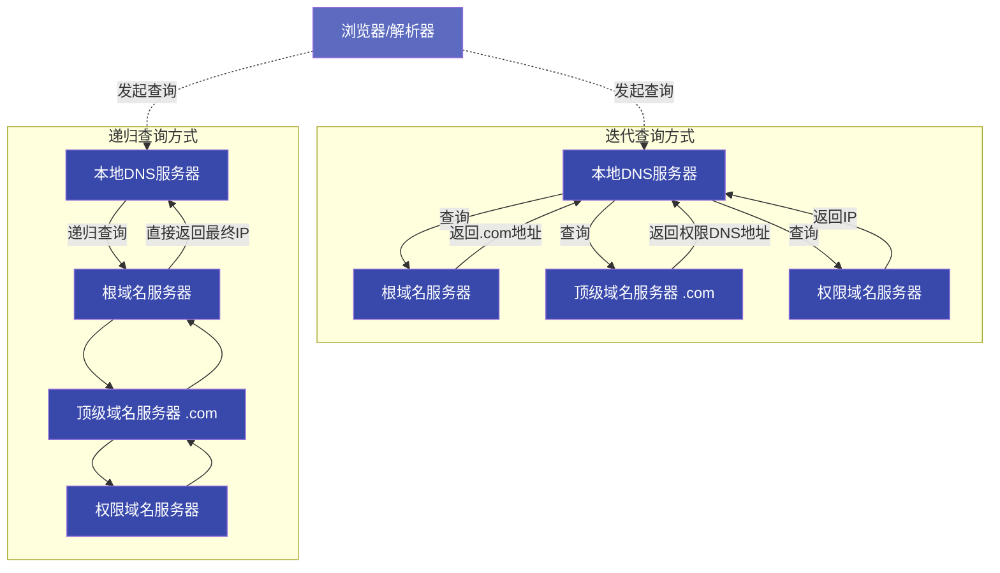
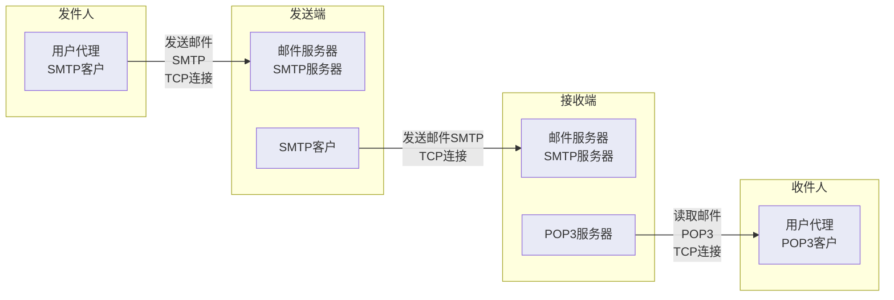

## 6.1 网络应用模型

### C/S 模型（客户/服务器）

- **工作流程**：服务器持续开机、被动等待请求 → 客户主动发起请求并等待结果 → 服务器处理后将结果返回客户。
- 客户是面向用户的，服务器是面向任务的。
- **核心特点**：
  1. 双方地位不平等，服务器可集中管理客户，管理集中便捷；
  2. 客户之间**不直接通信**（如两个浏览器不互相传数据）；
  3. **客户必须事先知道服务器地址**，服务器无须知道客户地址；
  4. **可扩展性差**：受服务器性能和带宽限制，支持的客户数量有限。
- **典型应用**：Web、FTP、电子邮件（SMTP/POP3/IMAP）。

### P2P 模型（对等）

- **思想**：内容不集中存于中心服务器，每个节点**同时具备下载和上传能力**，任意两台对等方（Peer）可直接通信。
- **本质**：没有固定角色——访问别人资源时是客户，为别人提供资源时是服务器；从实现机制看**P2P 本质上仍基于 C/S 模式**（易考辨析）。
- **优点**：
  1. 减轻中心服务器压力，消除对单一服务器的依赖，任务分散；
  2. 节点间可直接通信，无须服务器中转；
  3. **可扩展性好**：容量随节点数增加自然增长；
  4. **健壮性强**：单节点失效不影响其他节点。
- **缺点**：占用本机资源多（CPU、内存、磁盘 I/O）；流量极大（曾占互联网流量 50%~90%），**ISP 通常限制 P2P**。 
- BT 完全符合P2P 对等连接的定义：不区分服务请求方和提供方，每台主机既是客户又同时是服务器（通信双方地位平等）：
 1. 无中心服务器存储文件——文件被切成小块，分散在所有下载者手中。
 2. 下载的同时也在上传：你从别人那里下载缺少的块，同时把你已有的块传给别人。
 3. 每个节点既是客户又是服务器——正是 P2P 的本质特征。
 4. 参与的人越多，下载越快——这与 C/S 模型（用户多了服务器不堪重负）形成鲜明对比。

# 6.2 域名系统

## DNS 概述

### 1. 什么是域名？

- 域名是给互联网上的主机或路由器取的一个“名字”。
- 域名具有**层次化特性**。
- 访问某个域名，本质上是访问该域名所对应的主机。
- 域名—IP 是多对多，IP—MAC 也是多对多，域名—MAC 没有直接对应关系（只能间接映射）
### 2. DNS 的作用

- DNS 用于实现**域名到 IP 地址的转换**。
- 域名便于人类记忆，IP 地址便于计算机处理。
- DNS从概念上分为三部分： 层次域名空间，域名服务器，解析器

### 3. DNS 的基本特点

- DNS 属于**应用层**协议。
- DNS 通常基于 **UDP** 传输，端口号是 **53**。
- DNS 采用 **C/S（客户/服务器）模型**。
- DNS 是一种**分布式系统**，单个故障不会影响整个系统的正常运行。

## DNS 层次域名空间

### 一、域名书写规则

- 域名由多个**标号（Label）组成，各标号之间用“`.`”分隔。
- 域名书写顺序：**低级域名在左，顶级域名在右**。
- 标号主要由以下内容组成：
  - 英文字符，不区分大小写；
  - 数字；
  - 仅允许使用连字符“`-`”，不允许使用其他标点符号。
- 长度限制：
  - 单个标号长度不超过 **63 个字符**；
  - 全域名总长度（包括分隔点）不超过 **255 个字符**。
### 二、域名的层次结构与管理

- 域名层次结构从右到左依次为：

  根（`.`）→ 顶级域（TLD）→ 二级域 → 三级域 → 四级域 → …

- 顶级域由 **ICANN** 统一管理。
- 上级机构可以将子域逐级授权给下级机构管理。

**授权示例：**

ICANN → 授权 CNNIC（管理 `.cn`）→ 授权 CERNET（管理 `.edu.cn`）

### 三、顶级域名分类

| 类型 | 含义 | 示例 |
|---|---|---|
| `ccTLD` | 国家或地区顶级域名 | `.cn`、`.us` |
| `gTLD` | 通用顶级域名 | `.com`（公司）、`.net`（网络服务）、`.org`（非营利组织） |
| `.arpa` | 基础结构域名，又称反向域名 | 用于反向解析：IP → 域名 |

### 四、 域名解析过程

# 6.3 文件传输系统

### 6.3.1 FTP 的工作原理

**FTP 定义**：文件传输协议（File Transfer Protocol, FTP）是互联网上使用最广泛的文件传输协议，提供交互式访问，允许用户指定文件的类型与格式，并支持对文件设置存取权限。

**FTP 主要功能**：
1. 支持不同类型主机系统（硬件、操作系统等均可不同）之间的文件传输；
2. 通过用户权限管理，提供对远程 FTP 服务器上文件的管理能力；
3. 通过匿名（anonymous）FTP 方式，实现公用文件的共享。
4. FTP 支持ASCII和Binary两种方式的传输， 前者常用于非加密文本文件，后者常用于图像，声音等。

**FTP 工作模式**：
- 应用层协议，采用 **客户/服务器（C/S）** 工作模式，基于 **TCP**（两个并行） 提供可靠的传输服务。
- 一个 FTP 服务器进程可同时为多个客户进程提供服务。
- 服务器进程由两部分组成：
  - **主进程**：负责接收新请求；
  - **从属进程**：分别处理单个客户的请求。

**工作步骤**：
1. 打开熟知端口 **21（控制端口）**，供客户进程连接；
2. 等待客户进程发起连接请求；
3. 启动从属进程处理该请求，处理完毕后从属进程终止；
4. 主进程返回等待状态，继续接收其他客户请求。主进程与从属进程并发执行。

**FTP 协议特性**：
- FTP 是**有状态协议**，服务器需在整个会话期间维护用户的状态信息。例如，必须将用户账户与控制连接相关联，并跟踪用户在远程目录树中的当前位置。

---

### 6.3.2 TCP控制连接与数据连接

#### 1. 控制连接
- 服务器监听 **21 号端口**，等待客户连接，建立在此端口上的连接称为**控制连接**，用于传输控制命令（如登录、目录操作、传送命令等）。
- FTP 客户通过控制连接向服务器发送文件传送请求，但**控制连接本身不用于传输文件数据**。
- 在文件传输过程中，仍可通过控制连接发送中断等指令，因此**控制连接是持久连接，FTP会话期间TCP不中断**。
#### 2. 数据连接
- 当服务器的控制进程收到客户发来的文件传输请求后，会创建一个**数据传送进程**并建立数据连接。
- 该连接用于客户端与服务器端的数据传送进程之间的通信，实际完成文件内容的传输。
- 传输结束后，**数据连接关闭**，数据传送进程随之终止。

**数据连接支持两种传输模式**：
- **PORT 模式（主动模式）**（默认）：
  - 客户端首先连接服务器的 21 号端口，并完成登录；
  - 需要传输数据时，客户端随机选择一个本地端口，并通过 **PORT 命令**将该端口号告知服务器；
  - 随后，**服务器过 20 号端口主动连接到客户端指定的端口**以传输数据。

- **PASV 模式（被动模式）**：
  - 客户端登录后发送 **PASV 命令**；
  - 服务器收到后，在本地随机打开一个端口，并通过控制连接将该端口号返回给客户端；
  - **客户端再主动连接到该端口**以传输数据。

**两种模式的区别**：
- 主动模式：**服务器主动连接客户端**（服务器发起数据连接）
- 被动模式：**服务器被动响应客户端的连接**（客户端发起数据连接）
- **由客户端发送命令决定**使用哪种模式。
---
### 补充：

**FTP 控制信息的传输方式**：
- FTP 使用独立的控制连接传送命令，其控制信息属于**带外传送**，分离控制与数据。
- 使用 FTP 修改远程文件时，需先将文件下载到本地，修改后再传回服务器，整个过程涉及两次完整传输，**效率较低**。
- 由于主动模式无法穿透NAT, 显示应用中常用被动模式。

**对比 NFS（网络文件系统）**：
- NFS 采用不同的思路：它允许进程直接打开远程文件，并在指定位置进行读/写操作。
- 这样，用户只需传输大文件中的特定片段，而无须复制整个文件。

# 6.4 电子邮件

### 一、电子邮件系统的组成结构

1. **用户代理（UA）**：如 QQ 邮箱，提供"用户界面"，编辑、发送、接收邮件
2. **邮件服务器**：存放用户邮件，发送/接收邮件，SMTP 客户端&服务器双重角色
3. **电子邮件协议**：SMTP 发、POP3 收

### 二、电子邮件格式与 MIME

#### 1. 邮件格式
- 邮件 = **信封 + 内容**（内容 = 首部+主体）
- 信封常根据首部信息自动生成
- **首部**：To、From 必填，Subject 选填；  （收件人，发件人，主题）

#### 2. MIME（多用途因特网邮件扩展）
- **引入原因**：SMTP 限制只能发送 **7-bit ASCII**，仅支持纯英文邮件，不支持发中文、发文件
- **MIME 扩展**：
  - 新增五个首部字段（如 MIME 版本）
  - 定义了多种邮件主体的格式（如文本、图片）
  - 定义了传送编码（如 Base64）
  - 能够将任何数据编码为 **7-bit ASCII 码**

### 三、SMTP 与 POP3

#### SMTP（简单邮件传送协议）
- **功能**：发送邮件，**C/S 模型**，基于 **TCP**，服务器 **25 端口**
- **适用场景**：
  - 用户代理（Push 推）→ 发送方邮件服务器
  - 发送方邮件服务器（Push 推）→ 接收方邮件服务器
- **通信三阶段**：连接建立、邮件传送、连接释放

#### POP3（邮局协议版本3）
- **功能**：读取邮件，**C/S 模型**，基于 **TCP**，服务器 **110 端口**
- **适用场景**：
  - 仅用于：接收方用户代理（Pull 拉）← 接收方邮件服务器（常见的邮件读取协议有POP3, HTTP, IMAP) 
- **读取邮件时**，支持"下载并删除"、"下载并保留"两种模式

现在常用HTTP/HTTPS 协议， 既能收也能发。
在基于万维网的电子邮件中，用户浏览器与hotmail/Gmail的邮件服务器之间的邮件发送/接收 使用的是HTTP

# 6.5 万维网

### 一、WWW 定义
- **万维网（World Wide Web）**：一个全球范围的、分布式、联机式的信息存储空间
- 各种"资源"通过 **HTTP 协议**传送给用户

### 二、万维网的组成

#### 1. 统一资源定位符（URL）
- **格式**：`URL = <协议>://<主机>:<端口>/<路径>`
- 指向万维网上的某个特定资源
- 端口、路径可以省略，因为有默认值
  - 例：Web 服务器**默认 80 端口**，**默认首页（index.html）**

**示例**：
- 【例1】`https://www.bilibili.com`
- 【例2】`http://www.dilidili.com/肯德基.png`

#### 2. 超文本传输协议（HTTP）
- 应用层协议，使用 **TCP**作为传输层协议（可靠）， 注意HTTP本身是无连接、无状态的。
- HTTP常结合Cookie与数据库来实现用户行为跟踪。
- cookie 是一个存储在用户主机中的文本文件。
- HTTP 协议定义了"HTTP 请求报文"**、**"HTTP 响应报文"**两种数据结构
#### 3. 超文本标记语言（HTML）
- 一种文档结构的标记语言
- 使用一些约定的标记对页面上的各种信息（包括文字、图像、视频等）、格式进行描述
### 三、访问网页的过程

以访问清华大学网站为例：

1. 用户在浏览器地址栏中输入 URL：`http://www.tsinghua.edu.cn/index.htm`
2. 浏览器向 DNS 服务器请求解析 `www.tsinghua.edu.cn` 的 IP 地址
3. DNS 系统返回清华大学服务器的 IP 地址
4. 浏览器与该服务器建立 TCP 连接（默认端口号为 80）
5. 浏览器发出 HTTP 请求：`GET /index.htm`
6. 服务器通过 HTTP 响应把文件 `index.htm` 发送给浏览器
7. 释放 TCP 连接
8. 浏览器解析 `index.htm` 文件，并将 Web 页面显示给用户
---

**说明**：

- 每个万维网站点都运行一个服务器进程，持续监听 TCP 端口 80（默认），当监听到连接请求时，服务器便与浏览器建立 TCP 连接。
- 随后，浏览器向服务器发送 HTTP 请求，以获取指定的 Web 页面。
- 服务器收到请求后，组装所请求页面所需的资源，并通过 HTTP 响应返回给浏览器。
- 浏览器对收到的内容进行解析，并将最终的 Web 页面呈现给用户。
- 最后，TCP 连接被释放。

上述过程仅为简化描述。实际上，整个通信可能涉及 TCP/IP 体系结构中的多种协议：应用层的 DHCP、DNS 和 HTTP，传输层的 UDP 与 TCP，网络层的 IP 和 ARP，以及数据链路层的 CSMA/CD 协议或 PPP（涉及 ISP 接入或广域网传输时）等。本节主要聚焦于 HTTP。

- 一个网页 = **1 个 html 文件 + n 个网页元素**（本质上是文件）
- **每个文件的获取都需要经过一组 HTTP 请求 & 响应**
- **注意**：只有先获得 html 文件，才能知道其他 n 个被引用的网页元素的 URL
### 四、HTTP 协议的工作方式

#### 1. 非持续连接
- **特点**：每建立一次 TCP 连接，仅完成一组 HTTP 请求 & 响应
- 可以通过"并行 TCP 连接"**加快获取 n 个网页元素的速度
#### 2. 持续连接
- **特点**：每建立一次 TCP 连接，可以完成多组 HTTP 请求 & 响应
**持续连接分为两类**：

| 类型       | 特点                                              |
| -------- | ----------------------------------------------- |
| **非流水线** | 只有上一次 HTTP 请求收到响应后，才能发出下一次 HTTP 请求              |
| **流水线**  | 可以连续发出多个 HTTP 请求,若所有请求与响应均能连续传输，则获取全部引用对象仅需1RTT |

### 五、HTTP 版本对比

- **HTTP/1.0**：默认采用**非持续连接**
	每个网页元素的传输都需要建立一个TCP连接，（通常在TCP第三次握手的ACK报文中捎带HTTP请求）请求一个web文档所需时间 = 文档传输时间 + 2 × RTT， 
- **HTTP/1.1**：默认采用**持续连接**
	分为非流水线和流水线两种工作方式

| 应用程序  | FTP 数据连接 | FTP 控制连接 | TELNET | SMTP | DHCP             | DNS | TFTP | HTTP | HTTPS | POP3 | SNMP | RIP |
| ----- | -------- | -------- | :----: | ---- | ---------------- | --- | ---- | ---- | ----- | ---- | ---- | --- |
| 使用协议  | TCP      | TCP      |  TCP   | TCP  | UDP              | UDP | UDP  | TCP  | TCP   | TCP  | UDP  | UDP |
| 熟知端口号 | 20       | 21       |   23   | 25   | 67（服务器）/ 68（客户端） | 53  | 69   | 80   | 443   | 110  | 161  | 520 |
- OSPF 直接封装在 IP（协议号 89） 上，不用 TCP/UDP，但它自己实现了确认 + 重传（LSA 有序列号和确认机制），所以是可靠的。
- TFTP         虽然端口号是 UDP 69，但自己有确认+超时重传——简单版可靠（注意： UDP 常考反例）
