

# 一 计算机网络体系结构

## 1 计算机网络概念

1.  计算机网络组成：

- 组成部分：硬件、软件、协议。

- 工作方式：边缘部分（主机）、核心部分（路由器）。

- 功能组成：通信子网（下三层）、资源子网（应用层）。

2.  计算机网络分类：

- 按分布范围：广域网 WAN（用交换技术）、城域网 MAN、局域网 LAN（用以太技术，MAN 也并入局域网讨论）、个人区域网 PAN。

- 按传输技术：点对点网络，交换技术，分组转发与路由选择机制；广播网络，以太技术，联网计算机共享一个公共通信信道。

- 按拓扑：总线形网络、环形网络、星形网络、网状形网络。

- 按使用者：公用网络（电信公司建网）、专用网络（某部门本单位）。

- 按交换技术：电路交换、报文交换、分组交换。

3.  标准化工作：  
    因特网所有标准都以 RFC 形式在因特网上发布。  
    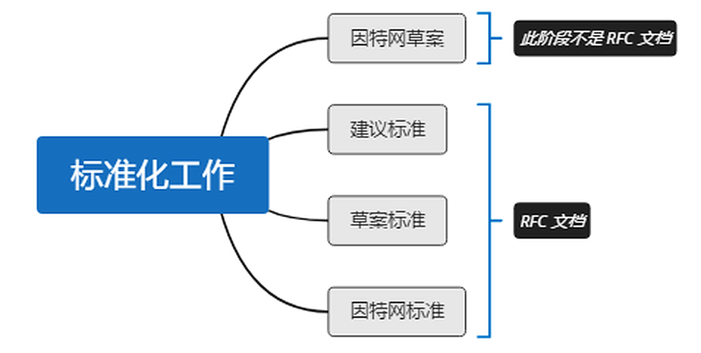

4.  性能指标：

- 带宽：通信领域指通信线路允许通过的信号频带范围；计算机网络领域指通信线路所能传送数据的能力（最高数据率）。

- 时延：数据从网络一端到另一端总时间。包括发送时延（传输时延，总时延中主要减少此时延，等于分组长度/信道宽度）、传播时延、排队时延、处理时延。

- 时延带宽积：等于传播时延 X 信道带宽。为管道可容纳的比特数量。

- 往返时延 RTT：发送端开始发数据，到收到接收端发送的确认总时间。

- 吞吐量：单位时间通过某个网络的数据量。

- 速率：数字信道上传送数据的速率。

- 利用率：信道利用率为某信道百分之几的时间是有数据通过的；网络利用率为全网络信道利用率的加权平均值。简单公式描述：D=D0/(1-U) ，即当前时延=空闲时的时延/（1-网络利用率），超过 50% 会产生巨大时延。

## 2 计算机网络体系结构与参考模型

1.  计算机网络分层结构：

- 体系结构：计算机网络各层及其协议的集合（体系结构是抽象的，实现是具体的）。

- 最底层是上一层服务的提供者；最高层是下一层服务的使用者；中间层是下一层服务的使用者，是上一层服务的提供者。

- 各层次中，每个报文，协议数据单元 PDU 都由两部分组成：协议控制信息 PCI、服务数据单元 SDU。

2.  协议、接口、服务的概念：

- 协议：为进行数据交换而建立的规则集合。协议是水平的。

- 接口：同节点内相邻交换信息的连接点。通过服务访问点 SAP 进行交互。

- 服务：下层为相邻上层提供的功能调用。服务是垂直的。补充，服务原语（A 到 B，n+1 层到 n 层间）：请求、指示、响应、应答。

3.  计算机网络提供的服务分类：

- 面向连接服务（连接建立、数据传输、连接释放。TCP。）、无连接服务（需要时直接发送。不可靠，尽最大努力交付。IP、UDP）。

- 可靠服务（保证数据正确、可靠传到目的地）、不可靠服务（需应用或用户保证其可靠性）。

- 有无应答服务（接收方收到数据后，向发送方发应答；无应答则需高层实现）。

4.  ISO 的 OSI 参考模型：  
    

- 应用层：用户与网络的接口，最复杂的一层，协议也最多。协议有 FTP、SMTP、HTTP 等。

- 表示层：两个通信系统交换信息的表示方式（数据压缩、加密、解密）。

- 会话层：即建立同步，允许不同主机间各进程之间的会话（建立、管理、终止会话）。

- 传输层：为端到端（进程到进程）提供通信，用端口号标识。为端到端连接提供流量控制、差错控制、服务质量、数据传输管理等服务。有复用（多进程同时使用下层服务）、分用（向上交付信息到多个进程）功能。协议有 TCP、UDP。

- 网络层：为点到点（主机到主机）提供通信，用 IP 地址标识。对分组进行路由选择、流量控制、差错控制、拥塞控制、网际互连。协议有 IP、IPX、ICMP、IGMP、ARP、RARP、OSPF（主要为无连接的网际协议、路由选择协议）。

- 数据链路层（MAC 介质访问控制层、LLC 逻辑链路控制层）：封装成帧、差错控制、流量控制、传输管理。协议有 SDLC、HDLC、PPP、STP、帧中继等。

- 物理层：注，传输信息的物理媒体当作第零层。定义数据终端设备 DTE、数据通信设备 DCE、物理和逻辑连接方法。协议有 EIA-232C、EIA/TIA RS-449、CCITT 的 X.21 等。

5.  TCP/IP 模型：  
    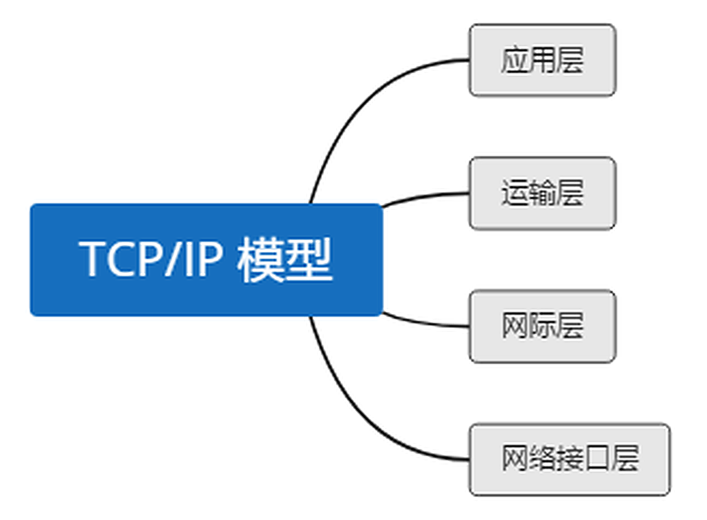  
    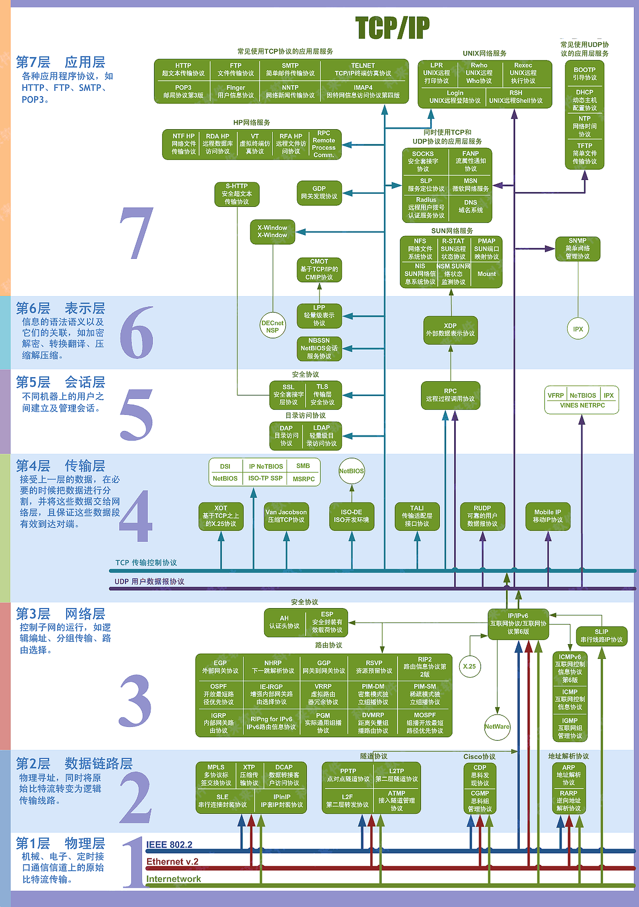

- 应用层：包含所有高层协议。

- 运输层：端到端对等实体进行通话。

- 网际层：定义了分组格式、协议。

- 网络接口层：只指出主机必须用什么协议与网络连接。具体物理网络可以为局域网（以太网、令牌环网、令牌总线等）、电话网（SDH、X.25、ATM、帧中继）。

6.  两个模型不同点：

- OSI 模型产生于协议发明前，力求完美，结构复杂、实现周期长、效率低。网络层支持面向连接/无连接服务，传输层支持面向连接通信。

- TCP/IP 模型产生于协议发明后，设计初就考虑到异构网络连接问题。网络层支持无连接服务，传输层支持面向连接/无连接通信。TCP/IP 模型成为事实的标准。

7.  各层 PDU 使用的单位：

- 传输层：报文段（TCP）、用户数据报（UDP）。

- 网络层：分组、数据报。

- 数据链路层：帧。

- 物理层：比特。

# 二 物理层

## 1 通信基础

1.  三组基本概念之数据、信号、码元：

- 数据：传送信息的实体。

- 信号：数据的电气或电磁表现（数据的存在形式）。模拟信号为连续变化的数据，数字信号为离散变化的数据。通过信号将数据从一点传到另一点。

- 码元：数字信号的计量单位。一个固定时长的信号波形（数字脉冲），表示一位 k 进制数字。称为 k 进制码元，该时长称为码元宽度。（一个码元是一个存放一定信息量的包，如一个码元为 16 进制码元，则一个码元 4 bit，共 16 种码元）。2 的码元一定信息量的包（bit） = k 进制码元。

2.  三组基本概念之信源、信道、信宿：  
    一个通信系统由信源、信道、信宿组成。

- 信源：产生发送数据的源头。

- 信宿：接收数据的终点。

- 信道：信号传输的媒介。

3.  三组基本概念之速率、波特、带宽：

- 速率：数据的传输速率，用码元传输速率（波形速率，每秒传输的码元数表示）、信息传输速率（比特率，每秒传输的比特数）表示。

- 波特：单位时间传输的码元个数。如 1 baud 为每秒传送 1 个码元。

- 带宽：原指信号的频带宽度，单位为 Hz。

4.  补充基本概念之基带传输、频带传输、宽带传输：

- 基带传输：把要传输的数据转换为数字信号（数字信号 1 或 0 直接用两种不同的电压来表示），使用固定的频率在信道上传输。计算机系统内近距离传输。

- 频带传输：将数字信号调制成模拟信号，信号在电话线等这样的普通线路上，以正弦波形式传播的方式。远距离传输。

- 宽带传输：通过借助频带传输，可以将链路容量分解成两个或更多的信道（如 FDM 技术），每个信道可以携带不同的信号。远距离传输。

5.  奈奎斯特定理、香农定理：

- 奈奎斯特定理：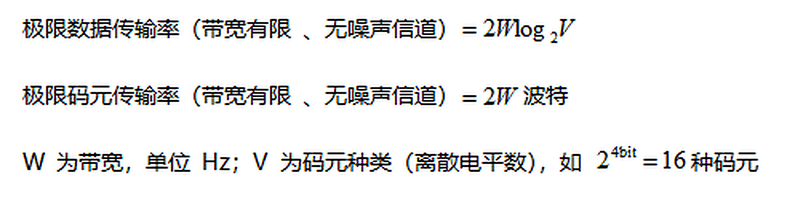

- 香农定理：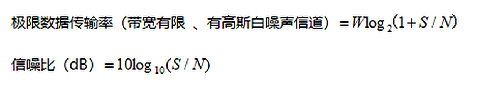

6.  编码与调制：  
    数据分为数字数据（离散值）、模拟数据（连续值）。他们可编码为数字信号或调制为模拟信号。  
    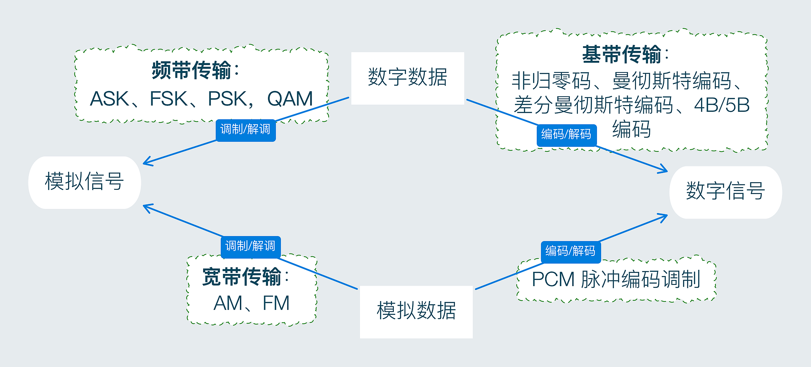

7.  编码与调制之数字数据编码为数字信号：

- 非归零编码：两个电压代表两个二进制数字。

- 曼彻斯特编码：一个码元分为两相等间隔，前后间隔高低电平不同代表一个二进制数字（一个码元两部分电平高低）。中间变跳可作为时钟信号或数据信号。以太网用的此编码。

- 差分曼彻斯特编码：前一个码元后半部分，和此码元前半部分电平相同或不同代表一个二进制数字（两个码元前后半部分电平同不同）。

- 4B/5B 编码：将数据流 4 位一组转成 5 位一组（只采用 16 种对应，剩下的作为控制码或保留）。

8.  编码与调制之数字数据调制为模拟信号：

- 幅移键控 ASK：容易实现，抗干扰差。

- 频移键控 FSK：容易实现，抗干扰强，应用广泛。

- 相移键控 PSK。

- 正交振幅调制 QAM：调幅、调相。其数据传输速率 = 波特 x log2(m种相位 x n种振幅)

9.  编码与调制之模拟数据编码为数字信号：  
    如音频信号进行编码 PCM（脉冲编码调制）。  
    抽样（对模拟信号周期性扫描。保证无失真，抽样频率最低为模拟数据带宽的两倍）、量化（把连续电平值转为离散数字量。抽样、量化就是分割、转换。）、编码（把量化结果转为二进制编码）。

10. 编码与调制之模拟数据调制为模拟信号：  
    最常用的是 AM、FM（调幅、调频）。使用 FDM 频分复用充分利用带宽。

11. 电路交换、报文交换、分组交换：  
    

- 电路交换：数据传输前，两点建立一条独占的物理通信路径。建立、传输、释放。建立时间最长，传输时延最小。

- 报文交换：数据交换单位为报文，交换节点采用存储转发方式。通信前不需要专门建立通信线路。报文交换对报文大小无限制，网络节点要较大缓存空间。使用在早期的电报通信网中。

- 分组交换：解决报文交换中大报文传输问题，将大数据块切分成小的数据块，加上一些必要的控制信息。分组交换延迟更小，适合计算机间突发式数据通信。

- 数据报：不需要建立连接，每个分组有完整目的地址，每个分组独立路由选择和转发，不保证分组的有序到达，不保证通信可靠性（主机来保证），出故障节点丢失分组可由其它路径正常转发，主机进行流量控制。

- 虚电路：端系统建立连接，会选择一个没用过的虚电路号。分组中有虚电路号，无目的地址。虚电路网络中每个节点维持张虚电路表。必须建立连接，属于同一条虚电路的分组按同一路径转发，保证分组有序到达，可靠的网络保证，某一结点故障均无法工作，差错和流量控制可由分组交换网络或主机保证。

## 2 传输介质

1.  概念：

- 传输介质是发送设备和接收设备间的物理通路。

- 物理层接口特性：机械特性、电气特性、功能特性、规程特性。

- 传输介质分类：导向传输介质（铜线、光纤等）、非导向传输介质（空气、真空、海水）。

2.  介质：  
    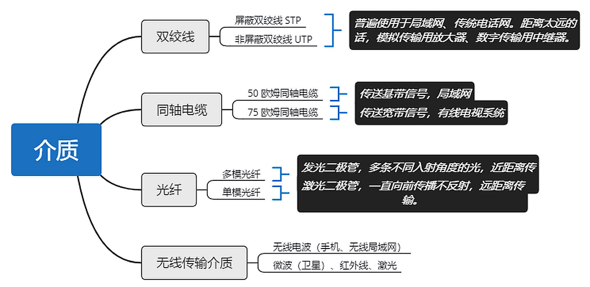

## 3 物理层设备

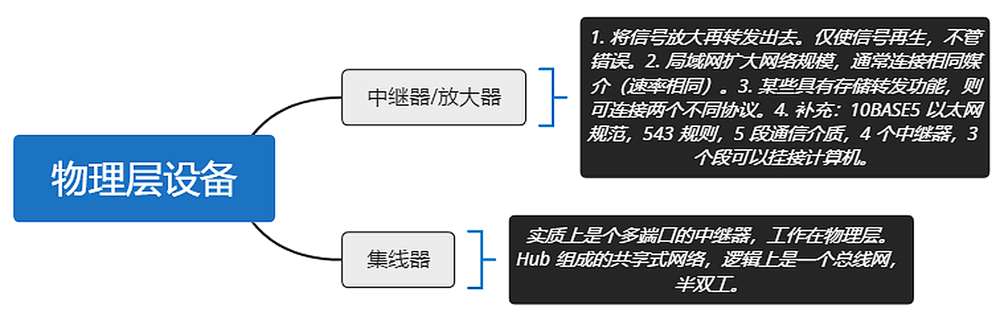

## 4 补充：宽带接入技术与认证方式

1.  宽带接入技术：

- ADSL 技术（非对称数字用户线路）：用数字技术对现有模拟电话用户进行改造。电话线经电话分离器、ADSL 调制解调器。

- HFC（光纤同轴混合网）：使用电缆调制解调器。

- FTTx 技术：经光纤干线、光分配网 ODN（PON 无源光网络）、用户端。

2.  三种常见认证方式：

- PPPoE

- Web + Portal

- 802.1x

# 三 数据链路层

## 1 数据链路层的功能

1.  为网络层提供的服务：

- 有确认面向连接服务。

- 有确认无连接服务（规定时间没收到确认重传，适用误码率高的信道，如无线通信）。

- 无确认无连接服务（适用于实时通信，误码率低的信道，如以太网）。

2.  链路管理：

- 建立、维持、释放（主要是面向连接的服务）。

- 分配、管理信道。

3.  帧界定、同步、透明传输：

- 帧界定：确定帧的界限。

- 帧同步：分出帧的起始与终止。

- 透明传输：不管传输的是怎样的比特组合，都能在链路上传送。

4.  流量控制：  
    发送方的发送能力大于接收方的接受能力，通过某反馈机制调节（限制发送方的流量）。

5.  差错控制：  
    在数字通信中利用编码方法对传输中产生的差错进行控制，以提高数字消息传输的准确性。

## 2 组帧

1.  概念：  
    发送方依据规则将网络层递交的分组封装成帧，帧要加首部和尾部（分组只是帧的数据部分，所以不需要加尾部）。出错时只重发出错的帧。

2.  组帧方法：  
    计数、填充、编码。

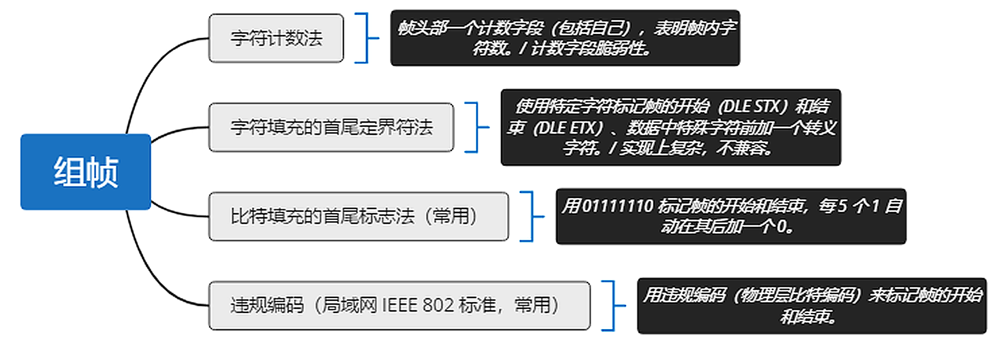

## 3 差错控制

1.  概念：  
    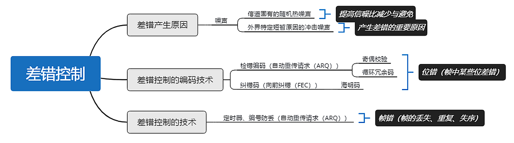

- 奇偶校验：奇校验：加上一位的校验位后，1 的个数为奇数；偶校验则为偶数。/ 奇偶校验无法检测出双位错误。

- 循环冗余校验：对于 m 比特的帧，用生成器生成一个多项式 G(x) ，通过其计算出 FCS（r）附加在原比特后（m+r）。若 m+r 在接收方被 G(x) 除无余数，则无差错。  

- 海明码：海明码检错 d 位，需要码距为 d+1；纠错 d 位，需要码距为 2d+1。/ 首先，确定校验位（码字内从左到右编号，2 的幂位为校验位，其余的填入数据）；其次，计算每个数据位影响哪几个校验位，得出校验位由哪几个数据位决定；最后，校验位的值由决定它的数据位中 1 的个数确定，偶数个 1 则校验位值填 0，奇数个填 1。  

## 4 流量控制与可靠传输机制

1.  概念：  
    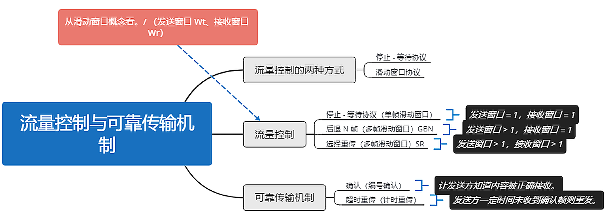

2.  注意的几点：

- 通过反馈机制由接收方控制发送方，发送数据的速率。

- 窗口大小为 1，可保证帧的有序接收。

- 帧的编号是循环使用的。

- 数据链路层的滑动窗口协议中，窗口大小在数据传输过程中固定；传输层在数据传输中可变。

- 数据链路层中，流量控制机制和可靠传输机制交织在一起。

- 向后滑动已确认过的帧数（收到确认就向后滑动，接收缓冲区依然为接收窗口大小）。

- 发送方维持一组允许发送的帧序号（发送窗口）。

- 接收方维持一组允许接收的帧序号（接收窗口）。

- 接收方收到数据帧后，将窗口向前移一个位置并发回确认帧（帧落在窗口外则丢弃）。

3.  三种流量控制机制详解：

- 停止 - 等待协议（单帧滑动窗口）：  
  发送方每发一帧，设置重传时间（超时重传），等待接收方应答信号；接收方收到若有错则丢弃，否则回馈确认（0、1 交替编号）。/ a）接收端连续出现相同序号的帧，表示发送端进行了超时重传。 b）发送端连续收到相同序号的确认帧，表示接收端收到重复帧。 c）两个成功发送帧间最小时间间隔 tr = 数据帧发送时间 + 设置的重传时间。

- 后退 N 帧（多帧滑动窗口）GBN：  
  发送方依次发送 N 个帧；接收方只对正确接收到的帧确认，未被确认的之后的所有帧都重发。第 N 个帧定时器超时未收到确认，之前的所有帧都重发。/ 连续发送可提高信道利用率，但重传时需要把出错帧及之后的全部重传。在信道传输质量很差导致误码率较大时，不一定比停止等待协议更优。/ 发送窗口 Wt 尺寸为：1 \<= Wt \<= (2^n)-1 ，n 为用 n 个比特对帧编号，至少预留一种编号以区别上次发帧的编号，编号有不同的为新帧。

- 选择重传（多帧滑动窗口）SR：  
  只重传出现差错的帧、计时器超时的数据帧。/ 加大接收窗口，收下发送序号不连续但仍处于接收窗口中的那些帧。所有缺失序号收到后一起交给主机。/ 发送缓冲区对应一个计时器，超时重传；接收方怀疑帧出错，会发送一个否定帧 NAK 给发送方，要求发送方对 NAK 中指定的帧进行重传。/ 为保证接收方向前移动窗口后，新窗口序号与旧窗口序号无重叠，应满足：接收窗口 + 发送窗口 \<= (2^n)；（小结：接收窗口 \<= 2^(n-1)；因为：接收窗口 = 发送窗口）。

4.  补充：信道利用率等概念

- 信道利用率（信道效率）= 有效发送数据时间 / 发送周期 T（发送到收到确认帧）

- 发送方有效发送时间 = 比特数据 L / 数据传输率 C

- 所以：信道利用率 = (L/C)/T

- 所以：信道吞吐率 = 信道利用率 x 发送方速率 = ((L/C)/T) x C = L/T

## 5 介质访问控制

1.  概念：

- 解决当局域网中共用信道的使用产生竞争时，如何分配信道的使用权问题。

- 介质访问控制子层（MAC）：广播信道中信道分配协议。

2.  常见介质访问控制方法：  
    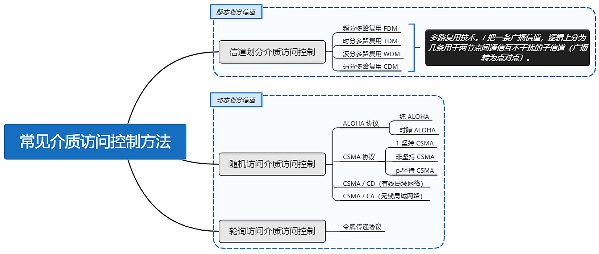

3.  介质访问控制相关协议详解：

- 频分多路复用 FDM：  
  多路基带信号调制到不同频率的载波上，再进行叠加形成一个复合信号（总带宽分割成若干与传输单个信号带宽相同（或略宽，保护频带）的子信道，每个子信道传输一种信号）。

- 时分多路复用 TDM：  
  物理信道按时间片分成若干个时间片，轮流分配给多个信号使用（每一时间片由复用的一个信号占用）。STDM 异步时分多路复用，按需分配时隙。

- 波分多路复用 WDM：  
  光的频分多路复用。一根光纤中传输多种不同波长（频率）的光信号。

- 码分多路复用 CDM：  
  用不同的编码区分各路原始信号。/ 将每比特时间分成 m 个更短的时间槽（芯片）；每个站点指定一个唯一的 m 位代码或芯片序列（发送芯片序列表示 1，发送芯片序列反码表示 0）；两个或多个站点同时发送时，各路数据在信道上线性相加。为信道中分离各路信号，要求站点芯片序列相交正交的。/ 小结：不同站点码片序列正交（规格化内积为 0）、在公共信道上，两个序列是叠加的（线性相加）。  

- 纯 ALOHA：  
  任何一站点随时发送数据，在一段时间内没收到确认则认为发生冲突，等待一段时间后再发送数据，直到发送成功。

- 时隙 ALOHA：  
  把所有站点在时间上同步起来，并将时间划分成一段等长的时隙，规定在每个时隙开始时才能发送一个帧（避免发送数据的随意性）。

- CSMA 协议：  
  载波侦听多路访问。比 ALOHA 多了载波侦听装置。  
  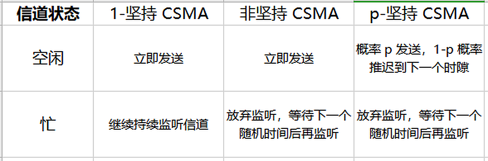

- CSMA/CD（有线局域网络）：  
  载波侦听多路访问/碰撞检测（适用于总线型网络，半双工）。/ 先听后发，边听边发（不同于 CSMA 之处），冲突停发，随机重发。/ 用截断二进制指数退避算法，等待一段随机时间（检测到信道忙）。/ 最小帧长：假设某个工作站检测到冲突发生，就发送碰撞信号，使冲突更加明显，使得所有工作站都能检测到总线发生冲突。然后每个想要发送数据的工作站，检测到总线为空，在发送数据之前，先发送一个数据帧（探测帧）。探测帧的长度既要求最快速的到达目的地（尽量小），又要保证探测帧的传递时间足够（发送时间大于所有工作站监测到冲突并发送碰撞的时间）使得其他工作站能够监听到。这个探测帧的长度就是以太网规定的最小帧长。结果就是，如果没有工作站发出碰撞信号打断探测帧的传输，那么就代表总线确实为空，并且没有工作站和“我”争抢总线资源。然后就可以正式发送数据。<a href="https://blog.csdn.net/u012503786/article/details/78615551" rel="noopener" target="_blank">最小帧长，部分参考链接</a>。/ 考虑如下极限的情况，主机发送的帧很小，而两台冲突主机相距很远。 在主机 A 发送的帧传输到 B 的前一刻，B 开始发送帧。这样，当 A 的帧到达 B 时，B 检测到冲突，于是发送冲突信号。假如在 B 的冲突信号传输到 A 之前，A 的帧已经发送完毕，那么 A 将检测不到冲突而误认为已发送成功。由于信号传播是有时延的，因此检测冲突也需要一定的时间。这也是为什么必须有个最小帧长的限制。/ 小结：最小帧长度在 10Mbps 中为 64B，即发送时间至少为 51.2μs（争用期即 RTT），即 512 bit 时间。发送方必须在发送结束前收到对方的冲突信号。所以发送时间长度至少为 RTT。

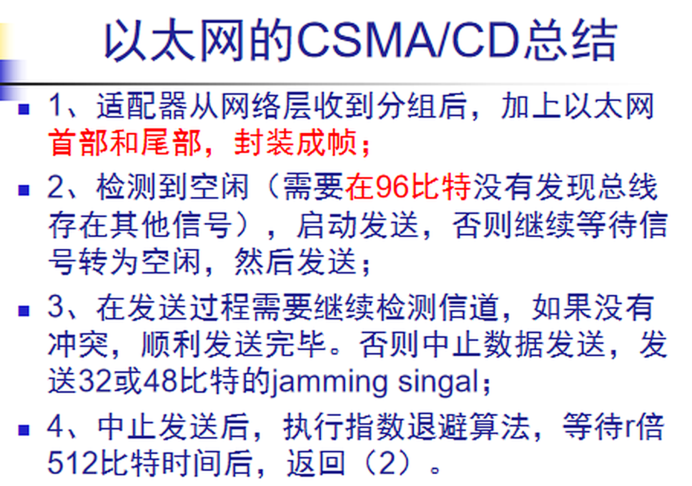

- CSMA/CA（无线局域网络）：  
  载波侦听多路访问/碰撞避免（减少碰撞发生的概率）。/ 发送过程中不需要进行冲突检测。  
  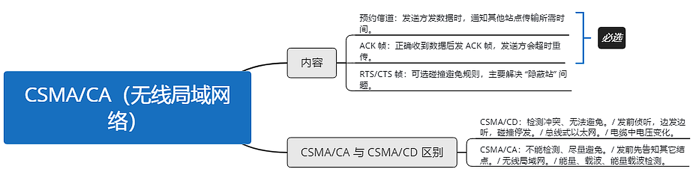

- 令牌传递协议：  
  令牌（一组特殊比特组成的帧）在各个结点间按某个固定次序交换，传递通路逻辑上必须是环。有令牌才可发数据。/ 帧在环上传送，每个站点都进行转发，目的站点（会维持一个副本）会在尾部设置响应比特，直到再传到发送站点将此帧撤掉。/ 轮询介质访问控制适合负载很高的广播信道（多点同时发送数据概率很大的信道）。

## 6 局域网

1.  基本概念：  
    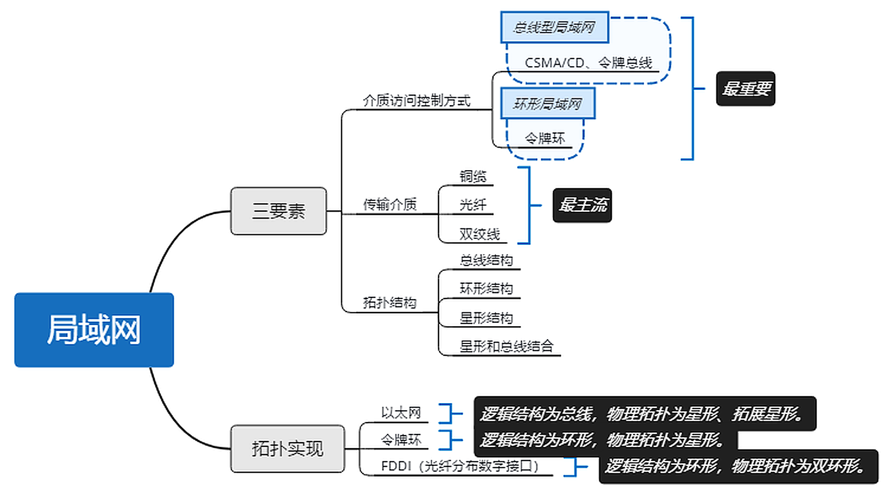

2.  IEEE 802.3 局域网参考模型：

- （对应 OSI 数据链路层与物理层。）

- LLC 逻辑链路控制：作用已经不大，网卡仅装 MAC 协议，没有 LLC 协议。/ 与传输媒体无关，向网络层提供服务（面向连接、无确认无连接、有确认无连接）。

- MAC 介质访问控制子层：向上屏蔽物理层访问差异，提供统一的接口。

3.  IEEE 802.3：

- 概念：  
  DIX Ethernet V2 标准与 IEEE 802.3 标准很小差别，因此，将 802.3 局域网简称为以太网。/ 逻辑上总线型，物理上为星型；信息以广播方式发送；CSMA/CD 对总线访问控制。

- 以太网的传输介质、网卡：  
  网络适配器或网络接口卡 NIC。/ 工作在数据链路层、物理层。/ 传输介质间物理连接和电信号匹配，帧发送与接收，帧封装与拆封，介质访问控制、数据编码解码，数据缓存。

- 以太网的传输介质：  
  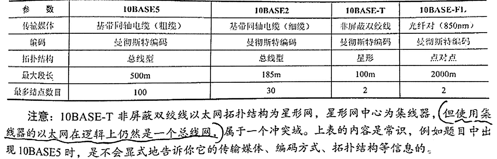  
  10Base-5 的含义：“10” 代表传播速率为 10Mbps、“Base” 代表 “基带传输”、数字 “5” 表示最大延伸距离接近 500 米，500 米内不需要转接器。

- 以太网的 MAC 帧：  
  媒体访问控制地址或 MAC 地址。六个字节（48 bit）十六进制数字表示（如 00-23-5A-15-99-42）；高 24 bit 是厂商代码，低 24 bit 是厂商自行分配。/ 以太网帧格式有 DIX Ethernet V2、IEEE 802.3 标准。/ 广播通信，网卡每收到一个 MAC 帧，硬件检查地址，收下或丢弃。/ 前导码：时钟同步，用于比特同步，MAC 帧无需结束符，因为每个帧间有一定的间隙；类型：指出交给哪个协议实体处理；校验码：目的地址、源地址、类型、数据部分校验（32 位 CRC）。  

- 高速以太网（大于等于 100Mbps）：  
  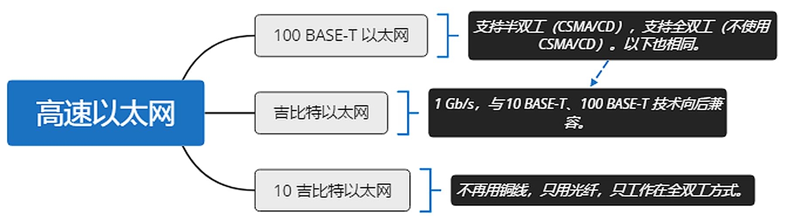

4.  IEEE 802.11：

- 概念：  
  MAC 采用 CSMA/CD 协议进行介质访问控制。/ 先监听信道，空闲发送，否则用截断二进制指数退避算法推迟（信道为空且为第一个帧时不用此算法）；收到 ACK 说明成功，否则重发。/ 注：发生碰撞也把整个帧发完，有线局域网中发生冲突立即停止发送数据。

- 有固定设施：  
  802.11 规定无线局域网最小构件为基本服务集（一个基站 AP，若干个移动站点）。  
  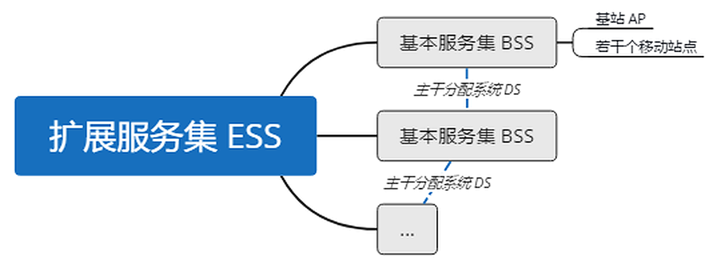

- 无固定设施（无线局域网自组织网络）：  
  自组织网络没有基本服务集中 AP。各点间地位平等，中间信点都为转发结点。

5.  令牌环：  
    逻辑上为环形拓扑结构，物理上为星形拓扑结构。参见上面的 “令牌环协议”。

## 7 广域网

1.  基本概念：

- 覆盖范围很广的长距离网络，是因特网的核心部分。

- 广域网是单一的网络，不等同于互联网。/ 使用结点交换机连接各个主机或路由器。/ 广域网与局域网二者平等（互联网角度看）。/ 路由器用来连接不同的网络。

- 广域网由结点交换机组成（单个网络中转发分组），互联网由路由器组成（多个网络中转发分组）。

- PPP、HDLC 是广域网最常见的数据链路层控制协议。  

2.  PPP 协议：

- 概念：  
  PPP 在 SLIP（串行线路网际协议）基础上发展而来。SLIP 主要完成数据报的传送，只能传送 IP 分组。/ PPP 特性：异步、同步线路上使用；点对点协议，不是总线型，不需要 CSMA/CD；只支持全双工链路；不可靠传输协议，只保证无差错接收，不纠错，也不使用序号和确认机制；PPP 两端可运行不同网络协议；PPP 是面向字节的，异步线路（默认）用字节填充法、同步线路（SONET、SDH 等）用硬件比特填充。

- PPP 帧：  

- PPP 组成部分：  
  链路控制协议 LCP（建立、配置、测试、管理数据链路层）；网络控制协议 NCP（配置不同网络协议）；封装 IP 数据报到串行链路。

- 状态：  
  当用户 PC 机拨号接入 ISP 后，就建立了一条从用户 PC 机到 ISP 的物理连接，这时，用户 PC 机向 ISP 发送一序列的 LCP 分组，封装成 PPP 帧，以便建立 LCP 连接。这些分组及其响应选择了将要使用的一些 PPP 参数。接着还要进行网络层配置，NCP 给新接入的用户 PC 机分配了一个临时的 IP 地址，这样，用户 PC 机就称为了因特网上的一个有 IP 地址的主机了。当用户通信完毕后，NCP 释放网络层的连接，回收原来分配出去的IP地址，接着，LCP 释放数据链路层连接，最后释放的是物理层的连接。  
  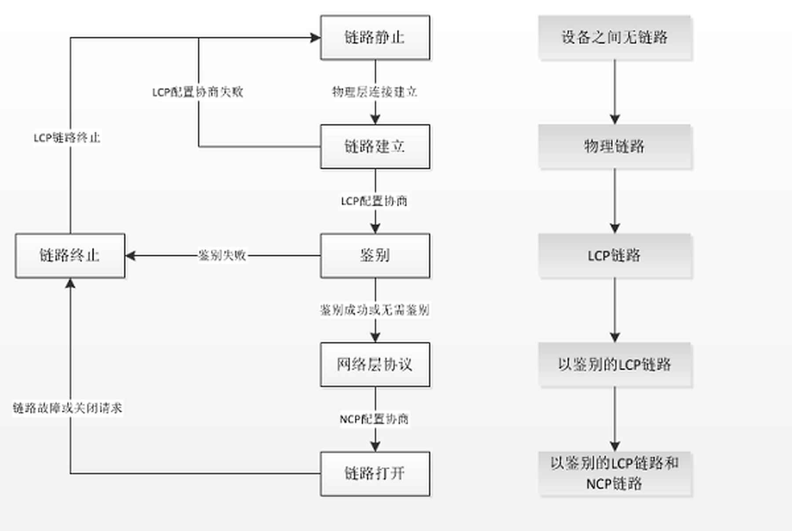

3.  HDLC 协议：

- 概念：  
  高级数据链路控制协议。/ 面向比特；0 比特插入法；全双工通信；所有帧采用 CRC 检验，对信息帧进行顺序编号。

- HDLC 工作原理概述：  
  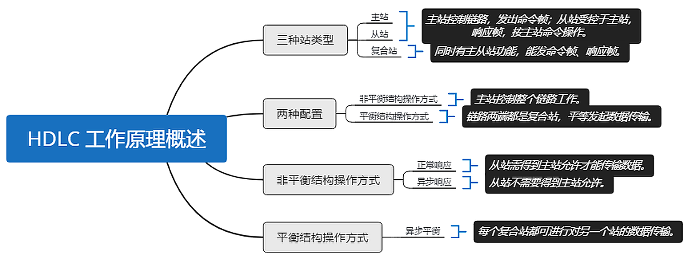

- HDLC 帧：  

4.  PPP 与 HDLC：

- PPP 面向字节；HDLC 面向比特。

- PPP 帧比 HDLC 帧多一个 2 字节协议字段。

- PPP 不使用序号、确认机制，只保证无差错接收。

- HDLC 使用编号和确认机制，提供可靠传输。

- HDLC 是 ISO 提出的，不属于 TCP/IP。

## 8 数据链路层设备

1.  概述：  
    

2.  网桥：

- 概念：  
  通过网桥连接多个以太网，使每个网段成为隔离开的冲突域（碰撞域）。/ 网桥连接起来若干网段最大吞吐量为 N 个网段之和，而处于同一冲突域的仍为原来的。

- 特点：  
  以目的网络的介质访问协议发帧。/ 网桥在不同或同类型的 LAN 间存储转发、协议转换。/ 可帧翻译互联不同类型的局域网。/ 网桥有足够大的缓冲空间。

- 透明网桥：  
  混杂方式工作，接收与之连接的所有 LAN 的每一帧。/ 其路由选择取决于源 LAN、目的 LAN（相同丢弃；不同转发；未知扩散）。/ 自学习算法处理收到的帧（端口与地址），使用生成树防止环路（生成树一般不是最佳路由）。

- 源路由网桥：  
  路由选择由发送数据帧的源站负责。/ 源站发送发现帧，从多个途径到达目的站，目的站发应答帧，将途径网桥的标记记录在应答帧中，最终选出最佳路由（往返时间最短）。/ 发现帧数量可能会指数增加，导致拥塞。

3.  局域网交换机：

- 概念：  
  桥接器在任意时刻只能执行一个帧的转发操作，隔离冲突域。/ 以太网交换机是一个多端口的网桥，工作在二层。即可以隔离冲突域，也可以隔离广播域。/ 可方便实现虚拟局域网 VLAN（二层交换机，不同 VLAN 的通信需要三层）。

- 原理：  
  检测以太网端口的数据帧 MAC 地址，动态查表比较，发送响应目的端口。

- 特点：  
  每个端口连单个主机（普通网桥连一个网络段）；一般为全双工；同时连接多对端口，使之间独占通信媒介，无碰撞；即插即用，自学习算法建立。

- 两种交换模式：  
  直通式：只检查目的地址，不支持不同速率端口的交换，缺乏智能性、安全性，快速。/ 存储转发式：检查数据正确性，支持不同速率端口交换，延迟较大。

4.  网桥与交换机：  
    以太网交换机，也称为交换式集线器，是简化（典型）的网桥。/ 一般用于互连相同类型的 LAN（例如：以太网与以太网的互连）。/ 交换机和网桥的不同在于：交换机端口数较多，交换机的数据传输效率较高。

## 9 疑难点小结

- 以太网采用无连接工作方式，不对帧编号。不可靠、尽最大努力交付。

- 局域网工作于一、二层；广域网工作于下三层。

- 放大器加强宽带信号（传输模拟信号）；中继器加强基带信号（传输数字信号），大多数以太网采用基带传输。

- 物理层：信号编码、译码、比特的接收和传输。/ MAC 子层：组帧、拆帧、比特差错检测、寻址、竞争处理。/ LLC 子层：建立释放数据链路层逻辑连接，提供与高层的接口、差错控制、给帧加序号。

- MAC 子层没有流量控制机制。流量控制要编号机制，其实现在 LLC 子层。

# 四 网络层

## 1 网络层的功能

- 异构网络互连：  
  网络通过中间设备实现互联。参加互联的计算机使用相同的网际协议 IP，把互联后的计算机看成一个虚拟（逻辑上的）的互联网。  
  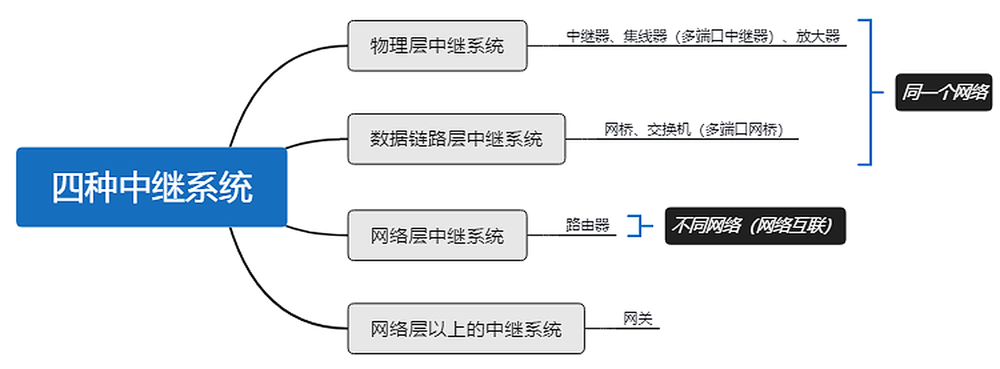

- 路由转发：  
  路由器的功能：路由选择（特定的路由协议构造出路由表）、分组转发（根据路由表生成的转发表对数据流转发）。

- 拥塞控制：  
  过量的分组导致网络性能下降（路由器端口缓冲区有限）。  
  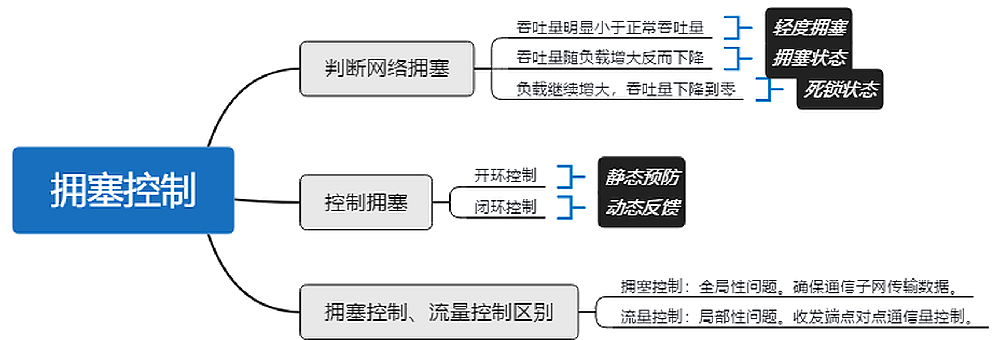

## 2 路由算法

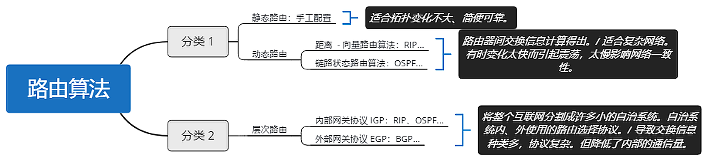

- 距离 - 向量路由算法：  
  仅与直接邻居交谈。定期将整个路由表传给相邻结点。/ 所有结点定期将整个路由表传邻居；被告知新路由加入本地，选择路由代价小的保留。更新报文大小与通信子网节点个数成正比。

- 链路状态路由算法：  
  每个结点通过广播与其它所有结点交谈。通过原始数据自己计算路径。/ 主动测试所有邻接结点，定期将链路状态传播给所有其它结点，链路状态发生变化才向其它所有节点发送消息。

## 3 路由协议

1.  概念：

- 自治系统 AS：  
  单一技术管理下的一组路由器。

- 域内与域间路由：  
  每个自治系统内一个或多个路由器需同时运行自治系统内、自治系统间的路由选择协议。

2.  RIP 路由协议（路由信息协议）：

- 内容：  
  仅和相邻路由交换当前知道的全部信息，30 秒广播一次。/ 一条路径最多 15 个路由器，16 跳不可达。防止环路。/ RIPv1 不支持子网掩码，每个网络的子网掩码要相同，RIPv2 支持 VLSM、CIDR。

- 所有路由器都知道整个 IP 网络路由表，称 RIP 最终收敛。

- 距离向量算法：  
  `<目的网络 距离 下一跳>`。/ 有更新查看下一跳是否相同，不同则换成距离小的。/ 默认 180 秒没收到更新超时，认为不可达，设置为 16。

- 缺点：  
  网络规模增大，会慢收敛，坏消息传的慢（明明已经不可达了，但是路由表还认为可达没更新）。

3.  OSPF 路由协议（开放路径最短优先）：

- 内容：  
  泛洪（链路状态发生变化时）本路由器相连的所有路由器链路状态，收敛快。/ 直接 IP 数据报传送。

- 原理：  
  各个路由器间交换信息，最终形成 全网拓扑结构图。/ 每个路由器根据全网拓扑计算最优路径（Dijkstra），存储下一跳。

- 过程：  
  确定可达性（问候分组）；数据库描述（数据库描述）；新情况下同步（链路状态请求、更新、确认）。

4.  BGP 路由协议：

- 内容：  
  边界网关协议，用于互联网网关之间。路径向量路由选择协议。/ BGP 路由表有 `网络前缀 下一跳 到达目的网络所经过的自治系统序列`。/ 四种报文：打开、更新、保活、通知。

- 原理：  
  AS 中至少一个路由充当发言人与其它的发言人建立 TCP 链接交换信息。（自治系统再分区域，区域有本地、地区、主干）/ BGP 刚运行与邻站交换整个路由表，以后只在变化时更新。  

5.  RIP、OSPF、BGP 比较小结：  

## 4 IPv4

1.  IPv4 分组：

- 分组格式：  

- IP 数据包分片：  
  以太网数据链路层 MTU 为 1500B，许多广域网不超过 576B。/ IP 数据报中标识：DF 为是否允许分片（0 是、1 否）；MF 为是否后面还有分片（1 是、0 否）。/ 当前分片开始位置为：片偏移 x 8B（除最后一个分片，都是 8 的倍数）。  
  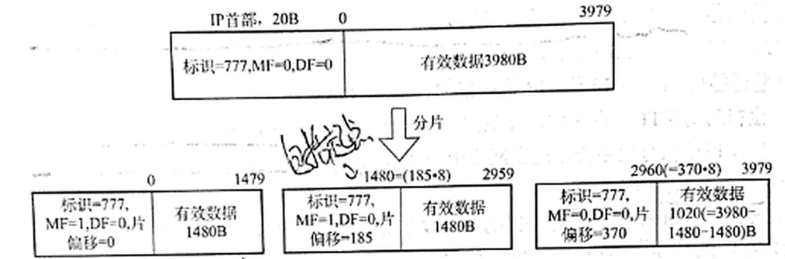

- 传统 A、B、C、D、E 类网络划分：  

- 私有 IP 网段：  

- 补充部分，默认路由：  
  127.0.0.0 网络为回环自检地址，不会出现在任何网络上。/ 255.255.255.255 为整个 TCP/IP 网络广播（受限广播地址）。/ 0.0.0.0 的作用：a）用作不确定的地址，如 DHCP 分配前的主机地址。b）某服务表示监听所有 IP 地址的主机。c）路由器的默认路由 0.0.0.0/0 子网掩码也为 0。在路由器查表时，拿子网掩码全 0 与数据报的目的网络地址与运算，得到 0.0.0.0，正好与默认路由的目的地址 0.0.0.0 匹配（默认路由匹配任意目的网络地址）。

2.  子网划分与子网掩码、CIDR：

- 子网掩码：  
  通过子网掩码来区分（子网号可全 0 或全 1）。`网络号 子网号 主机号` 为三级 IP 地址。对外表现为一个没有划分子网的网络。/ ABC 类有自己默认的子网掩码。/ 路由器在和相邻路由器交换路由信息时，必须把自己所在网络（或子网）的子网掩码告诉相邻路由器。在路由表中除了要给出目的网络地址外，还必须同时给出该网络的子网掩码。若一个路由器连接在两个子网上就拥有两个网络地址和两个子网掩码。/ 一个网络地址中只有一个固定的子网掩码。

- VLSM：  
  通常的子网划分，在一个网络地址中只有一个固定的子网掩码，对 IP 地址的利用率不高。 VLSM 提出供了在一个主类（A、B、C 类）网络内包含多个子网掩码的能力，以及对一个子网的再进行子网划分的能力。/ 在编址计划中有更多的体系分层，因此可以在路由表内进行更好的路由归纳。/ 在一个网络下可以根据主机数的需要分成不同长度的子网，使 IP 地址利用率更高。

- CIDR：  
  CIDR 建立在 VLSM 基础上，使用网络前缀概念 `网络前缀 主机号`。/ 最长前缀匹配，使用 CIDR 时，路由表由 `网络前缀 下一跳` 组成，在多个可能的匹配结果中选择前缀最长的。/ CIDR 和 VLSM 在某程度上可以看做是逆过程，CIDR 是把几个小网络汇聚成一个大网络来做表示，而 VLSM 则是把一个大网络继续细分为几个小网络进行 IP 地址分配。前者能让路由器的路由条目得到有效的减少，而后者可以充分利用IP进行地址分配而解决 IP 地址不被浪费的问题。

3.  路由转发原理：

- 将数据报目的 IP 地址和条目中子网掩码或网络前缀 “与” 运算，结果看是否和路由表条目中的 IP 地址相同，相同则匹配（CIDR 则选择网络前缀最长的即最精确的）。

- 过程（使用子网掩码的路由转发）：  
  直接交付 -\> 特定路由 -\> 匹配路由 -\> 默认路由（后三个是间接交付）

4.  NAT：

- 通过 `IP：端口` 的配合来做映射。

- 详解：  
  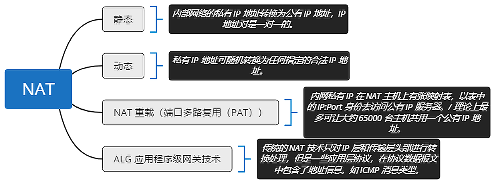

5.  ARP、DHCP、ICMP 协议：

- ARP（地址解析协议）：  
  每个主机有一个 ARP 高速缓存，ARP 协议动态维护 IP 到 MAC 的映射表。若无目的主机 IP，则广播 ARP 请求分组（通过目的 IP 地址）得到目的主机回复的 MAC。

- DHCP：  
  基于 UDP，应用层协议，C/S 工作方式。/ 过程：客户端广播发现报文，服务端广播提供，客户端广播请求，服务端广播确认。

- ICMP：  
  ICMP（网际控制报文协议）为 IP 层协议。主机或路由器报告差错和异常情况。  
  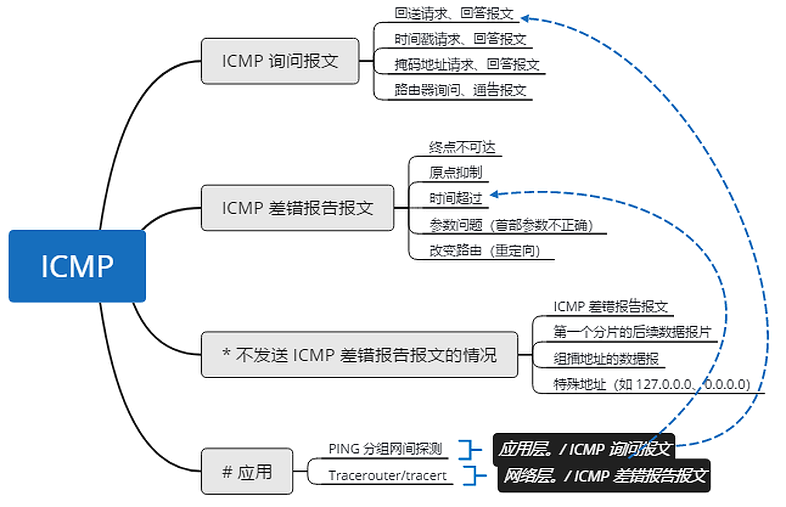

## 5 IPv6

1.  特点：

- 128 bit，每 16 bit 用冒号隔开。

- 源节点才能分片。

- 安全性：身份验证、保密功能。

- IPv4、IPv6 不兼容（双协议、隧道技术），但与其它网络协议兼容。

2.  三种地址类型：

- 单播地址：  
  标识一个接口，目的地址为单播地址的报文会被送到被标识的接口。

- 组播地址：  
  标识多个接口，目的地址为组播地址的报文会被送到被标识的所有接口。

- 任播地址：  
  标识多个接口，目的为任播地址的报文会被送到最近的一个被标识接口，最近节点是由路由协议来定义的。

- 注：IPv6 没有定义广播地址。

3.  IPv6 分级：

- 顶级（第一级）：全球都知道的公共拓扑。

- 场点级（第二级）

- 单个网络接口（第三级）  
  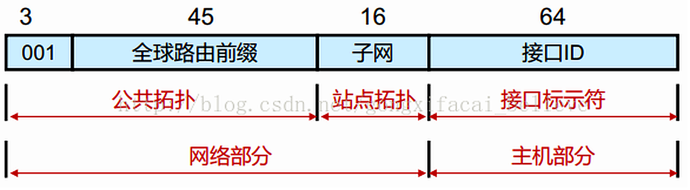

4.  地址缩写：

- 连续多个单位的 0，可缩写成两个冒号（只允许出现一次）。

- 每个单位全为 0，可缩写为一个 0。

- 每个单位中前置的 0 可省略。

5.  IPv4 向 IPv6 过渡：

- 双协议：设备上同时使用 IPv4 和 IPv6 协议栈。

- 隧道技术：把 IPv6 报文封装在 IPv4 报文中，IPv6 网络之间穿越 IPv4 网络进行通信。

## 6 IP 组播

1.  补充概念：单播（一对一），多播/组播（一对多），广播（一对所有）。

2.  概念：  
    原计算机一次发送的分组，可一次性到达用一组地址标识的若干台计算机。/ 例如：视频网站的一个频道向组播 IP 发数据包，IGMP 协议维护本地局域网用户是否加入组播组。本地组播路由器将组成员关系转发给因特网上其它组播路由器。加入的用户可收到来自此组播地址发送的数据报。组播地址相当于中间代理。

3.  组播协议：

- IGMP：  
  组成员管理协议用于管理组播组成员的加入和离开。

- 组播路由算法：  
  组播路由协议负责在路由器之间交互信息来建立组播树。  
  基于链路状态、距离向量、任何路由协议上（协议无关组播 PIM）。

## 7 移动 IP

1.  概念：  
    支持移动性因特网体系结构与协议。

2.  基于 IPv4 移动 IP 定义的三种功能实体：

- 移动节点：具有永久 IP 的移动节点。

- 本地代理（归属代理）：管理一个移动节点。

- 外部代理：在外部网络中，帮助移动节点完成移动管理功能。

3.  移动节点在外地网络时，移动节点向本地代理注册当前位置（转交地址），收发包通过外部代理进行中转。

## 8 网络层设备

1.  路由器的组成和功能：

- 多个广播域互联需要使用路由器。

- 路由器由路由选择、分组转发两部分组成：a）路由选择：路由协议交互完成计算，构造出路由表。b）分组转发：根据路由表生成转发表。解封装网络层数据报再根据转发表封装成网络数据包转发。

2.  路由表与路由转发：

- 路由表标准表项：目的网络 IP、子网掩码、下一跳 IP、接口。

- 注意（不考虑 NAT）：IP 数据报的源/目的地址不变；局域网内帧的源/目的地址不变，经过路由器时帧的源/目的地址变化。

# 五 传输层

## 1 传输层提供的服务

1.  传输层的功能：  
    提供端到端（进程到进程）通信。/ 复用（上层数据使用相同的传输层协议），分用（同一传输层协议数据向上交付给不同协议的应用）。/ 对收到的报文段首部、数据部分差错检测（网络层只检测首部）。/ 面向连接的 TCP，无连接的 UDP。/ 可靠不可靠：是否使用确认机制对传输的数据进行确认。

2.  传输层寻址（端口）：

- 端口号长度为 16 bit，最多 65536 个不同的端口号。/ 端口是传输层的服务访问点 TSAP，传输层与进程间数据交换。

- 通过套接字（主机 IP，端口号）来标识网络中一个主机的其上的一个应用。

- 熟知端口号：FTP 21、SSH 22、TELNET 23、SMTP 25、DNS 53、TFTP 69、HTTP 80、SNMP 161。

- 端口号分类：  
  

## 2 UDP 协议

1.  概念与特点：

- 只在 IP 数据包上增加两个基本服务，复用分用、差错检测。

- 无需建立连接。

- 接收方发现端口号不正确则丢弃，并由 ICMP 发送差错报告端口不可达。

- UDP 首部格式：  
  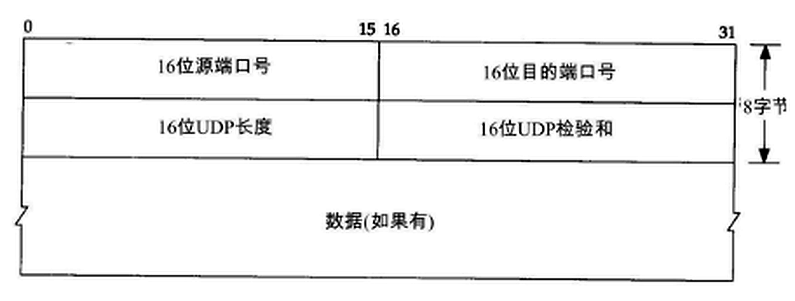

2.  UDP 校验：

- 添加伪首部、首部校验字段全 0、数据部分不是偶数字节补 0。

- 切分成 16 位字串，二进制反码求和（每位取反后相加，此处与有符号数的反码概念不同，高位有进位需低位加一），结果再取反作为校验字段。

- 接受方添加伪首部、数据部分。二进制反码求和。全为 1 则无差错。

## 3 TCP 协议

1.  概念与特点：

- 面向连接。/ 可靠交付，保证数据无差错、不丢失、不重复、有序。/ 全双工通信，双方设有缓存。

- TCP 首部格式：  
  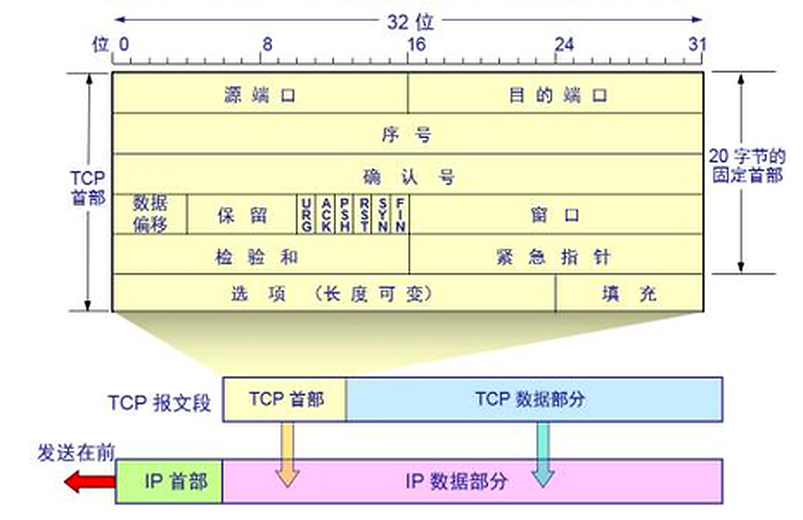

2.  TCP 的连接管理：  
    ACK 用于连接跟踪。  

3.  TCP 的可靠传输：

- 校验（和 UDP 的校验一样）。

- 序号：建立在字节流上，而非报文段上。

- 确认：TCP 使用累计确认，发送一个报文段字节后才发回一个确认。

- 重传：a)超时（超时重传时间应略大于加权平均往返时间 RTTs）。b) 冗余 ACK（某个报文段确认时捎带冗余 ACK 标表示之前丢失的报文段，期望收到之前丢失的）。规定当发送方收到同一个报文段 3 个冗余 ACK 时，旧可以认为跟在这个被确认报文段后的报文段已经丢失。这种技术被称为快速重传。

4.  TCP 的流量控制：

- 一个速度匹配服务，消除发送方使接收方缓存区溢出的可能性。

- 发送方（cwnd 拥塞窗口）\<- 接收方（rwnd 接收方窗口）。

- 接收方根据自己缓冲区大小确定接收窗口告诉发送方；

- 发送方根据当前网络拥塞程序估计确定拥塞窗口值。发送方取 cwnd、rwnd 中值小的作为发送窗口。

- 与数据链路层比较：  
  数据链路层：窗口大小不变化、两个相邻节点的流量控制；  
  传输层：窗口可大小变化，端到端的流量控制。

5.  TCP 的拥塞控制：

- 概念：防止过多的数据注入到网络中。/ 发送方窗口可等同于拥塞窗口 cwnd（接收方总是有足够大的缓存空间）。

- 两套组合，四种算法：慢开始和拥塞避免、快重传和快恢复（对前者的改进）。

- 具体策略：a）当发送方检测到超时、TCP 链接建立时，用慢开始和拥塞避免。b）当发送方检测到冗余 ACK 时，采用快重传和快恢复。

- 慢开始与拥塞避免详解：  
  a）慢开始：先令拥塞窗口 cwnd = 1（mms 最大报文段长度），每收到一个确认后 cwnd 加倍（指数增大），直到达到慢开始门限 ssthresh 值后改用拥塞避免算法。  
  b）拥塞避免：cwnd 每经过一个 RTT 就增加一个 MSS 大小（线性增大），当出现一次超时就令 cwnd = 1，ssthresh 为出现拥塞时 cwnd 的一半。  
  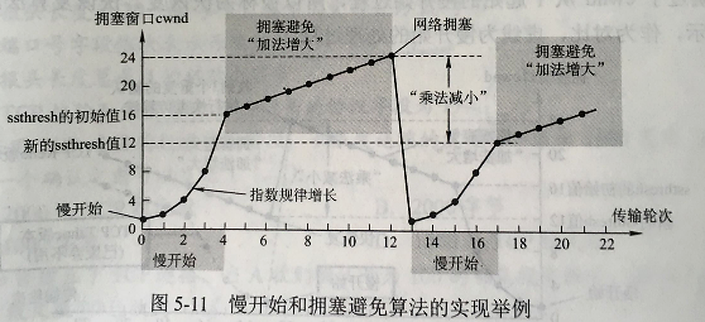

- 快重传和快恢复详解：  
  a）快重传：发送方连续收到三个冗余 ACK 报文时，直接重传尚未收到的报文段，不必等待那个报文段设置的重传计时器超时。  
  b）快恢复：连续收到三个冗余 ACK，设置 cwnd = 出现拥塞时 cwnd 的一半，ssthresh = 出现拥塞时 cwnd 的一半。然后 cwnd 线性增大。  
  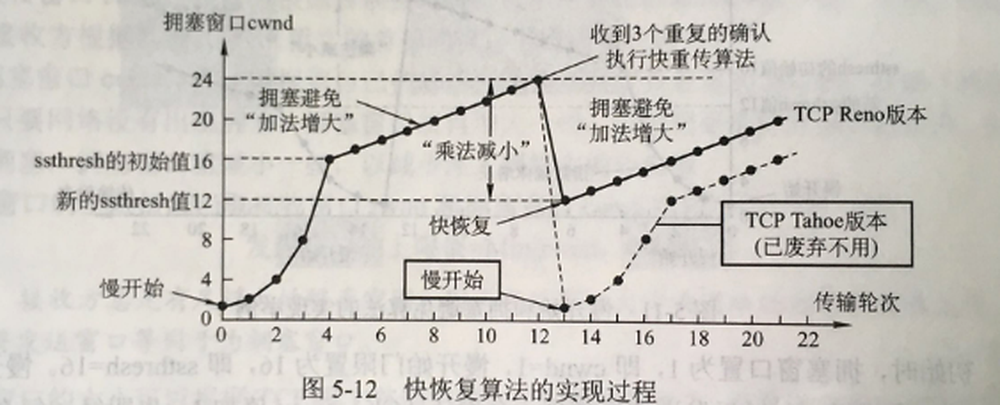

# 六 应用层

## 1 DNS

1.  概述：  
    DNS 使用 UDP，53 号端口。

2.  域名服务器分类：

- 根域名服务器：13 个，管理全部顶级域名。

- 顶级域名服务器：管理二级域名。

- 权限域名服务器：将主机名转换为 IP 地址。/ 很多权限域名服务器和本地域名服务器是同一个。

- 本地域名服务器：一个 ISP、大学或系。

3.  域名解析过程：  
    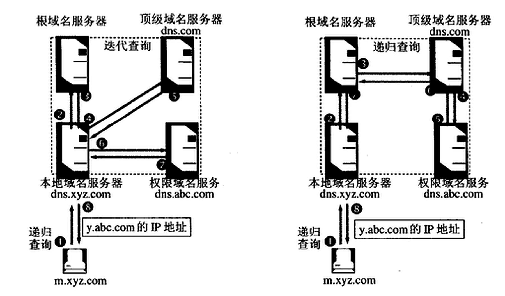

## 2 电子邮件

1.  组成部分：  
    用户代理、邮件服务器、电子邮件协议。

2.  协议：

- SMTP 简单邮件传输协议（推）：用户代理到发送方服务器；发送方服务器到接收方服务器。

- POP3 邮局协议（拉）：接收方服务器到用户代理。

3.  MIME（多用途互联网邮件扩展类型）：  
    是设定某种扩展名的文件用一种应用程序来打开的方式类型，当该扩展名文件被访问的时候，浏览器会自动使用指定应用程序来打开。多用于指定一些客户端自定义的文件名，以及一些媒体文件打开方式。/ 一些非英语字符消息和二进制文件，图像，声音等非文字消息原本都不能在电子邮件中传输（MIME 可以）。MIME 规定了用于表示各种各样的数据类型的符号化方法。 此外，在万维网中使用的 HTTP 协议中也使用了 MIME 的框架，标准被扩展为互联网媒体类型。

## 3 万维网

1.  万维网三个标准构成：

- 统一资源定位符 URL

- 超文本传输协议 HTTP

- 超文本标记语言 HTML

2.  特点：

- HTTP 协议是无状态的。

- 实际使用 cookie、数据库来跟踪用户活动。

- HTTP 协议本身是无连接的，HTTP 使用 TCP 连接，但通信双方交换 HTTP 报文前不需要先建立连接。

- 持久、非持久连接：  
  

